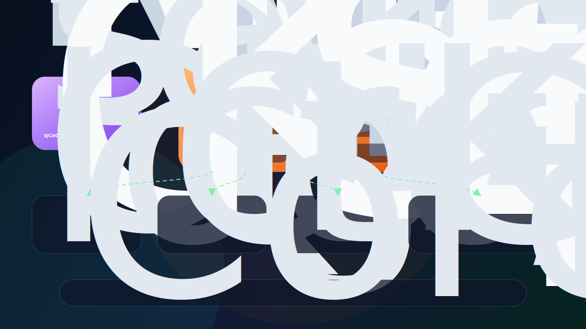

<h1 align="center">Ferrule</h1>

<p align="center">
  <strong>Rust-native, composable LLM inference for sparse MoE, expert streaming, and hardware-aware execution.</strong>
</p>

<p align="center">
  Ferrule keeps model-family policies, tensor source bindings, router/top-k experts, quantized weights, KV cache, and future speculation/parallelism state as explicit runtime concepts.
</p>

<p align="center">
  
  
  
  
  
</p>

<p align="center">
  <a href="#quick-start">Quick start</a> ·
  <a href="#current-milestone">Milestone</a> ·
  <a href="#core-features">Features</a> ·
  <a href="docs/ferrule_arch.md">Architecture</a> ·
  <a href="docs/ROADMAP.md">Roadmap</a>
</p>

---

## Current milestone

Ferrule just crossed an important line: **real local DeepSeek V4 Flash + DSpark weights can enter an interactive CUDA chat loop from Rust**.

This is not a mock path and not a DeepSeek-specific CUDA fork. The current DSV4 path keeps the split we want long-term:

```text
local HF safetensors → semantic source binding → DSV4 model semantics → generic CUDA source operators → readline chat
```

What works today:

- **DeepSeek V4 Flash + DSpark local CUDA chat** through `ferrule chat` / `just dsv4-chat`.
- Full 43-layer DSV4 greedy generation over local HF shards with strict `cuda` backend.
- Official-ish DSV4 chat prompt wrapper:
  ```text
  <｜begin▁of▁sentence｜><｜User｜>...<｜Assistant｜></think>
  ```
- `start_pos == 0` DSV4 prefill semantics for HC/layer traversal, window KV, compressed KV, indexer KV, `remainder`, and `cutoff`.
- Generic CUDA source operators for F32/BF16/FP8/FP4 linears, sparse attention sink, grouped `wo_a`, HC pre/post/head, shared SwiGLU FFN, routed FP4 experts, and lm_head top-k.
- CPU/reference anchors for tokenizer, source formats, HC math, sparse attention, routing, and MoE pieces.
- OLMoE remains the smaller CUDA executable regression fixture; the legacy OLMoE CPU forward path has been removed.

A real local smoke from the current DSV4 CUDA chat milestone:

```text
$ just dsv4-chat tokens=128
→ CUDA chat via cargo oxide build (arch: sm_121, tokens: 128)
=========================================
RUSTC-CODEGEN-CUDA CARGO build
=========================================

Running cargo build --features cuda --release -p ferrule-cli...

    Finished `release` profile [optimized] target(s) in 0.11s

✓ Cargo build succeeded
DeepSeek-V4: 4096d×43L, 256e top-6, vocab=129280 (cuda, attention=MLA, source=safetensors, arch=deepseek_v4)
Chat ready. Type /exit or Ctrl-D to quit. Template: deepseek-v4. DeepSeek-V4 greedy top-k fast path.
  /reset      clear session state
  /stats      show session stats
  /experts    show DSV4 layer/cache stats
  /ctx        show context window usage
You> hi
Ferrule> H! How can I help you?
stats> prefill=65789.6ms decode=41575.4ms pos=14
```

This is a huge milestone, but the next gates are clear: **official numeric parity first, then 20 tok/s load-excluded decode**. If Ferrule gives a wrong-identity answer, treat that as a correctness bug, not as a UI issue.

---

## Core features

| Feature | Why it matters |
|---|---|
| **Policy-composed Transformer runtime** | Model families map source tensors into semantic attention, FFN/MoE, KV, residency, quantization, and speculation policies instead of forking runners per model. |
| **MoE-first execution** | Router logits, hash/top-k selection, selected experts, shared experts, and expert residency are first-class runtime objects. |
| **Rust-native model runtime** | Model metadata, source tensor slices, WeightPack files, CUDA buffers, KV cache, sessions, and scheduler state have explicit ownership and typed boundaries. |
| **cuda-oxide kernels** | Custom CUDA kernels stay integrated with the Rust runtime, enabling MoE-specific quantized GEMV, packed FP4 expert execution, sparse attention, and future fusion work. |
| **Safetensors source binding** | Ferrule can inspect and bind Hugging Face safetensors by semantic role, with bounded reads instead of loading a whole 100GB+ checkpoint into RAM. |
| **WeightPack execution artifact** | Layer weights can be quantized once and reloaded from a Ferrule-owned package/cache; GGUF remains a compatibility/PK path rather than the only source format. |
| **CPU/reference components** | CPU reference pieces anchor CUDA kernels, source-format decoders, router behavior, HC math, graph validation, and future model support without keeping a legacy full-model CPU runner. |
| **State-aware design** | KV pages, source artifacts, WeightPack artifacts, model versions, adapters, speculation state, and future rollout/checkpoint state are planned as managed runtime state. |
| **Edge/hardware direction** | Expert placement, streaming, WeightPack layout, and scheduling can adapt to VRAM, DRAM, NVMe, cloud artifacts, and future multi-GPU / multi-node / RISC-V/GPU/NPU cooperation. |

---

## System vision

Ferrule is designed around a simple idea: future LLM systems need to co-design model structure, runtime state, and hardware placement.

<p align="center">
  
</p>

Near term, Ferrule aims to reach llama.cpp-level local usability while keeping a more explicit runtime architecture: fast cached startup, sampling controls, templates, quality checks, benchmarks, a small local server, and source-preserving bring-up for mainstream model families.

Long term, Ferrule should become a runtime substrate for edge-cloud LLM systems:

- cloud builds model versions, weight pack artifacts, calibration data, and adapters
- edge devices run private low-latency inference and collect rollout traces
- router statistics guide expert placement, prefetch, and offload
- KV/session state can become movable and eventually distributed
- speculation modules such as DSpark/MTP can attach through a target/draft policy
- hardware counters feed back into quantization and scheduling policies
- DP/TP/EP/SP/CP/PP placement can evolve under one state-aware runtime
- RISC-V/GPU/NPU paths can cooperate under one state-aware runtime

---

## Quick start

The fastest path to the current milestone is through the `justfile` wrappers. For CUDA work, prefer `just` / `cargo oxide` commands; plain CUDA `cargo test` can miss cuda-oxide artifact wiring.

1. Check the environment:

```bash
just cuda-info
just oxide-doctor
```

2. Build the CUDA release binary:

```bash
just build-cuda
```

If auto-detection picks the wrong GPU architecture, override it explicitly:

```bash
FERRULE_CUDA_ARCH=sm_121 just build-cuda
```

3. Put the local DSV4 source checkout here:

```text
models/DeepSeek-V4-Flash-DSpark
```

4. Run real local DeepSeek V4 Flash + DSpark CUDA chat:

```bash
just dsv4-chat tokens=128
# or:
just dsv4-chat 128
```

Inside chat:

```text
/reset    clear session state
/stats    show session stats
/experts  show DSV4 layer/cache stats
/ctx      show context window usage
/exit     quit
```

5. Run a one-shot DSV4 CUDA smoke:

```bash
just dsv4-cuda-generate Hello 2 4096 --chat
```

6. Generate tokenizer/chat parity JSON from the local official encoding code:

```bash
just dsv4-parity-json "Who are you?" target/dsv4_generation_parity.json
```

7. Optional: build CPU-only for metadata/reference work, or run the smaller OLMoE CUDA regression fixture:

```bash
just build-cpu

# If the OLMoE fixture is present and CUDA is available:
just chat models/OLMoE-Instruct q4 -n 256
```

---

## Current capability map

| Area | Status |
|---|---|
| Executable model fixture | OLMoE-style sparse MoE CUDA path via `RuntimeRunner`; legacy CPU FP32 forward was removed |
| Real large-model milestone | DeepSeek V4 Flash + DSpark local HF shards can run full 43-layer CUDA greedy chat |
| DSV4 execution boundary | `ferrule_runtime::models::deepseek_v4` owns DSV4 HC, MLA, compressor/indexer, router, MoE, and output semantics |
| Inference commands | `run`, `gpu-run`, `chat`, `server`, `bench-infer`, `compare-logits`, `perplexity`, `deepseek-v4-generate`, `deepseek-v4-probe` |
| MoE execution | router → top-k/hash selection → routed FP4 experts → shared FFN; next target is GPU-resident expert residency + batched selected-expert kernels |
| Expert streaming | bounded local HF shard reads for selected experts; source FP4 expert bundles and resident handle abstractions exist |
| Attention | OLMoE GQA executable path; DSV4 attention source binding, sparse attention reference, and CUDA sparse-attention ABI in progress |
| Hyper-Connections | DSV4 HC source binding plus reference `hc_pre` / `hc_post` / `hc_head` primitives |
| KV cache | contiguous, multi-session, paged, prefix, and radix-cache components exist; GPU OLMoE path uses persistent session KV |
| Quant/cache artifact | WeightPack cache for quantized weights; source-preserving FP4/FP8 decoders for DSV4 bring-up |
| Sampling/control | greedy and configurable sampling arguments, stop handling, structured/program-like generation utilities |
| Serving | minimal OpenAI-compatible local server path |
| Speculation | DSpark/MTP metadata and tensor roles are represented as a generic speculation attachment policy |
| Training/RL | design target, not implemented yet |

---

## Useful commands

Most day-to-day commands are wrapped in `justfile` recipes.

### Environment and build

```bash
# Show cuda-oxide/GPU/arch detection.
just cuda-info

# Run cuda-oxide's environment doctor.
just oxide-doctor

# Auto-detect CUDA availability: CUDA build when available, CPU build otherwise.
just build

# Explicit CPU or CUDA builds.
just build-cpu
just build-cuda

# Override detected architecture.
FERRULE_CUDA_ARCH=sm_121 just build-cuda

# Development check paths.
just check
just check-cuda
```

### DeepSeek V4 / DSpark local CUDA path

```bash
# Interactive readline chat over local HF shards.
just dsv4-chat tokens=128
just dsv4-chat 128

# One-shot greedy generation through the same DSV4 model boundary.
just dsv4-cuda-generate Hello 2 4096 --chat

# Full 43-layer first-token/top-k diagnostic.
just dsv4-cuda-first-token Hello 1

# Probe selected rows/top-k, optionally limiting layers for debugging.
just dsv4-cuda-probe "one two three four" 3 1 0

# CPU/source diagnostic probes without building CUDA.
just dsv4-probe Hello 0 4 2
just dsv4-topk Hello 0 3 4096

# Official tokenizer/chat parity JSON from local encoding_dsv4.py.
just dsv4-parity-json "Who are you?" target/dsv4_generation_parity.json
```

### Generic / OLMoE regression fixture

```bash
# Generic CUDA runner wrapper.
just run-cuda info models/DeepSeek-V4-Flash-DSpark

# OLMoE chat through the generic CUDA chat wrapper.
just chat models/OLMoE-Instruct q4 -n 256

# GPU one-shot run.
just gpu-run models/OLMoE-Instruct "Paris is" 16 q4

# Benchmark and compare-logits.
just bench models/OLMoE-Instruct "Paris is" 64 q4
just compare models/OLMoE-Instruct "The capital of France is" 8 q4

# Minimal local server.
just serve models/OLMoE-Instruct q4 8080

# Perplexity / metadata helpers.
just perplexity models/OLMoE-Instruct data/sample.txt
just info models/DeepSeek-V4-Flash-DSpark
```

### Validation and code quality

```bash
# Full default validation chain.
just test

# Focused tests.
just test-graph
just test-runtime
just test-model
just test-cli
just test-cuda
just test-cuda-required

# Formatting / lint.
just fmt
just fmt-fix
just clippy
just clippy-cuda
just lint
```

### Raw cargo commands still useful for targeted debugging

```bash
cargo check -p ferrule-runtime -p ferrule-cli
cargo check -p ferrule-runtime -p ferrule-cli --features ferrule-cli/cuda
cargo test -p ferrule-runtime deepseek_v4
cargo test -p ferrule-cli commands::chat::tests
```

For CUDA tests, use `just test-cuda` or `cargo oxide test`; avoid plain `cargo test -p ferrule-cuda` unless you intentionally want to debug cargo-oxide artifact linking.

---

## Active development focus

Ferrule's current implementation focus is separating model semantics from execution so new families can move toward a graph-backed runner:

1. **Compute graph IR** — keep a device-independent `ferrule-graph` core while CUDA kernels remain in `ferrule-cuda`.
2. **Layer source binding** — compose attention, HC, router, shared FFN, routed experts, and KV state into typed per-layer bundles.
3. **Source-format CUDA** — continue validating FP8 attention/shared linears, packed FP4 experts, and sparse attention against CPU/reference math.
4. **Graph migration path** — prototype Qwen3-style dense decoder graph first, then migrate MoE and DeepSeekV4 only after parity anchors are strong.

---

## Documentation

- [Architecture](docs/ferrule_arch.md)
- [Roadmap and llama.cpp gap analysis](docs/ROADMAP.md)
- [Runtime graph architecture](docs/runtime-graph-architecture.md)
- [Temporary inference roadmap / DeepSeek V4 bring-up notes](docs/TEMP_INFERENCE_ROADMAP.md)
- [Paper and system notes](docs/paper_reads.md)
