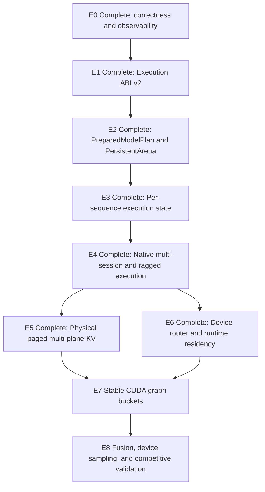

# Ferrule Execution Roadmap

_Last updated: 2026-07-13_

This is the canonical forward-looking roadmap for Ferrule. Historical bring-up
notes and old profiles belong in version history rather than the active
architecture documentation.

Related canonical documents:

- [`execution-engine-architecture.md`](execution-engine-architecture.md) — implemented
  E1–E6 execution ABI, prepared plans, sequence state, arenas, native batches,
  physical paged KV, device routing, and runtime residency ownership, plus the E7
  graph design.

- [`ferrule_arch.md`](ferrule_arch.md) — repository-wide architecture and model
  bring-up boundaries.
- [`runtime-graph-architecture.md`](runtime-graph-architecture.md) —
  device-independent graph IR; this is distinct from the execution ABI and CUDA
  graph capture.
- [`storage-residency-architecture.md`](storage-residency-architecture.md) —
  storage tiers, replicas, transfers, and residency policy.

---

## 1. North star

Ferrule should reach vLLM/SGLang-class execution ownership without copying their
framework surface:

```text
request / session / sampling
            │
            ▼
ferrule-runtime
  scheduler + admission + token budget
  sequence handles + physical KV lifecycle
  residency and executable-cache policy
            │ ExecutionBatch
            ▼
prepared model executor
  PreparedModelPlan
  SequenceExecutionState[]
  PersistentArena lease
  eager / graph lowering through one device pipeline
            │ stable buffers + page tables + expert indirection
            ▼
ferrule-cuda
  allocations / pools / streams / events
  kernels / graph exec / physical device resources
```

The execution architecture is complete only when all of the following are true:

1. One immutable `PreparedModelPlan` serves multiple independent sequences.
2. Runner-global `position`, KV, compressor state, and graph state are no longer
   the execution identity.
3. `ExecutionBatch` natively expresses ragged prefill, multi-row decode, and mixed
   batches with explicit state and KV bindings.
4. Runtime sequence/KV handles and physical CUDA state have one lifecycle source
   of truth.
5. Eager and CUDA graph execution call the same allocation-free `*_into` device
   pipeline.
6. A warm fixed bucket performs zero device allocation, zero intermediate hidden
   D2H, zero stream-wide synchronization, and no fixed-weight upload.
7. CUDA graph execs are reused across many iterations instead of being tied to one
   token, position, and route set.

---

## 2. Current verified baseline

Hardware and model:

- NVIDIA GB10, CUDA 13.0, `sm_121a`;
- `models/DeepSeek-V4-Flash-DSpark`;
- 43 layers, hidden size 4096, 256 routed experts/layer, top-6, FP4 routed
  experts.

Correctness baseline:

- the canonical five-token `Hello` fixture remains bit-exact at 43 layers and its
  cold continuation remains `[30594, 1175]`;
- after the GB10 MMA/attention/MoE cut, the separate eight-token performance
  fixture is also bit-exact at every one of 43 layers: `first_diverging_layer =
  null`, all `max_abs_diff = 0.0`;
- that fixture's top-1 values at layers `1 / 5 / 23 / 43` are
  `78660 / 63887 / 39654 / 1162` for both batched and token-loop execution;
- the real-model 43-layer, 4096-token fixture completes prefill and one decode
  across position 4096, producing finite candidates `[5, 223]` with logits
  `[16.987421, 16.9719]`; this is a boundary smoke result, not yet a historical
  golden;
- short-window real-model eager prefill/decode produces finite top-1 candidates and
  preserves the established sequence position contract;
- RoPE growth, combined KV growth, deterministic route-ranked MoE reduction, and
  GPU compressor numerics remain covered.

The urgent `43L × 4096` performance incident is closed, although SOTA parity is not:

| GB10 single-sequence measurement | Before this cut | Current cut |
|---|---:|---:|
| `1L × 4096` full prefill | `27.25s` | approximately `2.72s` |
| `1L × 4096` measured layer body | `26.34s` | approximately `1.66s` |
| `5L × 4096` full prefill | not recorded | `13.14s` |
| `43L × 4096` prefill | exceeded six minutes; projected about 19 minutes | `118.651s` |
| full 43L boundary test including continuation | did not complete | `124.16s` |

The measured layer body improved about `15.9×`. The completed 43-layer prefill is
about `34.5 prompt tok/s`; it replaces the previous six-minute non-result with a
real end-to-end measurement. FP8 artifact projections now use GB10 MMA, official
BF16 `wo_a` semantics use grouped MMA, 512-wide sparse attention is warp
cooperative, and routed MoE uses expert-major segments plus deterministic
route-rank reduction. Scalar/F32/tile implementations remain explicit differential
oracles and fallbacks.

That historical 4096-token run was dominated by compressor/indexer work,
layer-boundary HC host/device bridges, expert load/upload, metadata traffic, and
allocation churn, recording approximately `19.8 GB` H2D, `13.1 GB` D2H, and `368k`
device allocations. E2–E6 subsequently addressed the prepared-resource, arena, KV,
batching, and residency ownership classes; these historical counters are not a claim
about the current serving path.

These numbers remain a historical single-sequence performance baseline, not the
current serving architecture. E4 owns native packed decode, ragged prefill, and mixed
batches; E5 owns authoritative physical paged multi-plane CUDA KV with COW,
preemption/restore, and exact-prefix sharing; E6 owns device route/group resolution
and runtime-controlled expert slots, generations, leases, and publication. The CUDA
side now owns only physical source/staging/upload/table resources for residency.
Compressor control and stable CUDA graph buckets remain later work. The model-neutral
Axum/Hyper/Tokio serving substrate is now active: bounded async handlers feed one
model-owner thread, OpenAI chat/text completion streams carry usage and `[DONE]`, and
disconnect cancellation releases request state at a model-step boundary. Official
vLLM/SGLang benchmark results are not yet recorded. The earlier five-token
`17.47–17.75s` prefill and `0.80–0.824 tok/s` decode snapshot predates this kernel cut
and must not be presented as current headline throughput.

---

## 3. Canonical terminology

| Term | Meaning |
|---|---|
| `EnginePlan` | Existing model support/policy report. It says what a model requires; it is not an executable plan. |
| `GraphProgram` | Device-independent semantic graph IR plus external bindings. It is not a CUDA prepared plan. |
| `PreparedModelPlan` | Immutable model-global executable description: validated layer recipes, typed prepared handles, expert catalog, KV schema, and capabilities. |

| `SequenceExecutionState` | Backend/model state for one logical sequence: committed cursor, attention/compressor/indexer state, physical KV binding, and speculation state. |
| `PersistentArena` | Reusable scratch and stable metadata buffers keyed by phase/shape bucket. It is not authoritative sequence state. |
| `ExecutionBatch` | Packed/ragged execution command containing explicit sequence spans, positions, state slots, KV bindings, forward phases, and logits requests. |
| CUDA graph bucket | A cached graph exec over a stable prepared plan and arena bucket; dynamic values are patched through stable device metadata. |

Critical distinctions:

```text
EnginePlan != PreparedModelPlan
GraphProgram != PreparedModelPlan
PersistentArena != SequenceExecutionState
runtime SessionState != backend SequenceExecutionState
CUDA driver graph != runtime GraphProgram
```

---

## 4. Dependency graph



Serving is unlocked after E4 plus the first E5 physical-KV slice. Prefix reuse and
preemption require E5. DSpark requires E3 lifecycle isolation, E5 rollback-safe
KV, and E6 stable expert state.

---

## 5. Global invariants

Every phase must preserve these invariants:

### Correctness

- CPU/component reference, layer/attention checkpoints, deterministic ranked MoE
  reduction, compressor parity, and token-loop prefill remain available as diagnostic
  oracles. Token-loop execution is not a production prefill implementation.
- The 43-layer batched/token-loop diagnostic result remains elementwise `0.0` unless
  a deliberately documented numerical contract replaces bit-exactness.
- Residency, batching, graph mode, and cache placement must not change model
  semantics.
- An execution error must never be silently treated as a committed step. E3 owns
  explicit `SequenceExecutionState` commit/poison/reset semantics; E5 owns physical
  KV reserve/commit/rollback.
- State generation and resource generation are validated before execution; stale
  handles are rejected.

### Ownership

- Model code owns semantics and schemas, not request queues or CUDA graph policy.
- Runtime owns request/session/sampling/scheduling and logical resource lifecycle,
  not DSV4 tensor names or CUDA buffers.
- Backend owns device allocations, streams/events, physical resources, arenas, and
  prepared executable caches, not service-level policy.
- Sequence state, arena scratch, prepared weights, and diagnostics are separate
  lifetimes.

### Hot path

- No artifact discovery, environment parsing, string key construction, or weight
  upload in an execute call.
- No stream-wide synchronization as a semantic dependency.
- No host-dependent intermediate D2H after E4; diagnostics are opt-in and measured
  separately.
- No device allocation/free in a warm bucket after E2.
- Eager and graph modes use one `*_into` lowering after E2.

### Continuous benchmark gate

Every E1–E8 performance exit gate includes reproducible cold/warm measurements for
its affected scenarios. Report TTFT and ITL p50/p95, prefill/decode throughput, and
relevant allocation/copy/sync/cache counters at phase entry and exit. Headline runs
must keep profiling synchronizations disabled. This is a continuing regression gate
for each phase, not an E0 prerequisite or an E1 blocker.

---

# 6. Execution phases

## E0 — Correctness and observability gates

**Status: complete. The architecture-migration gate is closed, and its baseline
carried through completed E1.**

### Purpose

E0 was a bounded migration safety rail, not a phase for accumulating harnesses for
its own sake. It froze observable behavior and exposed hidden
allocation/copy/synchronization costs before KV, compressor, expert, workspace,
and graph ownership move. The independent oracles and incident attribution now
provide the required baseline for that migration. New lifecycle and benchmark
gates belong to the phase whose invariant they protect; they do not reopen E0.

### Completed architecture-migration gate

- The 5L/43L batched-vs-token-loop oracle remains bit-exact after replacing scalar
  projections, grouped output, sparse attention, and MoE dispatch; all 43 layer
  differences are `0.0`.
- Scalar FP8, F32 grouped output, scalar sparse attention, and tile MoE remain
  explicit differential or fallback oracles rather than being deleted.
- The 43-layer, 4096-token real-model fixture crosses position 4096 and completes
  its continuation successfully.
- Short-window real-model eager decode covers the resident device path.
- Allocation, byte-copy, synchronization, expert-transfer, and MoE stage counters
  are sufficient to attribute the current long-context path.
- The prior six-minute non-completion performance incident is closed by the
  completed long-context run.

### Deferred phase-owned gates

- E2 owns allocation, arena-growth/D2D-preservation, and prepared-expert
  load/upload failure injection as part of prepared resource and arena lifecycle.
- E3 owns generalized `SequenceExecutionState` step commit, poison, reset, and
  compressor/indexer transition semantics beyond the E1 single-runner adapter.
- E5 owns physical KV reserve → execute → commit/rollback semantics.
- Every E1–E8 phase owns the global cold/warm p50/p95 benchmark gate for the paths
  it changes. This reporting is continuous regression evidence, not an E0 blocker.
- Arena hit/miss/grow and reusable executable-cache counters become populated E2/E7
  gates when those resources exist; E0 does not fabricate zero-value ownership.

### Correctness exit gate

- [x] 43L batched/token-loop parity remains all `0.0`.
- [x] Differential and fallback oracles remain available.
- [x] Real-model 4096-token prefill and >4096 continuation complete successfully.
- [x] The short-window eager decode correctness test covers resident execution.

### Observability and incident exit gate

- [x] The long-context baseline records wall time, launches, allocations, copies,
  bytes, expert loads, selected experts, and MoE attribution.
- [x] The six-minute non-completion incident has a completed, attributable
  full-model replacement measurement.

### Not in E0

- No claim of multi-session execution.
- No scheduler micro-optimization.
- No large fusion work.

---

## E1 — Execution ABI v2

**Status: complete.**

### Depends on

The completed E0 architecture-migration gate and its frozen oracle/counter baseline.

### Implementation checkpoint

- [x] The only public `ExecutionBatch` is the dependency-neutral definition in
  `ferrule-common/src/execution.rs`, with opaque `StateSlot`, `KvWriteSlot`, and
  `KvBlockId` identifiers, packed token/position/write/logits vectors, and ragged
  `ExecutionSequence` spans.
- [x] `ForwardMode`/`ForwardPhase`, strict `TopK(NonZeroU32)` versus `Full` output
  semantics, phase-specific query limits, capabilities, contiguous positions,
  block ranges, and KV write-slot rules are validated before execution.
- [x] `PreparedModelPlan` and `ModelBatchExecutor` define the neutral plan,
  validation, sequence-state lifecycle, and execution traits without runtime IDs,
  model-family types, or CUDA buffers.
- [x] Runtime-private `ScheduledBatch` retains request/session/KV correlation while
  public output contains only `input_row`; prefill lowering moves the action token
  `Vec` into the batch with `mem::take` rather than cloning model data.
- [x] E1 introduced a temporary one-sequence `TopKCompatibilityExecutor` over
  `TopKModelRunner`; E4 deleted it after `ResidentTopKDriver` migrated to the
  generic native multi-session executor. DSV4 still validates `max_top_k = 40`.
- [x] The old graph-specific execution ABI is deleted. Reference `GraphProgram`
  execution consumes the shared batch vocabulary through an explicit
  `ReferenceGraphSequenceState` slice, while its low-level `TensorData` output
  remains distinct from model-executor `ExecutionOutput`.
- [x] Prototype scheduler/preemption implementations, duplicate graph entrypoints,
  implicit reference-graph default state, and obsolete public aliases are deleted.
  The active runtime path is `scheduling::actions` + private `ScheduledBatch` +
  `ResidentScheduler`; external graph resource contracts live in
  `graph::external_bindings`.
- [x] Model mutation, output-contract, runtime-commit, token-callback, and output
  application failures enter fail/poison handling. A failed KV free keeps ownership
  in the failed ledger, and a poisoned executor cannot yield its runner.
- [x] The migration changed neither DSV4 mathematics nor CUDA kernels.

### Correctness exit gate

- [x] Validation covers ragged spans, mixed mode, duplicate state slots, phase and
  capability limits, position continuity, block ranges, write slots, and strict
  top-k/full output contracts.
- [x] The E1 single-sequence migration path preserved resident-driver and eager
  behavior, including DSV4's real CUDA top-k limit; E4 later removed that adapter.
- [x] No duplicate public `ExecutionBatch` definition remains after migration;
  reference graph state is passed explicitly.
- [x] Failure paths do not silently return a mutated compatibility runner as clean.

### Performance exit gate

- [x] Prefill ABI lowering transfers the scheduler action token `Vec` with
  `mem::take`; it does not clone model data.
- [x] The 43-layer fixture remains bit-exact at all 43 layers, and no DSV4 math or
  CUDA kernel changed in E1.

### Not in E1

- No native multi-session or mixed execution is claimed; the compatibility adapter
  remains single-sequence.
- Current runtime `KvHandle` is not a physical page binding.
- No prepared DSV4 resource plan, persistent arena, or physical paged KV is claimed.

---

## E2 — `PreparedModelPlan` and `PersistentArena`

**Status: complete.**

### Depends on

The completed E1 execution ABI and compatibility checkpoint.

### Implementation checkpoint

- [x] `PreparedModel<R>` implements the neutral `PreparedModelPlan` contract, while
  `DeepSeekV4PreparedModelPlan` owns validated immutable layers, expert catalog, KV
  schema, truthful capabilities, and a prepare-time execution-policy snapshot.
- [x] `SequenceStateCore`, borrowed `PreparedStepBinding`, `ExecutionShapeKey`, and
  `PersistentArenaPool` live in the model-neutral execution layer; DSV4 composes
  them instead of defining parallel lifecycle vocabulary.
- [x] Artifact matrix slices, cache-key/row-slice helpers, generic SwiGLU structure,
  and CPU/CUDA backend selection moved out of the DSV4 model directory.
- [x] Environment-derived DSV4 policy is resolved only during prepare. The model
  hot path contains no environment reads, and fixed artifact resources are reused
  after bucket warmup.
- [x] Eager decode and prefill use caller-owned `*_into` buffers under one exact
  phase/shape arena lease. The 43-layer model deduplicates layer scratch by exact
  shape from 43 copies to 3 variants.
- [x] Token-specific one-shot CUDA graph execution, host→CUDA→host production
  bridges, duplicate CUDA forwarding wrappers, and unused experimental MoE paths
  were deleted rather than retained beside the prepared path.
- [x] GB10 fixed-bucket replay gates report zero device allocation attempts, zero
  allocation bytes, zero fixed artifact uploads, and zero arena miss/grow for both
  decode and prefill when sequence state, token/route, and expert generation are
  held fixed. Dynamic expert-generation changes remain owned by E6.

### Deliverables

- Extract immutable prepared model resources from DSV4 runner/operator cache:
  - validated layer recipes;
  - typed linear/norm/HC/sink/router/compressor/output handles;
  - immutable expert catalog;
  - KV layout schema;
  - kernel/fusion policy and execution capabilities.
- Resolve artifact tensors, environment-derived execution policy, and string cache
  keys only during prepare.
- Introduce `PreparedStepBinding` for positions, KV lengths/slots, route count,
  expert generation, and logits intent.
- Introduce `PersistentArenaPool` keyed by exact phase/shape buckets.
- Consolidate the current eager decode layer arena and MoE workspaces under one
  arena lease.
- Add deterministic failure injection for allocation, arena acquire/grow and D2D
  preservation, prepared-expert load/upload, and resource installation. A failed
  prepare or grow operation must not publish a partial plan, arena, or expert
  handle.
- Add strict allocation-free `*_into` CUDA APIs where the eager device pipeline
  benefits from stable output ownership.
- Split layer execution into reusable device stages:
  - HC-pre + norm;
  - attention query/KV/top-k/output;
  - HC-post;
  - FFN HC-pre + norm;
  - prepared shared/routed MoE accumulation;
  - final HC-post.
- Keep prefill HC/hidden ping-pong on device across all layers.
- Keep stage boundaries suitable for future E7 graph lowering without adding a
  graph execution mode in E2.

### Correctness exit gate

- [x] The unified prepared path preserves the frozen 1/5/43-layer oracle; the
  parallel old execution path was deleted after migration instead of retained.
- [x] Arena reuse, exact-bucket switching, failed construction, and reset tests
  produce no stale or partially published bucket.
- [x] Allocation/arena/expert/sequence-transition failpoints leave previously
  published resources valid and releasable, with no partial generation visible.
- [x] Opt-in parity/trace downloads are outside normal execution and do not alter
  prepared state or default-path counters.

### Performance exit gate

For a warm fixed bucket:

- [x] device allocation attempts and allocation bytes/step: `0`;
- [x] fixed-weight uploads/step: `0`;
- [x] layer-boundary HC/hidden D2H/H2D: `0`;
- [x] arena miss/grow only during prepare or first bucket warmup.

The zero-allocation gate fixes the exact phase/shape bucket, sequence checkpoint,
token/route, and expert generation. Loading a newly selected expert is a residency
generation change and is intentionally measured under E6 rather than hidden inside
the E2 bucket gate.

### Not in E2

- Multiple active sequences are not required yet.
- Full device router/residency is not required yet.
- Do not introduce long-lived graph replay before state bindings are explicit.

---

## E3 — Per-sequence execution state

**Status: complete.**

### Depends on

E2 prepared model and arena ownership.

### Implementation checkpoint

- [x] Add `DeepSeekV4SequenceExecutionState` and make the legacy runner wrap one
  default sequence instead of owning parallel runner-global state/position/predictor
  fields.
- [x] Add generation-bound `begin_step` / `commit_step` / poison semantics; decode
  and batched prefill publish the committed cursor only after successful hidden/KV
  work.
- [x] Add reset reuse/release modes, host-semantic lifecycle guards, stale-binding
  invalidation, and poisoned-state rejection. E3's temporary model-local D2D
  checkpoint/fork mechanism was deleted after E5 made page rollback,
  preempt/restore, and exact-prefix COW authoritative.
- [x] Add focused cursor isolation, interleaving, stale-binding, and failed-step
  tests.
- [x] Move physical CUDA window/combined/indexer KV from backend-global layer maps
  into typed per-sequence bindings and add D2D physical checkpoint/restore/fork.
- [x] Add real two-sequence CUDA interleaving parity over shared prepared resources;
  reset/release of A leaves B unchanged.
- [x] Add compressor/indexer state-transition failure injection and poisoned-state
  integration coverage.
- [x] Separate eager arena ownership from semantic layer state and complete
  release/backend-shutdown wiring.
- [x] Replace prepared/sequence parallel `Vec<Option<_>>` slots with fully initialized
  vectors; execution contains no lazy bind/state initialization path.
- [x] Move expert planner/handles out of sequence checkpoints into backend-global
  layer expert runtime shared across serial sequences. This was the E3 intermediate
  state; E6 later replaced CUDA logical residency with runtime control while retaining
  planners/CPU handles only for the reference path.
- [x] Remove duplicate host-only checkpoint/fork APIs and reset-time expert/arena
  destruction.

### Deliverables

- Introduce `SequenceExecutionState` with:
  - committed position;
  - per-layer attention/compressor/indexer state;
  - physical CUDA state binding;
  - sequence predictor/speculation state;
  - generation/version handle.
- Separate DSV4 layer state into:
  - immutable prepared layer;
  - per-sequence semantic state;
  - backend-global expert/runtime state;
  - per-batch arena;
  - diagnostics.
- Move CUDA window/combined/indexer KV out of backend-global layer-keyed maps and
  into typed per-sequence state.
- Replace parallel layer/state `Vec<Option<_>>` with prepared and sequence vectors
  that have explicit initialization contracts.
- Add explicit lifecycle:
  - create;
  - reset with capacity reuse/release modes;
  - checkpoint/restore/fork;
  - release;
  - backend shutdown.
- Define explicit `SequenceExecutionState` step semantics: stage mutations, publish
  committed cursor/compressor/indexer state only after success, poison state when
  rollback is unavailable, and require reset/release before reuse.
- Inject failures at compressor/indexer state-transition boundaries and verify that
  uncommitted state is never exposed as reusable.
- Initial CUDA checkpoint is a D2D bit-copy; graph and diagnostics are not part of
  a checkpoint.
- Remove runner-global position/state as the physical source of truth.
- Keep the legacy runner as a wrapper over one default sequence and arena.

### Correctness exit gate

- Two sequences interleaved serially match independent execution bit-exactly.
- Reset/free of A cannot change B.
- A failed step does not expose A as committed, cannot contaminate B, and leaves A
  observably poisoned until explicit reset/release when rollback is unavailable.
- Multi-turn continuation no longer reads runner-global position.

### Performance exit gate

- Sequence switch does not upload fixed weights or clear global expert residency.
- Create/free does not destroy shared arenas or prepared resources.

### Completion validation

- `just test-model`: 151 tests plus local descriptor smoke pass.
- `cargo test -p ferrule-runtime --lib --tests`: 211 unit tests, 15 local
  integration tests, 12 runtime integration tests, and 8 storage tests pass.
- CUDA failpoint fire-once/disarm passes through `cargo oxide`.
- Real DSV4 CUDA gates established transition-failure poison isolation, serial
  two-sequence bit-exact isolation, release/shutdown, eager decode correctness, and
  L0 prefill parity. E4/E5 supersede the old D2D checkpoint gate with packed
  multi-session and page-managed rollback/COW gates.

### Not in E3

- This proves sequence isolation, not continuous batching.
- Initial execution may remain on one CUDA stream.

---

## E4 - Native multi-session and ragged execution

**Status: complete.**

### Depends on

E3 explicit sequence state.

### Implementation checkpoint

- [x] Add `MultiSessionRunner` trait in `ferrule-model/src/runner.rs` extending
  `TopKModelRunner` with `with_sequence_state`, `fork_sequence_state`,
  `reset_sequence_state`, `release_sequence_state`, and
  `multi_session_capabilities`. DSV4 implements this trait; the runtime executor
  is fully generic.
- [x] Add `NativeMultiSessionExecutor<R: MultiSessionRunner>` in
  `ferrule-runtime/src/engine/native_executor.rs`. It accepts multi-sequence
  decode, ragged prefill, and mixed prefill/decode batches through the neutral
  `ExecutionBatch` ABI. Each sequence is routed through `with_sequence_state`,
  and output rows are correlated by `input_row`.
- [x] Rewrite `ResidentTopKDriver` to use `NativeMultiSessionExecutor` instead
  of `TopKCompatibilityExecutor`. The driver now requires `R: MultiSessionRunner`,
  manages per-session `R::SequenceState` objects (forked on admission, released
  on finish/cancel/fail), and routes execution through the native executor.
- [x] Implement decode-priority token-budget scheduling with round-robin prefill
  fairness. `SchedulerAction::Execute` packs multiple ragged prefills plus decode
  rows up to `max_batch_tokens`, and lowers true `Prefill`/`Decode`/`Mixed` batches.
- [x] DSV4 `DeepSeekV4Runner` implements `MultiSessionRunner` with truthful
  `max_sequences = usize::MAX`, `supports_mixed = true`, and
  `logits_row_policy = LastPerSequence`.
- [x] Update CLI (`bench_interactive`) and local DSV4 test to use the new
  driver API (`executor().runner()` instead of `compatibility_executor()`).
- [x] Delete the production single-token/append-prefill decode fallback. One-token
  and appended segments now use the same batched prefill pipeline; the explicit
  token-loop layer trace remains only as a differential oracle.
- [x] Add native batch-vs-serial exact-output/state tests, sequence reset isolation,
  mixed row-correlation tests, and scheduler token-budget tests. The real 1-layer
  DSV4 CUDA ragged batch-vs-serial/reset-isolation gate passes locally.
- [x] Add a model-neutral whole-batch override and three-phase backend transaction
  hooks to `MultiSessionRunner`. The generic serial path remains the correctness
  fallback; a packed backend can consume the complete `ExecutionBatch` without
  leaking model-specific types into runtime.
- [x] DSV4 now overrides the whole-batch hook for CUDA paged decode batches of two
  or more sequences. Execution is layer-major: HC pre/post, RMS normalization,
  deterministic segmented MoE, final HC/norm, and chunked output-head top-k operate
  on packed rows. Output-head rows preserve single-row tie ordering and reuse exact
  `(batch_rows, top_k)` workspaces across changing batch sizes.
- [x] Real local DSV4 CUDA batch-2 and batch-4 resident waves are bit-exact with a
  serial single-sequence baseline for both token IDs and logit bit patterns. Native
  packed counters prove the whole-batch hook was used after page reuse.
- [x] Packed decode attention is now a real rows pipeline for both compressed and
  non-compressed layers: Qa/Qb/KV and index-query projections, indexed RoPE,
  window/main/indexer paged scatters, paged indexer top-k, and single/dual-plane
  sparse attention execute over packed rows. Non-compressed layers no longer switch
  paged bindings per row; only fixed-size recurrent compressor transitions remain
  sequence-owned.
- [x] The local batch-2/4 gate now proves bit-exact token/logit output, fewer
  launches and H2D metadata copies per token than paged serial dispatch, zero
  warm batch-4 device allocations, and higher aggregate batch-4 throughput.
- [x] The DSV4 whole-batch override now uses one mode-neutral packed pipeline for
  decode, ragged prefill, and mixed prefill/decode. Row-to-sequence selectors and
  per-row causal visible lengths address shared sequence page tables without
  duplicating mutable state; only recurrent compressor transitions remain ordered
  sequence-major. A real local mixed/ragged gate is bit-exact with serial execution.
- [x] E4's required CUDA kernel gate and real local packed decode, ragged/mixed, and
  exact-prefix/COW gates pass; the current aggregate suite counts are recorded in the
  E6 completion validation below.

### Deliverables

- Native multi-row decode.
- Ragged chunked prefill.
- Mixed prefill/decode batches.
- Device-resident compressor/indexer ring metadata.
- Remove appended-prefill token-loop fallback.
- Batch HC/attention/MoE over real sequence rows.
- Preserve deterministic route-rank reduction for each sequence/token.
- Add token-budget, fairness, and decode-latency-aware scheduling.
- Keep physical paging behind the model-neutral batch ABI; E5 supplies the
  authoritative implementation without changing E4 scheduler semantics.

### Correctness exit gate

- Batched and serial execution are bit-exact for varying sequence lengths,
  positions, and phases.
- Cancel/free of one sequence cannot change another.
- Mixed batch row correlation and logits intent are exact.

### Performance exit gate

- Batch 2/4 aggregate throughput exceeds serial dispatch.
- Host calls, launches/token, and metadata copies/token decrease.
- Warm bucket allocations remain zero.

### Not in E4

- Physical page allocation, paged attention, prefix reuse, and preemption are E5
  responsibilities rather than E4 scheduler responsibilities.

---

## E5 - Physical paged multi-plane KV

**Status: complete.**

### Depends on

E3 sequence ownership and E4 batch bindings.

### Implementation checkpoint

- [x] Add model-agnostic `KvLayoutSchema` trait, `KvPlaneDescriptor`,
  `KvPageId`, and `KvReservation` types in `ferrule-common/src/execution.rs`.
  Models implement `KvLayoutSchema` to describe their KV planes (window,
  compressed, indexer, metadata), page size, and max sequence length.
- [x] Add `KvPageManager` in `ferrule-runtime/src/cache/page_manager.rs` as the
  logical page allocation, free-list, refcount, and block-table owner. It implements
  reserve -> commit/rollback, OOM-safe partial reservation cleanup, page reuse,
  stale-generation rejection, shared-prefix fork, partial-tail COW, preempt/restore,
  compact block/write bindings, and utilization/fragmentation stats.
- [x] Implement DSV4 `KvLayoutSchema` planes for window latent KV, compressed/main
  KV, indexer KV, compressor metadata, and indexer metadata.
- [x] Connect optional `KvPageManager` transactions to `ResidentTopKDriver`:
  admission allocates, execute reserves, failure rolls back, success commits, and
  finish/fail releases. A truthful `Paged` backend receives compact block IDs and
  write slots through `ExecutionBatch`; DSV4 reports `Paged` only after its bounded
  physical pool has been configured.
- [x] Add page boundary, >4096, growth, partial-OOM rollback, COW rollback,
  preempt/restore, refcount, reuse, and DSV4 window-ring-wrap tests. Exact-prefix
  fork additionally validates the expected committed position and all refcount
  increments before publishing, including failure-atomic stale-position and
  refcount-overflow tests.
- [x] Add model-neutral `CudaKvPagePool` with one preallocated contiguous buffer per
  token-scaled plane, fixed physical slots, compact page-table lowering, range-only
  COW, failure-atomic reserve/commit/rollback, page reuse, host preempt/restore,
  utilization, and external-fragmentation counters. Pool growth never copies history.
- [x] Extend the generic runner/executor/driver lifecycle with backend physical
  `prepare -> execute -> commit/rollback` hooks. Runtime `KvReservation` objects are
  passed through unchanged, so CUDA does not infer or duplicate COW/refcount policy;
  runtime also forwards page IDs whose global refcount reaches zero for physical reuse.
  Packed logical and physical commits validate the complete batch before publishing,
  preventing partial multi-sequence commit or stranded provisional slots.
- [x] Add model-neutral single- and dual-plane paged sparse-attention kernels,
  compact combined-ring index conversion, and paged-plane address validation. Add
  DSV4 paged indexer top-k variants without changing their query/RoPE/ranking math.
- [x] Wire provisional DSV4 window, main-compressed, and indexer data-plane writes to
  physical slots. Paged decode reads window/main data directly through paged attention
  and reads indexer data through paged top-k kernels; it does not gather KV history.
- [x] Real `cargo oxide` CUDA tests pass for COW/rollback isolation, page-boundary and
  non-zero-layer paged attention parity, dual-plane ring conversion, and paged indexer
  parity. The full required CUDA kernel gate also passes.
- [x] Move compressor/indexer recurrent sequence metadata and append state to
  device-resident sequence state. Recurrent prefill seed is one kernel and recurrent
  decode append/boundary handling no longer performs D2H/H2D metadata round trips.
- [x] Connect model-neutral physical preempt/restore hooks through runner, executor,
  scheduler, and `ResidentTopKDriver`. Only exclusively referenced pages are evicted;
  backend-owned host snapshots are restored exactly or released when runtime refcounts
  reach zero. The driver preempt/restore continuation test passes.
- [x] Fresh serving admission constructs position-zero model state directly instead
  of forking the runner default session. Diagnostics use explicit page-managed
  sequences; serving prefix forks use the exact prepared/publish transaction.
- [x] Connect exact-prefix fork as one prepared driver transaction across scheduler
  state, model recurrent state, and the runtime block table. DSV4 copies only
  O(layers) continuation metadata, shares physical prefix pages, rebuilds bindings
  on the next batch, and uses partial-tail COW on suffix append. A real local CUDA
  fork/COW gate is bit-exact with full serial execution and verifies page reuse.
- [x] Delete fallback contiguous DSV4 `kv_cache`, `combined_kv_cache`, and
  `indexer_kv_cache` storage and all growth/copy paths. CUDA prefill, decode, mixed
  execution, inspect/generate/chat, parity, and long-context diagnostics now require
  resident or diagnostic page-managed bindings. CPU/reference host caches remain
  correctness infrastructure only.
- [x] Delete obsolete model checkpoint/restore and recurrent D2D clone APIs. Runtime
  reserve/rollback, physical preempt/restore, and exact-prefix COW are the only
  serving recovery/sharing semantics.

### Deliverables

- Define a DSV4 `KvLayoutSchema` for:
  - window latent KV;
  - compressed/main KV;
  - indexer KV;
  - compressor/indexer metadata planes.
- Runtime `KvPageManager` becomes the only allocation/refcount/block-table owner.
- CUDA backend owns physical plane pools and device page tables.
- Add physical KV reserve → execute → commit/rollback semantics. Reserved pages and
  lengths remain uncommitted until success; failure or cancellation rolls them back.
- Lower compact slot mappings and block tables into `ExecutionBatch`.
- Delete the independent layer-keyed DSV4 CUDA KV ledger.
- Support page reuse, refcount/COW, preemption/restore, and exact-prefix sharing.
- Keep host paged KV only as reference/test infrastructure.

### Correctness exit gate

- Page boundary, ring wrap, growth, and >4096 tests.
- Stale generation handles are rejected.
- Prefix sharing and post-prefix COW are correct.
- Preempt/restore is bit-exact with uninterrupted execution.
- Failure between reserve and commit restores the previous committed KV view.
- No leak, double free, or refcount corruption under cancellation/failure.

### Performance exit gate

- Appending/growing never copies full KV history.
- A batch updates compact page metadata only.
- Page utilization and fragmentation are observable.

### Not in E5

- Do not integrate radix lookup before physical pages/COW are authoritative.
- Do not enable DSpark before rollback is proven.

---

## E6 — Device router and runtime residency coordinator

**Status: complete.**

### Depends on

E4 native batching; required before E7 stable graphs.

### Implementation checkpoint

- [x] `ferrule-common` defines the model-neutral expert-residency ABI:
  model-qualified `ExpertKey`, stable `ExpertSlotId`/`ExpertSlotGeneration` bindings,
  selected-expert leases, selected/prefetch install intents, failure-atomic
  `prepare_install` → backend transfer → `publish_install`/`cancel_install`, and
  aggregate/per-layer stats.
- [x] `ferrule-runtime::ExpertResidencyController` owns one coordinator per layer.
  `NativeMultiSessionExecutor` lazily injects it before the first execution path that
  needs residency; the control remains attached to the runner and is reused when a
  clean runner is moved out and wrapped by another executor.
- [x] DSV4 CUDA consumes immutable source catalogs and owns staging caches, pinned
  upload sources, asynchronous upload tickets/events, resident device handles, and
  physical stable tables only. It allocates no CUDA-side CPU
  `ExpertStreamingPlanner` or `CpuExpertHandleStore` mirrors; those remain solely in
  the CPU/reference path.
- [x] Selected and prefetch transfers use pinned asynchronous uploads. Selected
  compute queues a wait on the upload event on the compute stream without host event
  synchronization or stream-wide synchronization.
- [x] Device publication/eviction kernels update stable pointer, expert-to-slot, and
  generation tables in place. Normal publication performs no table H2D copy and no
  stream-wide synchronization.
- [x] Selected demand deterministically cancels excess prefetch reservations. Any
  already-submitted upload ticket and its pinned/device resources remain retained in
  the abandoned/retired lists until completion events make them safe to release.
- [x] DSV4 operator counters expose aggregate runtime-controller residency stats in
  addition to physical upload, hit, wait, and eviction counters.
- [x] DSV4 score/hash route IDs and weights stay device-side; packed fixed-eight
  grouping and stable-slot resolution preserve complete route coverage and
  token-major route-rank reduction across mixed sequences.
- [x] The old CUDA planner/backend reconciliation, host pointer/weight dispatch,
  host `BTreeMap` segment grouping, segment metadata upload, and compatibility
  switches are removed.

### Correctness exit gate

- [x] Device route IDs/weights and stable-slot resolution match reference semantics.
- [x] Real packed batch-2/batch-4, ragged/mixed, exact-prefix fork/COW, and repeated
  sequence-residency reuse are exact.
- [x] Selected leases prevent eviction; stale generations, cancellation, transfer
  failure, and deterministic slot reuse are covered.

### Performance exit gate

For the implemented resident/publication paths:

- [x] full router-logit D2H: `0`;
- [x] per-layer pointer-array/route-weight H2D: `0`;
- [x] stable-table publication H2D copies and stream-wide sync: `0`;
- [x] selected upload dependency is a compute-stream event wait, not host or
  stream-wide synchronization;
- [x] repeated sequence execution reuses residency.

### Completion validation

- `ferrule-common`: 36 tests passed.
- `ferrule-model`: 179 unit tests plus integration coverage passed.
- `ferrule-runtime`: 292 tests passed with one expensive local test ignored.
- `ferrule-server`: 16 protocol/worker tests passed, including official-client payload
  shapes and disconnect cancellation without worker poisoning.
- `ferrule-cli`: 14 tests passed.
- `just test-cuda-required` passed after the serving changes.
- CUDA `expert_slot_resolve`: 5 tests passed.
- Real DSV4 CUDA gates passed for packed batch-2/batch-4 exactness, ragged/mixed
  exactness, prefix-fork COW exactness, repeated sequence residency reuse, and the
  latest 43-layer resident runtime-driver path.
- Explicit device router/hash/paged-decode CUDA gates passed with zero wrapper
  copies or stream-wide synchronization where required.

### Not in E6

- Distributed expert parallelism, NCCL/DeepEP, RDMA, and remote cache are later.

---

## E7 — Stable CUDA graph buckets

**Status: planned after completed E2/E4/E5/E6.**

### Depends on

Prepared arenas, native batches, stable physical KV, and stable expert indirection.

### Deliverables

- Graph bucket key includes forward mode, batch/query bucket, logits mode, KV
  schema, route capacity, and arena/resource generation.
- Graphs read stable arena inputs and device metadata slots.
- Each step patches token, position, length, page, route, and logits metadata.
- Graph lifecycle belongs to backend executable cache, not runner or sequence state.
- Remove `replays_remaining = 1` semantics.
- Prefer piecewise/breakable graphs; residency misses and unsupported shapes may
  fall back to the same eager pipeline.
- Capture closure permits only kernels, D2D copies, and device memset.

### Correctness exit gate

- At least 100 consecutive replays in one bucket.
- Multi-token, multi-sequence, and page-boundary eager/replay parity.
- No stale token, route, KV pointer, or resource generation.
- Capture failure cannot advance live sequence state.

### Performance exit gate

- recapture/token after warmup: `0` for fixed workloads;
- graph hit rate target: `>=95%` for a fixed serving scenario;
- replay allocation and stream-wide sync: `0`;
- CPU enqueue cost, launches, and ITL improve over E6 eager.

### Not in E7

- Do not require a monolithic full-model graph.
- Do not capture selected-expert I/O or host policy.

---

## E8 — Fusion, device sampling, and competitive validation

**Status: final optimization phase for this roadmap.**

### Depends on

Stable E7 execution shape and profiling.

### Deliverables

Only profiler-justified work:

- projection + norm + RoPE fusion;
- HC + adjacent norm/residual fusion;
- WO-A/output projection tuning;
- router + top-k + group compact fusion;
- grouped FP4 packing/dispatch tuning;
- output head + device sampling;
- bucket autotuning;
- [x] model-neutral OpenAI chat/text API, SSE streaming, bounded admission/fanout,
  per-request EOS policy, and disconnect cancellation;
- [ ] production metrics/profiling endpoints, device sampling, and structured masks;
- DSpark proposal/verify/rollback after E5/E6 state safety.

### Correctness exit gate

- Every fusion has an unfused differential test.
- Full-model parity/golden/quality gates pass.
- Any changed floating-point association has a documented contract; tolerances are
  never silently widened to hide a regression.

### Performance exit gate

Report both stage and end-to-end deltas:

- cold/warm TTFT p50/p95;
- ITL p50/p95;
- prefill/decode/aggregate tok/s;
- memory footprint and page utilization;
- graph/arena/expert hit rates;
- expert transfer bytes and waits;
- quality/parity note.

Comparisons with vLLM, SGLang, and TRT-LLM must fix model, artifact/quantization,
prompt/context, batch/concurrency, generated tokens, hardware, graph mode, and
quality settings.

---

## 7. Immediate implementation slices

E0–E6 and implementation Slices A–D are complete. They remain below as the historical
execution order and validation record. The active sequence is now: validate the new
OpenAI HTTP/SSE substrate with official vLLM/SGLang clients, implement E7 stable CUDA
graph buckets, then complete E8 device sampling, profiler-driven fusion, metrics, and
competitive reporting.

### Slice A — E1 neutral ABI and compatibility adapter

**Status: complete.**

- [x] Add the dependency-neutral execution vocabulary and validation.
- [x] Add `PreparedModelPlan` / `ModelBatchExecutor` lifecycle traits.
- [x] Add runtime-private `ScheduledBatch` lowering and a truthful single-sequence
  compatibility adapter.
- [x] Preserve DSV4 math and CUDA kernels unchanged.

**Gate: complete.** Common/model/runtime/CLI suites, the real resident-driver and
eager local tests, and 43-layer bit-exact parity pass.

### Slice B - E2 strict `*_into` primitives and shared-FFN arena

**Status: complete.**

- [x] Preserve the existing allocation counters and add arena hit/miss/grow
  attribution.
- [x] Add deterministic allocation and arena-growth/D2D-preservation failpoints.
- [x] Validate reusable SwiGLU workspace and allocation-free add-into primitives at
  the CUDA layer; DSV4 does not retain graph-only ownership for them.

**Gate:** rows=1 eager stage correctness; failed arena growth leaves the previous
resource generation usable.

**Validation:** eager DSV4 decode correctness, L0 prefill parity, failpoint
fire-once/disarm, and arena counter tracking cover the retained path.

### Slice C - E2 prepared decode arena and unified layer stages

**Status: complete.**

- [x] Extract prepared layer recipes and typed handles.
- [x] Move retained eager layer scratch under one arena lease.
- [x] Add prepared-expert load/upload/install failpoints before publishing handles.
- [x] Share layer prefix/suffix and attention query/KV/output stages between eager and
  graph.
- [x] Keep current host route preparation temporarily between prefix and suffix.

**Gate:** 1/5/43L bit-exact; warm eager uses zero device allocation; failed prepare
publishes no partial expert or plan resource.

**Validation:** 1/5/43L prefill parity all `0.0`; `deepseek_v4_cuda_l0_prefill_parity_local`
and `deepseek_v4_cuda_eager_graph_replay_parity_local` pass. The eager decode path now
uses the same arena `*_into` stages as graph capture for HC-pre/norm/post. Expert
upload failpoints in `install_uploaded_expert`, `materialize_selected_bundle_sync`,
and `prewarm_experts` reject publication before `self.experts.insert`.

### Slice D - E2 cross-layer device prefill

**Status: complete.**

- [x] Add whole-model HC ping-pong buffers.
- [x] Keep prompt HC/hidden rows on device across layers.
- [x] Download only explicit parity/final output.

**Gate:** 43L prefill `0.0`; layer-boundary HC D2H/H2D becomes zero; prefill wall
and copy counters improve.

**Validation:** 43L prefill parity all `0.0`; `deepseek_v4_cuda_l0_prefill_parity_local`
and `deepseek_v4_cuda_eager_graph_replay_parity_local` pass. The CUDA prefill path
now uses `prefill_start_cuda_device_chain` for every layer, keeping HC state on
device across all layers. Only the final HC state is downloaded when the caller
needs `Vec<f32>` for logits computation.

---

## 8. Global non-goals

- No flag-day rewrite of runner, attention, CUDA, and runtime in one change.
- No deletion of CPU/component oracle, token-loop parity, or deterministic reducer.
- No second execution ABI hidden in graph or scheduler modules.
- No DSV4-specific fields in generic runtime contracts.
- No claim that metadata-only `PagedSequenceKvCache` is production CUDA paged KV.
- No radix cache before physical pages/refcounts/COW.
- No optimization of token-specific one-shot graphs.
- No broad fusion before prepared execution and native batching.
- No stream synchronization used as a correctness fix.
- No duplicate hidden vectors used to fake DSpark columns.
- Distributed parallelism and remote storage are outside this roadmap's critical
  path, but the ownership model must not block them.

---

## 9. Required validation commands

Use the repository `justfile` so CUDA builds receive the detected GB10 target:

```bash
cargo fmt --all -- --check
cargo check --workspace
git diff --check
just test-model
just test-cuda-required
just test-cuda-required --test fp8_mma_smoke -- --nocapture
just test-cuda-required --test sparse_attention_warp -- --nocapture
just test-cuda-required --test moe_segment_smoke -- --nocapture
just oxide-test --features cuda --release -p ferrule-model \
  rope_table_grows_across_4096_boundary -- --ignored --nocapture
just oxide-test --features cuda --release -p ferrule-model \
  combined_kv_growth_preserves_device_values -- --ignored --nocapture
just test-dsv4-runtime-driver-local \
  deepseek_v4_cuda_l0_prefill_parity_local
just test-dsv4-runtime-driver-local \
  deepseek_v4_cuda_eager_graph_replay_parity_local
just dsv4-prefill-parity \
  models/DeepSeek-V4-Flash-DSpark Hello 43 cuda --chat --json
```

The expensive 43-layer boundary gate established the closed E0 baseline. Rerun it
before changing compressor/KV ownership or when a phase can affect long-context
semantics, not on every edit:

```bash
just test-dsv4-runtime-driver-local \
  deepseek_v4_cuda_continuation_crosses_4096_local
```

Each architectural phase must also add its own focused state-isolation,
allocation/synchronization, batch, page, residency, or graph tests before the next
phase starts.
