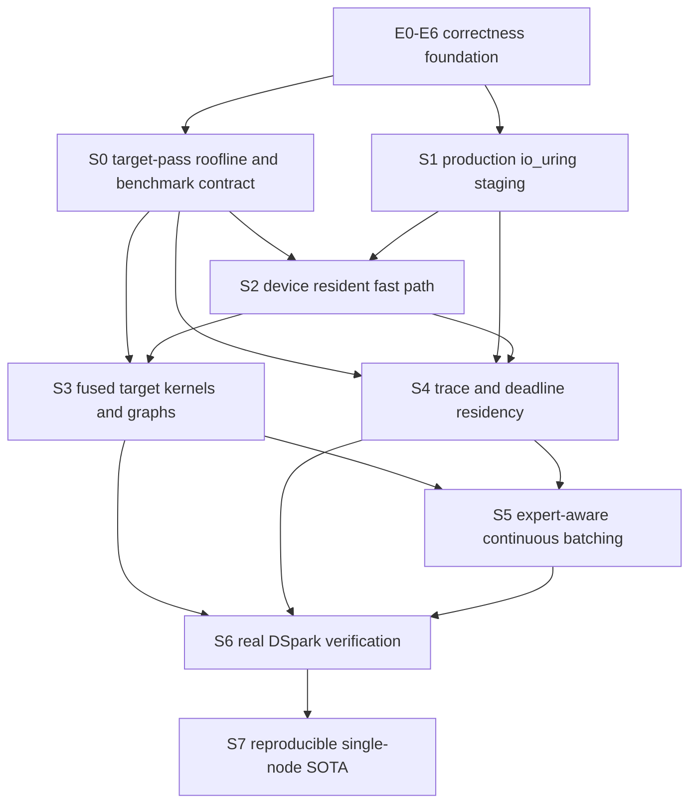

# Ferrule single-node SOTA roadmap

> Canonical execution plan for DeepSeek-V4-Flash-DSpark on one NVIDIA DGX Spark.
>
> Updated: 2026-07-14. This revision incorporates the production io_uring work,
> control-plane reductions, warm-residency measurements, concurrency 1/2/4 serving
> results, the local paper set under `papers/`, and the corrected conclusion that
> DSpark is likely required for the 15–17 accepted-token/s target.

## 1. North star

Ferrule's target is the fastest **lossless** DeepSeek-V4-Flash-DSpark runtime on one
DGX Spark / GB10 while preserving the checkpoint's real router, experts, attention,
KV semantics, and generated tokens.

The headline target is:

```text
15–17 accepted output tokens/s on one DGX Spark
```

This is an end-state **DSpark accepted-token throughput** target. It is not a claim
that a complete 43-layer target-model pass can or should execute once per emitted
token at 15–17 passes/s.

The distinction is mandatory:

```text
base-step throughput       complete exact target-model verification passes/s
accepted-token throughput  committed output tokens/s after proposal and verification

accepted tok/s = accepted tokens per target pass / target-pass seconds
```

A plausible end-state operating point is approximately four accepted tokens per
250 ms target verification pass. The actual optimum must be measured; it is not a
hard-coded architectural constant.

Single-node SOTA is not one number. A claim requires all of the following under a
published, reproducible workload:

1. competitive warm single-stream ITL at concurrency 1;
2. competitive cold and warm TTFT reported separately;
3. highest useful output-token throughput at concurrency 1/2/4;
4. exact target-model output with no expert approximation or skipped verification;
5. bounded operation inside 128 GB coherent memory without swap/page-cache collapse;
6. complete commands, environment, counters, and raw artifacts;
7. DSpark acceptance and rollback statistics when speculation is enabled.

Prediction and speculation are allowed only when semantically invisible:

```text
prediction miss -> extra I/O, fallback, or wait
speculation miss -> exact target rejection and rollback
never            -> changed router choice, substituted expert, or changed token
```

## 2. Current verified state

### 2.1 Correctness and execution foundation

The former E0–E6 foundation is complete:

- dependency-neutral execution ABI;
- prepared model plans and persistent arenas;
- explicit per-sequence state;
- native multi-session/ragged execution;
- physical paged multi-plane KV with rollback, COW, and prefix sharing;
- device router output;
- runtime-owned expert slots, generations, reservations, and leases.

The 43-layer CUDA path has repeatedly preserved deterministic greedy output. Stable
expert publication still uses the existing slot/generation/lease ABI and ordinary
device expert frames.

### 2.2 Completed prefetch and residency corrections

The CUDA path now has:

- one prefetch admission owner per token/layer;
- no unscored source-catalog fallback;
- current-token `L -> L+1` transition observation;
- a per-layer outstanding hard cap;
- host staging separated from stable-slot reservation;
- selected takeover from queued, staged, or uploading work;
- slab-aware admission with capacity reserved for selected demand;
- completed upload-guard reclamation before selected fallback;
- near-layer ordering rather than HashMap iteration order;
- safe cancellation of a prefetch reservation that would evict another expert
  selected by the same packed batch.

The last item fixed a real concurrency failure:

```text
prepared expert install became stale before publication
```

The failure occurred when prefetched expert A had reserved the slot occupied by B,
while the same exact packed routes selected both A and B. Ferrule now cancels only
the conflicting slot reservation, preserves staged/uploaded data, and lets selected
takeover reserve a non-conflicting slot. Concurrency 1/2/4 serving subsequently
completed without HTTP 500 failures.

### 2.3 Hardware constraints

```text
GPU                  NVIDIA GB10, sm_121a, coherent/integrated memory
Physical memory      approximately 127.6 GB shared by CPU, GPU, page cache, and staging
Checkpoint           48 safetensors shards, approximately 156 GiB
Routed experts       approximately 137.1 GiB before dense weights/KV/arenas
Storage              Samsung 3.7 TB NVMe, ext4
Kernel               Linux 6.11, io_uring enabled
```

The complete checkpoint cannot remain resident. Coherent memory removes a discrete
PCIe-VRAM ownership boundary, but it does not make copies, cache movement, stream
ordering, page faults, or LPDDR bandwidth free.

### 2.4 Verified storage and memory design

Direct GDS is not the production default on the tested GB10:

```text
GB10 model support       unsupported by gdscheck
NVMe P2PDMA              unsupported
cuFile compatibility     installed
registered device path   failed through nvidia_fs/nvfs
```

Read-only 1 GiB / 16 MiB-request measurements:

| Path | Throughput | Average latency |
|---|---:|---:|
| page cache cold after `DONTNEED` | 1.05 GiB/s | 14.47 ms |
| cuFile compatibility | 6.79 GiB/s | 2.03 ms |
| io_uring registered buffers, QD1 | 6.92 GiB/s | 1.61 ms |
| io_uring registered buffers, QD2 | **10.53 GiB/s** | **2.21 ms** |
| io_uring registered buffers, QD4 | 10.71 GiB/s | 5.07 ms |
| io_uring registered buffers, QD8 | 10.70 GiB/s | 10.51 ms |

QD2 is the production starting point. Higher QD adds deadline latency without useful
bandwidth on this device.

A real 12.75 MiB FP4 expert A/B was output-identical but showed:

| Backing | First use | Warm expert execution |
|---|---:|---:|
| ordinary device frame | 1,581.2 us | **518.2 us** |
| mapped pinned | **1,395.8 us** | 1,155.9 us |

Therefore the production hierarchy is:

```text
NVMe
 -> io_uring O_DIRECT
 -> registered CUDA page-locked slabs
 -> upload stream
 -> ordinary device expert frame
 -> stable slot publication
 -> FP4 Tensor Core execution
```

Mapped pinned memory is a staging tier, not the hot compute backing.

### 2.5 Production io_uring checkpoint

Implemented:

- `io-uring 0.7.13`;
- `O_DIRECT`;
- sparse fixed-file registration;
- 4 KiB-aligned registered buffers;
- QD2;
- configurable 16 MiB / 16-slab default;
- six expert tensor slices coalesced into two extents;
- CUDA page-locked registered slabs;
- direct tensor-subrange upload into ordinary device frames;
- slab leases retained by upload guards until completion;
- async prefetch and selected fallback;
- selected reserve equal to half the physical expert capacity of the slab pool;
- full I/O counters in runtime JSON.

The corrected 43-layer path has repeatedly reported:

```text
slab_exhaustions = 0
fallback         = 0
admission_skips  = 0
failed_extents   = 0
```

Parity evidence includes:

- one-layer mmap/io_uring row-0 logit: `-2.800501`;
- two-layer prefetch token: `83484` through both readers;
- 43-layer token: `19923` through both readers;
- 43-layer continuation after control-plane changes: `[19923, 3]`.

### 2.6 Control-plane checkpoint

Completed reductions:

```text
router D2H calls/token            86 -> 43
output-head D2H calls/token       64 -> 2
steady stream-wide syncs/token     5 -> 0
```

Current non-final generated-token control traffic is approximately:

```text
43 router compact D2H calls
 2 final output-head D2H calls
45 total D2H calls
```

The final request step still has one safe sequence-release synchronization when no
subsequent output-head read guarantees completion. It is not a steady-token barrier
and must be replaced by deferred/event-owned reclamation rather than deleted blindly.

Output-head chunk-local top-k results are now merged on device. Generated tokens remain
`[19923, 3]`. This removed host round trips but produced little wall-time improvement,
proving that the 1,010 MiB head scan and target compute dominate over the tiny result
copies.

### 2.7 Warm residency evidence

A 32-token warmup followed by four measured tokens produced:

| Measured token | Decode step | Resident hits | Upload hits | Cold misses | Expert load bytes |
|---:|---:|---:|---:|---:|---:|
| 1 | 1.090 s | 219 | 7 | 39 | 521,404,416 |
| 2 | 0.900 s | 221 | 12 | 35 | 494,665,728 |
| 3 | 0.937 s | 200 | 14 | 57 | 775,421,952 |
| 4 | 0.841 s | 209 | 17 | 49 | 655,097,856 |

The average measured expert payload was approximately `0.61 GB/token`, down from the
cold diagnostic's `1.07 GB/token`. Decode nevertheless remained around `0.84–1.09 s`.

This changes the optimization priority:

- I/O remains a hard physical constraint;
- warm residency is already moving payload toward the viable bandwidth range;
- the remaining wall time cannot be attributed to NVMe alone;
- the next required measurement is a resident/no-I/O exact target roofline.

### 2.8 Serving evidence

`vllm bench serve`, random data, input 8, output 8, four requests:

| Concurrency | Output throughput | Relative to C1 | p50 TPOT | Mean TTFT |
|---:|---:|---:|---:|---:|
| 1 | 0.78 tok/s | 1.00x | 963 ms | 3.46 s |
| 2 | 1.04 tok/s | 1.33x | 1,308 ms | 5.95 s |
| 4 | 1.15 tok/s | 1.47x | 1,652 ms | 15.72 s |

Artifacts are under:

```text
target/bench/vllm-serve/agent-run/sweep-output8/
```

Simple FIFO batching is therefore insufficient. Larger batches improve aggregate
throughput, but random requests enlarge the unique expert set and increase latency.
Ferrule requires expert-aware batch formation and an incremental expert-byte cost
model, not a policy that always maximizes row count.

### 2.9 Current physical conclusion

At 15 tok/s, the current warm average expert traffic alone would demand roughly:

```text
0.61 GB/token * 15 token/s = 9.15 GB/s
```

That is already close to the measured storage ceiling before dense weights, KV,
output head, unified-memory contention, and compute. The exact 43-layer target path is
currently about 13–15x slower than a 66.7 ms/token target.

Therefore:

- 15–17 complete target passes/s is not a credible near-term target;
- 15–17 accepted tokens/s remains possible only by combining a much faster target
  pass with multiple accepted tokens per verification pass;
- DSpark is likely a required performance phase, not optional polish.

## 3. Canonical architecture decisions

### 3.1 Expert state machine

```text
Predicted
  -> ReadQueued                 no stable slot
  -> Reading                    no stable slot
  -> RegisteredPinnedReady      no stable slot
  -> PromotionQueued
  -> SlotReserved               immediately before upload
  -> DeviceUploading
  -> Published
  -> Retired after last compute event
```

Selected demand may promote priority or replace a conflicting reservation. It never
changes the expert selected by the true router.

### 3.2 Two prediction horizons

Far horizon stages storage only:

- route traces and request-level activation fingerprints;
- exact hash layers;
- measured transition/sequence probabilities;
- bounded confidence and cutoff depth;
- no stable slot reservation.

Near horizon promotes to device:

- current-token route trajectory;
- selected demand and primarily `L+1` candidates;
- deadline, score, outstanding bytes, upload frames, and slot pressure;
- adaptive cutoff derived from measured read+promotion latency.

Unscored fallback is forbidden in online decode.

### 3.3 Device resident fast path

The desired steady layer path is:

```text
router on device
 -> resolve exact IDs against stable slot table on device
 -> all-hit: execute routed MoE without host materialization
 -> miss: append compact miss records and wake host service
 -> publish uploaded miss
 -> resume exact execution
```

The host should not receive all route weights or perform residency work for an all-hit
layer. Prediction remains advisory; stable slot generations remain authoritative.

### 3.4 Expert-aware batching

Batch admission optimizes incremental work, not raw row count:

```text
benefit = shared dense compute + shared resident experts + shared loaded experts
cost    = incremental unique expert bytes + deadline risk + latency debt + memory pressure
```

The scheduler may use predicted route fingerprints to group requests, but exact routing
and output remain unchanged. A request must not starve because its expert overlap is low.

### 3.5 Kernel strategy

FlashAttention, FlashInfer, DeepGEMM, and related systems are design references, not
drop-in replacements for the DSV4 path.

The first fusion target is routed FP4 MoE:

```text
stable route resolve
 -> token/expert grouping
 -> gate/up FP4
 -> SwiGLU
 -> down FP4
 -> route-weighted reduction
```

The implementation must support GB10 `sm_121a`, E2M1/UE8M0 weights, top-6 routing,
stable frames, and rows 1/2/4 before optimizing larger serving buckets.

### 3.6 DSpark/offloading co-design

Drafting, verification, and expert I/O share one governor:

- draft work predicts future target experts;
- cutoff layers limit speculative prefetch depth;
- accepted-token probability weights admission;
- rejected candidates may waste staging but never alter target output;
- verification batches target tokens and experts;
- rollback restores KV, route-visible, and scheduler-visible state.

The governor optimizes bytes per accepted token, not only acceptance or prefetch recall.

## 4. Dependency graph



S3 and S4 may proceed in parallel after S0 provides trustworthy component timing and
route traces.

# 5. SOTA phases

## S0 — Exact target-pass roofline and benchmark contract

**Status:** highest-priority active phase.

### Purpose

Determine where the remaining `0.84–1.09 s` exact target step is spent before another
large implementation change.

### Deliverables

1. A deterministic 43-layer route trace for a fixed prompt/continuation.
2. A resident/no-I/O replay where the exact selected working set is preinstalled.
3. CUDA-event timings for:
   - attention/MLA/HC;
   - router and stable route resolution;
   - shared expert;
   - routed FP4 MoE gate/up, activation, down, and reduction;
   - expert wait and upload dependency;
   - final norm and output head.
4. Launch count and launch-gap report.
5. Separate reports for:
   - cold storage;
   - warm real residency;
   - resident/no-I/O roofline;
   - output-head included and excluded.
6. Single-stream output length 64–128 and serving concurrency 1/2/4 artifacts.

### Exit gate

- the exact target pass is partitioned into measured GPU compute, host wait, I/O wait,
  output-head, and launch/control time;
- component totals explain the observed wall time within an explicitly documented error;
- all roofline modes produce the same exact tokens;
- the next kernel or scheduler change is justified by measured percentage, not intuition.

### Non-goals

- treating synchronization-heavy diagnostic timing as the headline result;
- claiming SOTA from output length 1/2/8;
- using a synthetic model or different quantization for the target roofline.

## S1 — Production io_uring registered staging

**Status:** architecture implemented and real-checkpoint validated; operational metrics
hardening remains.

### Completed

- O_DIRECT fixed-file io_uring backend;
- registered aligned CUDA-pinned slabs;
- QD2 and bounded physical admission;
- two-extent expert reconstruction;
- direct slab-to-device subrange upload;
- selected reserve and safe slab lifetime;
- mmap fallback;
- exact parity and zero exhaustion/fallback validation.

### Remaining deliverables

- histogram-quality read latency p50/p95;
- current/peak read and upload queue depth by deadline class;
- explicit selected-reserve utilization;
- repeated long-output serving validation;
- documented fallback behavior for unsupported filesystems.

### Exit gate

- byte identity for all six expert components;
- no buffer reuse before CQE and upload completion;
- no per-expert pageable `Vec -> pinned` copy in the io_uring CUDA path;
- no fallback/exhaustion under the production benchmark matrix;
- QD2 remains near the measured storage ceiling.

### Non-goals

- direct GDS as the default on unsupported GB10;
- mapped-pinned hot expert execution;
- increasing QD without a deadline benefit;
- rewriting the maintained io-uring crate ABI.

## S2 — Device-resident route and miss-only host path

**Depends on:** S0 and S1.

### Deliverables

1. Exact device route IDs/weights remain the compute source of truth.
2. Stable slot/generation resolution runs on device.
3. All-hit layers execute without host materialization.
4. Device compacts only misses into a bounded control queue.
5. Host handles miss promotion and publication without downloading resident routes.
6. Route-ready scheduling can enqueue `L+1` work before current routed compute completes.
7. Request completion uses event-owned deferred reclamation rather than a whole-stream sync.

### Correctness gate

- all-hit and miss paths match current tokens and layer outputs;
- a stale/canceled prefetch can never publish;
- selected experts cannot be evicted by a conflicting reservation;
- device miss queues are bounded and generation checked;
- fallback to the current host path remains available during rollout.

### Performance gate

- all-hit layers perform no route D2H;
- route D2H moves from fixed 43/token toward actual miss-layer traffic;
- resident/no-I/O target latency improves materially;
- miss handling does not increase selected late waits or wrong-prefetch bytes.

## S3 — Fused target kernels and stable graph buckets

**Depends on:** S0; the final graph path depends on S2.

### Priority 1: routed FP4 MoE

- profile rows 1/2/4 and selected-expert distributions;
- fuse or persist route resolve/grouping where profitable;
- implement GB10-specialized grouped gate/up FP4;
- fuse SwiGLU and hidden packing;
- implement grouped down FP4 and weighted reduction;
- retain scalar/eager correctness fallback.

### Priority 2: output head

Completed:

- chunk-local top-k stays on device;
- global top-k merge stays on device;
- final output D2H is 2 calls instead of 64.

Remaining:

- compact final ID/value into one transfer or perform greedy selection on device;
- profile/fuse chunk top-k and global merge;
- reduce the cost of the 1,010 MiB BF16 scan without changing logits semantics.

### Priority 3: attention/HC and graph replay

- fuse only profiler-proven material stages;
- stable decode graph buckets for rows 1/2/4;
- graph-safe KV and stable expert bindings;
- no allocation, D2H, or whole-stream sync inside capture;
- eager fallback for unsupported shapes and diagnostics.

### Exit gate

- exact numerical/token parity;
- routed MoE and total launch counts fall materially from the current approximately
  2.5k launches/token;
- graph replay survives sequence reuse, slot generations, KV growth, and rollback;
- throughput gains hold with real expert misses, not only a synthetic resident case.

## S4 — Trace-driven, deadline-aware residency

**Depends on:** S0–S2 metrics.

### Deliverables

- route traces with token, layer, selected rank, hit class, reuse distance, and timing;
- checkpoint-specific SRP/SCH-style locality measurements;
- offline LRU/LFU/frequency-recency/transition and Belady-oracle simulation;
- hotset sweep 6/8/12/16/24/32/48 per layer;
- far-horizon `StageToRegisteredPinned` and near-horizon `PromoteToDevice` actions;
- deadline queue ordered by selected status, target layer, confidence, completion estimate,
  and shard locality;
- on-time, late, wasted, evict-before-use, and wrong-prefetch byte counters;
- memory-pressure controller across device frames, slabs, KV, and arenas.

### Paper-derived constraint

DeepSeek-family routing locality is not assumed to match the strongest MoE models.
The local-routing paper places DeepSeek-V2-Lite around `37.9%` SRP for a 16-token
segment. Ferrule must measure this checkpoint rather than assuming LRU or Markov will
remove most misses.

### Exit gate

- production hotset is justified by hit-rate/latency/bytes curves;
- warm expert traffic improves from the current approximately `0.61 GB/token` average;
- wrong prefetch never blocks selected demand;
- the production policy approaches its trace-derived oracle enough to justify complexity;
- peak coherent-memory use retains a documented safety margin.

## S5 — Expert-aware continuous batching

**Depends on:** S3 and S4.

### Deliverables

1. Admission cost based on incremental unique expert bytes.
2. Predicted route fingerprints for request grouping.
3. Dynamic rows 1/2/4 selection instead of always filling the largest batch.
4. Cross-sequence sharing of resident and newly loaded experts.
5. Multi-token Tensor Core expert execution.
6. Fairness, starvation bounds, and latency debt.
7. Separate prefill/decode budgets and prefix-aware admission.
8. Telemetry for:
   - unique experts/layer/batch;
   - expert bytes/emitted token;
   - expert overlap across requests;
   - batch rows and GPU occupancy;
   - latency cost of grouping delay.

### Baseline to beat

For input 8/output 8:

```text
C1 0.78 tok/s
C2 1.04 tok/s
C4 1.15 tok/s
```

### Exit gate

- aggregate throughput scales materially better than the current C4/C1 ratio of 1.47x;
- bytes per emitted token do not increase faster than useful compute;
- p95 request latency remains within a published service objective;
- concurrency 1/2/4 passes cancellation, isolation, and residency-generation tests.

## S6 — Real DSpark proposal, verification, and I/O governor

**Depends on:** S3–S5 target-path maturity.

### Deliverables

- proposal state and draft execution;
- multiple candidate tokens per proposal;
- packed exact target verification;
- accepted-prefix commit and rejected-suffix rollback;
- KV, route, expert, output-head, and scheduler consistency across rollback;
- proposal-derived future expert staging;
- SP-MoE-style cutoff layer and deadline admission;
- adaptive proposal length based on acceptance, target-pass time, expert bytes, and memory;
- acceptance, candidates/verify, accepted tokens/pass, rejected-prefetch bytes, and rollback
  counters.

### Correctness gate

- greedy output is identical to non-speculative target decode;
- all rejection lengths and EOS/cancellation boundaries rollback exactly;
- rejected proposals cannot leave published logical state;
- predictor/draft failure cannot poison subsequent requests.

### Performance gate

- accepted tokens per exact 43-layer pass is consistently greater than one;
- accepted-token throughput improves after proposal, verification, I/O, and rollback cost;
- bytes per accepted token decreases;
- the measured operating point supports or falsifies the 15–17 tok/s target honestly.

## S7 — Reproducible single-node SOTA validation

**Depends on:** S0–S6.

### Deliverables

- fixed single-stream and serving benchmark contracts;
- cold and warm runs reported separately;
- concurrency 1/2/4 with long enough outputs to amortize TTFT;
- controlled comparison with every runnable single-node competitor;
- raw server logs, environment, GPU state, JSON details, and exact commands;
- lossless base and DSpark modes reported separately;
- memory, power where available, and failure/retry statistics.

### Exit gate

- no comparison changes checkpoint, tokenizer, prompt distribution, sampling, context/output
  length, or quality semantics;
- all headline runs have zero failed requests;
- accepted-token throughput and base target-pass throughput are both reported;
- the SOTA claim links raw artifacts and reproduction commands;
- 15–17 tok/s is claimed only if the measured accepted-token result reaches it.

## 6. Immediate implementation slices

### Slice A — Resident/no-I/O exact roofline

**Status:** next.

Files likely involved:

- `crates/ferrule-model/src/models/deepseek_v4/runner.rs`
- `crates/ferrule-model/src/models/deepseek_v4/cuda_cache.rs`
- `crates/ferrule-cuda/src/context.rs`
- benchmark/runtime counter reporting.

Work:

- capture a deterministic exact route trace;
- preinstall that trace's selected working set;
- report component CUDA-event time without changing output;
- establish resident and output-head-excluded lower bounds.

### Slice B — Device all-hit/miss-only route resolution

Files:

- `crates/ferrule-cuda/src/kernels.rs`
- `crates/ferrule-cuda/src/context.rs`
- `crates/ferrule-model/src/models/deepseek_v4/cuda_cache.rs`
- `crates/ferrule-model/src/models/deepseek_v4/layer.rs`

Work:

- resolve stable slots on device;
- build a bounded miss queue;
- bypass host materialization on all-hit layers;
- retain the exact fallback path.

### Slice C — FP4 MoE rows 1/2/4 kernel plan

Files:

- `crates/ferrule-cuda/src/kernels.rs`
- `crates/ferrule-cuda/src/context.rs`
- `crates/ferrule-model/src/models/deepseek_v4/cuda_cache.rs`

Work:

- derive launch shapes from real route traces;
- fuse only measured hot stages;
- preserve stable-frame and upload-event safety;
- compare eager/fused parity and GPU time.

### Slice D — Trace simulator and production policy

Files:

- `crates/ferrule-model/src/moe/prediction.rs`
- `crates/ferrule-model/src/moe/streaming.rs`
- runtime counter/benchmark reporting;
- a reusable trace-analysis script under `scripts/` if needed.

Work:

- export route/reuse traces;
- compute checkpoint-specific locality and oracle curves;
- select hotset, horizon, and replacement policy from evidence.

### Slice E — Expert-aware scheduler admission

Files:

- runtime scheduler/driver;
- model prediction summary boundary;
- serving telemetry.

Work:

- estimate incremental unique expert bytes;
- group compatible requests within a bounded delay;
- select rows 1/2/4 dynamically;
- enforce fairness and latency debt.

### Slice F — DSpark transactional prototype

Work begins only after S0 establishes target-pass cost and S3 provides a verification-capable
packed target path.

## 7. Global invariants

### Correctness

- the real router always determines exact expert IDs and weights;
- no expert skipping, low-bit substitution, or approximate target MLP;
- every stable pointer is generation and lifetime protected;
- rollback restores KV, route-visible, expert-visible, and sampling-visible state;
- benchmark modes never silently enable synchronization-heavy profiling;
- prefetch cancellation is normal control flow and cannot poison a layer.

### Ownership

- runtime owns request scheduling, batch admission, KV pages, and logical residency;
- model owns DSV4 math, source binding, and model-specific prediction signals;
- CUDA owns streams, events, frames, stable tables, pinned registration, and graph buckets;
- storage owns files, SQEs/CQEs, aligned extents, and slab reuse;
- DSpark transactions own proposal/verification commit and rollback boundaries.

### Hot path

Steady decode must not perform:

- per-token device allocation;
- whole-stream synchronization;
- all-layer fixed-K prefetch;
- process-global mmap lookup per tensor;
- pageable-to-pinned expert copies in the io_uring path;
- output-head chunk-by-chunk host merge;
- host route processing for an all-hit layer after S2;
- FIFO batch growth without incremental expert-byte admission after S5.

### Test discipline

- permanent tests cover correctness and lifetime regressions;
- one-off performance harnesses are removed after results are recorded;
- reusable benchmarks live under `scripts/` or `justfile`;
- artifacts live under `target/`;
- no benchmark modifies checkpoint files;
- no performance win is accepted without token parity.

## 8. Benchmark contract

### Single-stream base decode

```text
input length       32
output length      64 or 128
concurrency        1
temperature        0
ignore EOS         true
warm measured      at least 64 tokens
mode               exact non-speculative target
```

Report output-head-included and target-body timing separately.

### Serving sweep

```text
input length       32
output length      at least 32
concurrency        1,2,4
prompts            at least 5x concurrency
request rate       published and identical
sampling           greedy, ignore EOS for fixed length
```

Short `8 -> 8` runs are diagnostic baselines only.

### DSpark sweep

Report:

- proposal length;
- acceptance rate;
- accepted tokens/target pass;
- target verification time;
- rejected-prefetch bytes;
- bytes/accepted token;
- effective accepted-token throughput.

### Required counters

- TTFT, ITL, TPOT, E2EL percentiles;
- request/output-token throughput;
- exact target passes/s;
- accepted tokens/s;
- selected/resident/upload/staged/cold expert classes;
- requested/read/upload expert bytes per emitted and accepted token;
- I/O/upload queue depth and deadline lateness;
- unique experts per layer/batch;
- D2H/H2D calls and bytes;
- kernel launches and graph replays;
- device/slab/pageable/KV/arena peak bytes;
- failed requests and fatal worker states.

## 9. Paper-derived guidance

The local papers support the following decisions:

- **BaM:** GPU-initiated storage can remove CPU control overhead, but GB10/GDS support and
  the current workload do not justify replacing the working io_uring path first.
- **MoE-Infinity / FlashMoE:** trace-aware frequency/recency replacement can greatly beat
  naive offloading baselines; Ferrule should implement trace/oracle measurement before a
  learned policy.
- **Local Routing Consistency:** locality differs materially by model; DeepSeek must be
  measured, not assumed.
- **Klotski:** multi-batch overlap is useful only with expert-aware batch planning; this is
  consistent with Ferrule's measured 1.47x throughput at 4x concurrency.
- **SP-MoE / MoE-SpeQ:** speculative decoding and expert offloading require one cutoff,
  deadline, and acceptance-aware governor.
- **Pre-gated/Read-ME/RMoE:** model/router co-design can expose future routing earlier, but
  replacing or retraining the checkpoint router is outside the lossless target milestone.
- **HOBBIT/EdgeMoE:** mixed-precision substitution or expert skipping may improve edge
  deployment but is not permitted in the exact target path.

## 10. Global non-goals

- B+ tree or a general database index for sequential tensor extents;
- direct GDS claims on unsupported GB10 hardware;
- managed-memory prefetch as the production expert path;
- mapped-pinned hot expert execution;
- full-model page-cache residency;
- fixed-K all-layer prefetch without confidence/deadline admission;
- router replacement, retraining, expert skipping, or quality substitution in the lossless path;
- CPU expert compute as the GB10 default;
- SOTA claims obtained by changing output length, sampling, tokenizer, or checkpoint;
- describing microbenchmark bandwidth as end-to-end token throughput.

## 11. Validation commands

Fast correctness during implementation:

```bash
cargo fmt --all
cargo test -p ferrule-model
cargo check -p ferrule-model --features cuda
cargo check -p ferrule-cli --features cuda
git diff --check
```

CUDA artifact validation when CUDA code changes:

```bash
just test-cuda-required
```

Read-only platform validation:

```bash
just dsv4-storage-platform-check
```

Single-stream and serving performance gates:

```bash
just dsv4-runtime-driver-bench
just dsv4-serve
just dsv4-vllm-bench baseline
just dsv4-vllm-bench sweep
```

The benchmark agent is responsible for starting the server, waiting for `/health`,
running the client, preserving artifacts, and stopping the server.

A phase is complete only when both its correctness and measured performance gates pass.
Compiling, adding counters, reducing API calls, or winning a microbenchmark alone does
not complete a phase.
