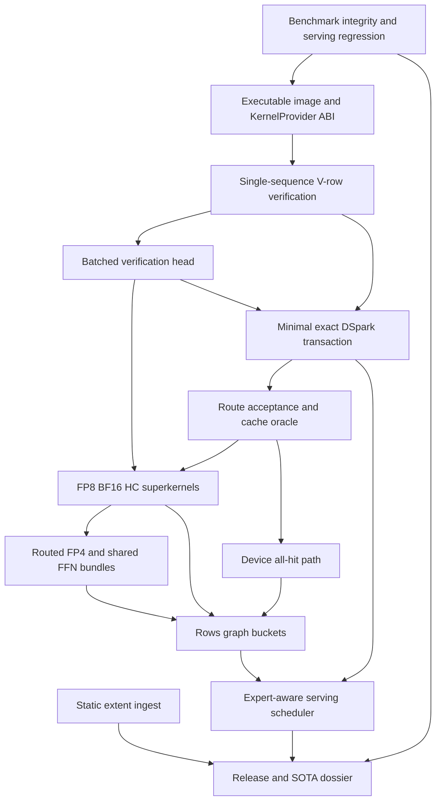

# Ferrule single-DGX Spark SOTA release roadmap

> Canonical engineering and release plan for exact DeepSeek-V4-Flash-DSpark inference on
> one NVIDIA DGX Spark / GB10.
>
> Updated: 2026-07-15.
>
> This document is organized around one release equation, three feasibility kill gates,
> and a reproducible SOTA claim. Historical measurements are retained only when they change
> a design decision.

## 0. Executive decision

Ferrule has a credible SOTA opportunity, but the opportunity is conditional and not yet
proven.

The strongest parts of the current system are:

- exact 43-layer CUDA target execution on the real 48-shard checkpoint;
- Rust-owned sequence, KV, expert-frame, upload-event, and rollback state;
- context-bound typed CUDA execution image;
- physical paged multi-plane KV;
- stable expert slot/generation/lease semantics;
- production `O_DIRECT + io_uring` reads into registered CUDA-pinned slabs;
- resident/no-I/O replay with token and logit-bit parity;
- honest hardware, storage, serving, and Nsight evidence.

The blockers are not missing generic features. They are specific to the 16 accepted-token/s
critical path:

1. native CUDA packed execution does not yet support the essential DSpark shape
   `1 sequence × V candidate rows`;
2. packed output-head evaluation is row-serial;
3. the execution image describes resources, but not per-shape executable kernel plans;
4. dominant FP8/BF16/HC/FP4 work still runs as an operator-by-operator eager pipeline;
5. complete DSpark proposal, verification, commit, and rollback are not implemented;
6. current serving throughput has regressed and does not scale proportionally with raw
   concurrency;
7. current release artifacts are local development evidence, not yet a frozen public SOTA
   dossier.

The program remains **GO** only while all three feasibility gates in Section 1.4 remain
physically achievable. Failure of any gate requires changing the operating point, target,
or hardware claim rather than continuing local kernel tuning.

---

## 1. Release contract

### 1.1 North star

Ferrule releases the single-DGX Spark SOTA milestone only when one DGX Spark sustains:

```text
>= 16 accepted output tokens/s
```

under a frozen warm workload with:

- the exact DeepSeek-V4-Flash-DSpark checkpoint;
- exact target verification;
- the real router and experts;
- no expert skipping, substitution, or approximation;
- zero headline request failures;
- bounded execution inside the 128 GB coherent-memory system;
- published raw artifacts and a reproducible environment manifest.

This is an accepted-token target, not a claim of 16 complete 43-layer target passes/s.

### 1.2 Release equation

For verification width `V`, mean committed tokens `A(V)`, and complete cycle latency
`T_cycle(V)`:

```text
accepted tok/s = A(V) / T_cycle(V)
```

The complete cycle includes:

```text
T_cycle(V)
  = draft
  + exact target verification
  + commit or rollback
  + non-overlapped expert I/O
  + scheduler/control latency
  - only overlap proven safe by measurement
```

The release gate is:

```text
A(V) / T_cycle(V) >= 16
```

Kernel microbenchmarks, launch reductions, target-body passes/s, and optimistic
`A / T_body(1)` multiplication are intermediate evidence only.

### 1.3 Provisional operating budget

The current planning point is `A≈4`:

```text
exact target verification, V chosen by acceptance data  <= 200 ms
draft + commit/rollback + uncovered I/O/control          <=  50 ms
complete cycle                                           <= 250 ms
mean committed tokens                                    >= 4
accepted throughput                                      >= 16 tok/s
```

This is a planning constraint, not a measured result. Components may borrow budget only if
the measured complete cycle still passes the release equation.

`V=4, A=4` implies nearly 100% mean acceptance. Therefore `V=2/4/8` must be measured rather
than assuming `V=4` is optimal.

### 1.4 Feasibility kill gates

#### Gate F1 — Resident packed verification

Implement and measure exact all-resident verification for:

```text
1 sequence × V rows, V in {2,4,8}
```

including the required target logits/output-head work and excluding draft/I/O.

Decision:

- `V=4 > 250 ms`: the `V=4, A=4` operating point is rejected;
- `V=4 > 200 ms`: the provisional 50 ms non-verification budget is rejected;
- if every measured `V / T_verify(V) <= 16`, the one-Spark headline is rejected unless a
  different exact verification algorithm changes the bound.

#### Gate F2 — Real acceptance

Run the complete correctness-first DSpark transaction and measure:

- accepted-prefix histogram;
- `A(V)` for `V=2/4/8`;
- draft, verify, commit, and rollback latency;
- complete `T_cycle(V)`;
- accepted tokens reported internally and returned externally.

Decision:

```text
A(V) < 16 × T_cycle(V) for every viable V
```

rejects the 16 tok/s target on the current design.

#### Gate F3 — I/O and capacity

At 16 accepted tok/s, the measured NVMe ceiling gives a long-run budget of:

```text
10.53 GiB/s / 16 = 0.658 GiB per accepted token
```

At `A=4`:

```text
<= 2.63 GiB per complete cycle
```

Use real proposal/rollback route traces and the actual memory budget to compare current
policy with a Belady oracle. If the oracle still exceeds `0.658 GiB/accepted token`, no
prefetch or scheduler policy can meet the target.

### 1.5 SOTA claim gate

Reaching 16 tok/s is an internal release target, not automatically a SOTA claim.

A public SOTA claim additionally requires:

```text
Ferrule beats the strongest eligible runtime
under the same frozen checkpoint, tokenizer, prompts, sampling, hardware, and metric
```

with a difference larger than measurement noise and without unacceptable latency, memory,
or failure-rate regressions.

If no competing runtime supports the exact contract, the claim must be phrased as a first
published exact result under that contract, not as an unqualified SOTA claim.

---

## 2. Current verified evidence

### 2.1 Test platform

```text
System                NVIDIA DGX Spark
GPU                    NVIDIA GB10, sm_121a
CPU                    20-core Arm
Coherent memory        approximately 127.6 GB available, 128 GB nominal
Shared LPDDR bandwidth vendor peak 273 GB/s
CUDA / driver          CUDA 13.0 / 580.82.09
Kernel                 Linux 6.11, aarch64
Storage                Samsung 3.7 TB NVMe, ext4
Checkpoint             DeepSeek-V4-Flash-DSpark
Checkpoint layout      48 safetensors shards, approximately 156 GiB
Routed experts         approximately 137.1 GiB
```

The checkpoint exceeds physical memory before dense weights, KV, arenas, pinned slabs, page
cache, and the OS. Ferrule is solving a deadline-streaming problem, not a conventional
full-residency deployment.

### 2.2 Correctness and execution foundation

Verified implementation foundation:

- exact 43-layer CUDA target path;
- packed/ragged execution ABI and explicit sequence state;
- physical paged multi-plane KV;
- KV rollback, COW, and prefix-sharing primitives;
- compressed attention and indexer state;
- FP8/BF16 attention projections;
- routed FP4 MoE with exact router ordering;
- stable expert frame/slot/generation/lease state;
- transactional expert publication through upload events;
- device output-head top-k merge;
- persistent outer arenas and exact-shape attention scratch;
- context-bound typed CUDA execution image;
- producer-owned FP8 activation packs;
- HC device prelayout preserving original per-row accumulation order;
- BF16 compressor dual projection over a shared caller-owned input.

CPU execution remains a correctness oracle, not a performance target.

### 2.3 Storage evidence

Direct GDS is not the production path on the tested GB10:

```text
GB10 model support       unsupported by gdscheck
NVMe P2PDMA              unsupported
registered device path   failed through nvidia-fs/nvfs
```

Read-only 1 GiB / 16 MiB-request measurements:

| Path | Throughput | Average latency |
|---|---:|---:|
| page cache cold after `DONTNEED` | 1.05 GiB/s | 14.47 ms |
| cuFile compatibility | 6.79 GiB/s | 2.03 ms |
| io_uring registered buffers, QD1 | 6.92 GiB/s | 1.61 ms |
| io_uring registered buffers, QD2 | **10.53 GiB/s** | **2.21 ms** |
| io_uring registered buffers, QD4 | 10.71 GiB/s | 5.07 ms |
| io_uring registered buffers, QD8 | 10.70 GiB/s | 10.51 ms |

QD2 is the production starting point. Higher QD adds deadline latency without useful
bandwidth.

A real 12.75 MiB FP4 expert A/B was output-identical:

| Backing | First use | Warm expert execution |
|---|---:|---:|
| ordinary device frame | 1,581.2 us | **518.2 us** |
| mapped pinned | **1,395.8 us** | 1,155.9 us |

Production hierarchy:

```text
NVMe
 -> io_uring O_DIRECT
 -> registered CUDA page-locked slabs
 -> upload stream
 -> ordinary device expert frame
 -> stable slot publication
 -> FP4 Tensor Core execution
```

Mapped pinned memory is staging, not hot compute backing.

### 2.4 Resident target-pass checkpoint

Current real-checkpoint resident replay:

| Pass | Wall time | Target passes/s | Kernel launches | Selected expert bytes | Top-1 |
|---|---:|---:|---:|---:|---|
| capture with head | 850.042 ms | 1.176 | 2,314 | 1,069,547,520 | `19923`, `30.054031372070312` |
| resident with head | 670.436 ms | 1.492 | 2,234 | 0 | `19923`, `30.054031372070312` |
| resident body without head | 627.717 ms | 1.593 | 2,136 | 0 | n/a |

Capture and resident-with-head retained token equality and logit-bit equality. Both resident
passes had zero selected cold misses, zero selected expert-load bytes, and zero steady device
allocations.

Relative to the earlier 705.811 ms resident body, the current 627.717 ms is 11.1% faster.
This is an aggregate execution-image/pack/direct-input/fusion checkpoint and must not be
attributed to one kernel.

Current warm non-speculative output throughput is 1.28672 tok/s, 12.44x below the 16 tok/s
headline. Complete DSpark accepted throughput is not yet measurable.

### 2.5 Nsight checkpoint

A full Nsight Systems resident replay retained parity. The aggregate GPU kernel-time
breakdown across capture and resident replay was:

| Kernel group | GPU kernel time |
|---|---:|
| FP8 MMA GEMM | 34.3% |
| BF16 GEMM | 15.3% |
| HC-pre | 12.5% |
| routed FP4 dual projection | 7.1% |
| grouped output-A | 4.8% |
| BF16 compressor pair | 3.9% |
| routed FP4 down | 3.4% |
| FP8 activation pack | 3.4% |
| remaining BF16 GEMV | 3.3% |

The top nine groups account for 88.0% of aggregate kernel time. Sparse attention itself was
below 0.1% in this trace.

Consequences:

- a literal FlashAttention kernel transplant does not address the measured bottleneck;
- FP8/BF16/HC account for approximately 72.7% and are first priority;
- routed FP4 is second priority at approximately 10.5% for dual/down kernels;
- CUDA Graph alone cannot remove dominant kernel work;
- isolated M=1 GEMV wins cannot reach the release budget.

Amdahl estimate: accelerating the top 88% by 4x leaves about 213 ms of M=1-equivalent body
time. Reaching 200 ms with an unchanged remainder requires approximately 4.4x acceleration
of the top 88%. Multi-row weight reuse may improve this bound, but must be measured.

Artifacts:

```text
target/bench/s3-kernel-slice/resident-replay-full.nsys-rep
target/bench/s3-kernel-slice/resident-replay-full.sqlite
target/bench/s3-kernel-slice/resident-replay-full-kernels.csv
target/bench/s3-kernel-slice/resident-replay-full-cuda-api.csv
```

### 2.6 Serving evidence

Historical diagnostic, random input 8/output 8, four requests:

| Concurrency | Output throughput | Relative to C1 | p50 TPOT | Mean TTFT |
|---:|---:|---:|---:|---:|
| 1 | 0.78 tok/s | 1.00x | 963 ms | 3.46 s |
| 2 | 1.04 tok/s | 1.33x | 1,308 ms | 5.95 s |
| 4 | 1.15 tok/s | 1.47x | 1,652 ms | 15.72 s |

Current-branch diagnostic, official `vllm bench serve`, fixed input 8/output 8, eight
requests, request rate `inf`, seed zero, greedy, ignore EOS:

| Concurrency | Output throughput | Relative to C1 | Mean TPOT | Mean E2EL |
|---:|---:|---:|---:|---:|
| 1 | 0.277 tok/s | 1.00x | 3,863 ms | 28.86 s |
| 2 | 0.352 tok/s | 1.27x | 6,463 ms | 45.24 s |

The current sweep was stopped before C4 completed. No reproducible C8 JSON exists.
`/tokenize` was unavailable, making zero-valued C2 TTFT/ITL invalid; duration, throughput,
TPOT, and E2EL remain usable.

Conclusions:

- raw FIFO concurrency does not yield proportional throughput;
- C2 adds 27% throughput while worsening mean TPOT by 67%;
- the current C1 result is a release-blocking anomaly relative to the historical artifact;
- old and current runs are not a paired regression A/B because request counts and branch
  state differ;
- current C1/C2/C4/C8 must be rerun under one frozen contract before release.

Artifacts:

```text
target/bench/vllm-serve/agent-run/sweep-output8/
target/bench/vllm-serve/20260715-s3-c1-c8/
```

### 2.7 Static checkpoint ingest

The expert reader already uses direct registered slabs. Static execution-image construction
still follows a per-tensor path:

```text
metadata inventory
 -> per tensor open/seek/read_exact
 -> pageable Vec<u8>
 -> retained host payload
 -> serial upload during execution-image compilation
```

The `fastsafetensors` paper and implementation validate metadata-first range planning,
aggregated transfer, and delayed tensor construction as useful design principles. Their
reported 4.8–7.5x loading wins are upstream Python/multi-NVMe/GPU results, not Ferrule GB10
measurements.

Ferrule should port the range-planning and aggregated-copy design onto its existing
registered io_uring slab engine. It should not import a Python/DLPack owner, whole-shard GPU
buffer, second pinned pool, mmap-plus-pin GB10 path, or unsupported GDS path.

Static ingest primarily affects cold TTFT, publication latency, memory headroom, and the
ability to produce backend-native layouts without duplicate weights. It does not explain
the 627.717 ms resident body and must proceed in parallel with, not replace, the target
kernel critical path.

---

## 3. Canonical target architecture

### 3.1 Rust remains the unique runtime owner

Rust owns:

- CUDA context, streams, events, and graphs;
- device allocations and arenas;
- paged KV and transactional sequence state;
- expert frames, slots, generations, and leases;
- static execution image;
- cancellation, failure recovery, and rollback;
- storage slab leases and upload tickets;
- scheduler, admission, and DSpark commit state.

External kernel systems may generate device code but must not introduce a second allocator,
stream owner, tensor owner, KV owner, or expert residency state machine.

### 3.2 Execution image becomes an executable plan

Target structure:

```text
DeepSeekV4CudaExecutionImage
  ├── LayerResourceImage
  │     ├── static typed weights/layouts
  │     ├── norms/HC/router/sinks
  │     └── stable dynamic indirections
  └── LayerKernelPlan[rows=1/2/4/8]
        ├── selected KernelProvider and kernel IDs
        ├── backend-native weight layouts
        ├── tile/persistent schedule
        ├── fusion and epilogue descriptors
        ├── workspace offset plan
        ├── graph bucket bindings
        └── measured/autotuned configuration
```

Kernel selection occurs during prepare/compile, not through string lookup or hot-path dynamic
policy.

### 3.3 Kernel provider boundary

Ferrule CUDA supports multiple leaf providers:

```text
KernelProvider
  ├── CudaOxideProvider       custom control/glue and correctness fallback
  ├── EmbeddedCubinProvider   fixed-shape production kernels
  └── CUTLASS/CuTe-generated cubins where they win
```

Rules:

- Rust loads cubins through the CUDA Driver API;
- provider descriptors are versioned POD data;
- no C++ object crosses the hot FFI boundary;
- no provider owns allocation or streams;
- provider-native weight transforms are performed once during ingest into the final unique
  device layout;
- cuda-oxide remains valid for routing, metadata, recurrent compressor logic, paged control,
  custom HC glue, and eager correctness paths.

Restricting all dominant GEMM kernels to handwritten cuda-oxide is not a release invariant.
Performance evidence decides the provider.

### 3.4 Shape strategy

```text
rows=1      persistent small-M kernels and multi-N consumers; no padded batch-16 work
rows=2/4    Tensor Core verification kernels
rows=8      enabled only when acceptance/serving evidence justifies it
larger M    conventional tiled/grouped GEMM
all rows    producer-owned packs, native layouts, stable descriptors, graph buckets
```

Raw concurrency never decides the row bucket by itself. Admission includes incremental
unique expert bytes, residency, deadline risk, and latency debt.

### 3.5 Superkernel bundle A — HC producer

Semantic boundary:

```text
HC-pre
 -> layer RMSNorm
 -> normalized activation
 -> FP8 pack/scales when needed
 -> preserve post/comb outputs
```

Requirements:

- preserve exact HC model semantics;
- keep the eager original-order implementation as oracle;
- parallelize independent rows and pipeline loads;
- remove avoidable hidden global write/read, separate norm launch, and duplicate pack;
- permit deterministic optimized reductions only after the numerical gate in Section 3.11.

### 3.6 Superkernel bundle B — MLA projection

Semantic boundary:

```text
one activation producer
 -> QueryA + KV true multi-N consumer
 -> QueryA norm + QueryB
 -> query head norm + RoPE
 -> KV norm + RoPE + quantization
 -> direct paged KV destination
 -> compressor BF16 projection/recurrent append where applicable
```

Requirements:

- rows=1 never routes through padded `m16n8` work;
- rows=2/4/8 use dedicated Tensor Core schedules;
- QueryA/KV share one producer pack and one backend plan;
- KV epilogue writes the final paged destination where safe;
- sparse attention remains an independent semantic kernel until profiling changes its
  priority.

Output-side MLA bundle:

```text
inverse RoPE load
 -> grouped output-A
 -> output-B producer/consumer plan
```

### 3.7 Superkernel bundle C — Shared FFN

```text
one activation producer
 -> multi-N gate/up
 -> fused SwiGLU + down-input pack
 -> down
 -> direct accumulator epilogue
```

Shared FFN and routed MoE may overlap only when stream dependencies and shared LPDDR
contention show an end-to-end win.

### 3.8 Superkernel bundle D — Stable-frame routed FP4 MoE

```text
stable slot/generation resolve
 -> rows=1 rank-major or rows=2/4 expert-major dispatch
 -> gate/up FP4
 -> SwiGLU + hidden pack
 -> down FP4
 -> exact rank-ordered weighted reduction
```

Requirements:

- kernels dereference stable slot tables, not graph-captured physical frame pointers;
- miss masks prevent invalid pointer access;
- rank order remains authoritative;
- rows=1 does not execute fixed padded multi-column work;
- the first production bundle may use several high-quality kernels rather than one unsafe
  monolith.

### 3.9 Native single-sequence verification

The execution ABI must support:

```text
1 sequence × V candidate rows
```

separately from multi-session batching.

Required device descriptor:

- candidate positions and causal visibility;
- row-to-sequence mapping with one sequence allowed;
- per-row verification intent;
- device-authoritative KV/compressor lengths;
- branch/transaction identifier;
- commit prefix length and rollback boundary;
- stable output/logit destinations.

Per-layer host `Vec`, `BTreeMap`, and `BTreeSet` construction is removed from graph-stable
verification. Host metadata is committed transactionally after completion events.

### 3.10 Batched verification head

For `V=2/4/8`:

```text
batched HC head
 -> batched output norm
 -> batched vocabulary projection or drafted-token verification
 -> device accepted-prefix computation
 -> full top-k only for rows required by sampling semantics
```

The system must not perform a serial 1,010 MiB output-head scan independently for every
candidate row when exact drafted-token verification can use a narrower device contract.
Any narrowed contract must be proven equivalent to full target verification.

### 3.11 Numerical contract

Unbreakable semantic requirements:

- source bytes, quantization, router policy, and expert identity are exact;
- no expert substitution, skipping, or approximate target acceptance;
- KV, recurrent state, commit, and rollback are exact;
- optimized execution is deterministic;
- generated tokens match the exact oracle on the release corpus.

Bitwise eager execution remains the development oracle. Optimized Tensor Core and reduction
kernels may use a different deterministic floating-point order only when they pass:

- per-layer/logit numerical envelopes fixed before testing;
- exact router IDs and selected experts;
- long-output token parity;
- near-tie router and vocabulary regression corpus;
- resident, cold-miss, packed, graph, and rollback parity;
- optional exact fallback when a proven margin/error bound indicates a near tie.

An optimized path that changes a generated token without a valid fallback is rejected.
Requiring every intermediate scalar to match the legacy kernel bitwise is not a universal
release invariant because it would exclude standard Tensor Core schedules.

### 3.12 Device all-hit and graph path

Desired all-hit layer path:

```text
router on device
 -> stable slot resolve on device
 -> all-hit executes without route D2H or host lease construction
 -> actual miss writes a compact control record
 -> host promotes only the miss
 -> exact continuation/restart protocol
```

Before graph capture:

- device batch descriptor is stable;
- KV/expert/RoPE table bases are stable or indirectly addressed;
- all-hit path has no D2H or whole-stream synchronization;
- miss side effects and restart/rollback boundary are explicit;
- graph buckets own fixed ping-pong workspaces;
- host telemetry is delayed and cannot block resident computation.

Capture order:

```text
rows=1 resident graph
rows=2 verification graph
rows=4 verification graph
rows=8 only if measured useful
```

Capturing 2,000 weak kernels is not completion of the kernel phase.

### 3.13 Expert-aware scheduler

Admission objective:

```text
benefit = shared dense work + resident expert overlap + loaded expert overlap
cost    = incremental unique expert bytes + miss deadline + memory pressure + latency debt
```

Rules:

- rows=1 stays on a fast persistent path instead of waiting for an unprofitable batch;
- rows=2/4/8 form only when predicted overlap and kernel gain exceed incremental bytes;
- resident-ready rows are separated from miss-blocked rows;
- miss I/O overlaps useful resident work;
- slab/frame credits and deadline lateness constrain admission;
- fairness prevents low-overlap requests from starvation;
- request queue depth is not a performance objective.

### 3.14 Exact DSpark transaction

```text
draft proposal
 -> target branch KV/state
 -> packed exact verification
 -> device accepted-prefix result
 -> commit accepted prefix
 -> rollback rejected suffix
 -> update residency/acceptance telemetry
```

The governor optimizes accepted tokens per byte and per complete cycle, not acceptance rate
or prefetch recall in isolation.

Required rollback coverage:

- all accepted;
- rejection at the first, middle, and last proposal;
- all rejected;
- EOS;
- cancellation and timeout;
- KV growth/COW/prefix sharing;
- compressor recurrent state;
- slot generation reuse;
- worker failure with in-flight I/O/upload.

### 3.15 Single-owner safetensors ingest

Canonical chain:

```text
HfSafetensorsInventory / immutable source manifest
 -> typed ReadPlan(path, aligned extent, destination id/offset, transform)
 -> shared io_uring O_DIRECT fixed-file + registered-slab extent engine
 -> borrowed pinned slab views
 -> upload-stream scatter into preallocated typed CUDA storage
 -> event ticket retains slab lease
 -> transactional execution-image publication
```

Rules:

- static and expert reads share the low-level extent/slab engine but retain distinct policy;
- static extents sort by file/offset, align to 4 KiB, and coalesce adjacent ranges;
- QD2 read wave `N+1` overlaps upload wave `N` within slab credits;
- backend-native transforms write the final unique layout;
- raw static host payloads are released after image publication;
- no whole-shard CUDA arena, second pinned pool, DLPack owner, or content-hash payload cache;
- source identity, bounds, dtype, shape, and byte lengths are revalidated before publication;
- CPU/reference materialization remains explicit and on demand.

---

## 4. Dependency and critical path



Critical release path:

```text
benchmark integrity
 -> executable kernel plan
 -> 1-sequence × V verification
 -> batched verification head
 -> dominant FP8/BF16/HC kernels
 -> minimal DSpark and real acceptance
 -> route/cache feasibility
 -> FP4/all-hit/graphs as measured
 -> complete cycle >=16 accepted tok/s
```

Parallel release lanes:

- static ingest/cold TTFT/memory;
- serving scheduler and `/tokenize` correctness;
- parity corpus and artifact publication;
- competitor eligibility and baseline runs.

Static ingest is important but does not block resident kernel experiments. Full cross-request
continuous batching is not a prerequisite for the first single-sequence DSpark acceptance
measurement.

---

## 5. Phased implementation plan

## Phase P0 — Benchmark integrity and current regression

### Purpose

Create a trustworthy measurement loop before further performance changes.

### Deliverables

- fix or implement `/tokenize` or an equivalent exact token-accounting endpoint;
- hard-fail invalid TTFT/ITL instead of recording zero;
- freeze model/tokenizer/template/prompt/client/server manifests;
- rerun current C1/C2/C4/C8 under one contract;
- reproduce or explain the current C1 serving anomaly;
- add NVTX ranges for prefill, capture, resident head/body, layer bundles, MoE, and DSpark
  cycle components;
- preserve unprofiled and matching profiled artifacts.

### Exit gate

- zero failed requests;
- valid token accounting and streaming timestamps;
- paired current-branch serving matrix with repeated runs;
- performance deltas attributable to one code/config change.

## Phase P1 — Executable image and native V-row correctness

### Purpose

Establish the final runtime shape before optimizing more kernels.

### Deliverables

- `KernelProvider` and versioned POD launch descriptors;
- `LayerKernelPlan[1/2/4/8]` compiled into the execution image;
- existing cuda-oxide kernels registered as the initial provider;
- native `1 sequence × V rows` execution for `V=2/4/8`;
- device-stable verification descriptor;
- correctness-first batched HC head/norm/output verification;
- all-resident teacher-forced verification benchmark.

### Exit gate

- exact eager parity for every row and sequence-state transition;
- rollback returns KV/compressor/position state exactly;
- `T_verify(2/4/8)` and route-union baseline reported;
- no per-layer host container construction in the stable V-row path.

## Phase P2 — FP8/BF16/HC target superkernels

### Purpose

Attack the measured 72.7% dominant kernel family.

### Order

1. rows=1 QueryA/KV true multi-N producer/consumer;
2. rows=2/4 verification FP8 schedules;
3. BF16 small-M Tensor Core kernels and compressor multi-N;
4. HC-pre → norm → pack producer fusion;
5. grouped output-A/output-B plan;
6. rows=8 only after acceptance evidence.

### Deliverables

- cuda-oxide and/or embedded CUTLASS/CuTe cubin implementations;
- backend-native weight layouts produced during ingest;
- targeted Nsight Compute reports for selected production kernels;
- deterministic numerical and near-tie parity gates;
- unprofiled resident `T_verify(2/4/8)` after every bundle.

### Exit gate

- intended operating point satisfies resident verification budget;
- no token/router regression on the release parity corpus;
- no duplicate full weight layout in coherent memory;
- fallback remains available for unsupported shapes.

### Kill gate

After reasonable production kernels, failure of Gate F1 stops the current 16 tok/s plan.

## Phase P3 — Minimal exact DSpark and feasibility proof

### Purpose

Measure real acceptance before completing secondary optimizations.

### Deliverables

- real proposal source and immutable identity/hash;
- exact verify, accepted-prefix, commit, and rollback;
- `V=2/4/8` sweep;
- accepted-prefix histogram and `A(V)`;
- complete cycle timer and component timers;
- request-visible tokens reconciled with internal committed tokens;
- route/union/rejected-prefetch traces.

### Exit gate

- all acceptance/rejection rollback cases pass;
- Gate F2 passes for at least one operating point or remains within an explicit optimization
  budget;
- no acceptance result depends on approximate target execution.

## Phase P4 — Route/cache oracle and acceptance-aware I/O

### Purpose

Prove the storage side of the release equation.

### Deliverables

- trace format with cycle, layer, row, rank, expert, hit class, and timing;
- actual available-memory budget after dense weights/KV/arenas/slabs/OS;
- LRU/LFU/frequency-recency/transition and Belady-oracle simulation;
- bytes/cycle and bytes/accepted token;
- far-horizon storage staging and near-horizon promotion actions;
- deadline/cutoff admission weighted by acceptance probability;
- selected-demand takeover and bounded slab/frame credits.

### Exit gate

- Gate F3 passes under the chosen operating point;
- no wrong prefetch changes target output;
- production policy approaches a documented fraction of the oracle;
- no slab exhaustion/fallback in the release matrix.

## Phase P5 — Routed FP4, shared FFN, and all-hit device control

### Purpose

Optimize the next measured kernel group and remove resident host barriers.

### Deliverables

- rows-aware stable-frame FP4 gate/up;
- SwiGLU + hidden-pack fusion;
- down and exact rank-ordered reduction;
- shared FFN bundle with direct accumulator epilogue;
- all-hit route execution without route D2H or host lease construction;
- compact actual-miss control queue;
- explicit miss continuation/restart boundary.

### Exit gate

- routed FP4 bundle wins end to end, not only in microbenchmarks;
- all-hit layers wake no host service;
- miss execution remains exact;
- parity survives mixed resident/miss rank order.

## Phase P6 — Stable graph buckets

### Purpose

Remove launch/control gaps after dominant kernel work has been reduced.

### Deliverables

- rows=1 resident graph;
- rows=2/4 verification graphs;
- rows=8 graph only when useful;
- stable device descriptors and workspace bindings;
- sequence reuse, KV growth, slot-generation reuse, and rollback coverage;
- graph miss escape/restart protocol.

### Exit gate

- no D2H, whole-stream sync, or allocation in all-hit replay;
- graph and eager outputs satisfy the numerical contract;
- graph replay yields a measured complete-cycle win.

## Phase P7 — Static safetensors extent engine

### Purpose

Reduce cold publication latency and memory amplification without creating a second owner.

### Deliverables

- immutable 48-shard source manifest;
- generalized artifact extent engine over existing fixed files/registered slabs;
- typed destination preallocation and async scatter upload;
- bounded read/upload double buffering at QD2;
- transactional image publication from source descriptors;
- raw host payload release after publication;
- backend-native layout transform support.

### Exit gate

- all static and expert source bytes validated;
- direct 1 GiB/16 MiB QD2 microbench remains at least 10.0 GiB/s;
- contiguous static `aligned/requested <= 1.02`;
- pageable staging bytes zero on the new CUDA path;
- no shard/checkpoint-sized staging or page-cache growth;
- pinned peak bounded by the configured slab pool;
- cold inventory/image publication/first-token A/B reported;
- unchanged model parity.

This phase proceeds in parallel with P2–P5 and must not displace the resident/DSpark critical
path.

## Phase P8 — Expert-aware serving and release

### Purpose

Turn the single-sequence cycle into a useful, reproducible service and determine whether the
result is SOTA.

### Deliverables

- incremental-expert-byte admission;
- resident-ready/miss-blocked separation;
- dynamic rows=1/2/4/8 bucket selection;
- fairness and latency-debt enforcement;
- fresh and warm C1/C2/C4/C8 sweeps;
- long-output parity and failure testing;
- competitor eligibility matrix and same-contract runs;
- public release artifact archive with hashes.

### Release gate

All must pass:

```text
exact target semantics and committed-token parity
zero headline request failures
lower 95% confidence bound of warm accepted throughput >= 16 tok/s
memory bounded with no swap or page-cache collapse
published environment and raw artifacts
Ferrule beats the strongest eligible same-contract competitor for a SOTA claim
```

---

## 6. Immediate implementation slices

### Slice A — KernelProvider and executable plan ABI

Files:

- `crates/ferrule-cuda/src/context.rs`
- `crates/ferrule-cuda/src/kernels.rs`
- new internal provider/manifest modules under `crates/ferrule-cuda/src/`;
- `crates/ferrule-model/src/models/deepseek_v4/cuda_cache.rs`.

Work:

- separate resource ownership from kernel implementation;
- register current cuda-oxide kernels as provider zero;
- define embedded cubin provider and versioned launch descriptors;
- add per-shape kernel/layout/workspace plan to the execution image;
- reserve ingest-time backend-native transforms;
- avoid hot-path dynamic trait dispatch.

### Slice B — One sequence × V rows

Files:

- `crates/ferrule-model/src/models/deepseek_v4/runner.rs`
- `crates/ferrule-model/src/models/deepseek_v4/attention.rs`
- `crates/ferrule-model/src/models/deepseek_v4/layer.rs`
- runtime KV transaction code.

Work:

- remove the `sequences.len() >= 2` limitation for verification batches;
- distinguish multi-session packed rows from single-sequence causal verification rows;
- move lengths/masks/positions into a stable device descriptor;
- remove per-layer host maps/sets/vectors from the stable path;
- add teacher-forced V=2/4/8 correctness and timing tests.

### Slice C — Batched verification head

Work:

- batched HC head and norm;
- batched vocabulary projection;
- exact drafted-token verification on device;
- accepted-prefix output;
- avoid serial full-vocab scans when target semantics permit;
- retain full top-k for required sampling rows.

### Slice D — FP8 MLA bundle

Work:

- rows=1 persistent QueryA/KV multi-N;
- rows=2/4 Tensor Core verification;
- chain QueryA norm/QueryB and KV epilogues through one backend plan;
- direct paged KV write when safe;
- compare cuda-oxide and embedded cubin providers.

### Slice E — BF16 and HC producer bundle

Work:

- BF16 small-M Tensor Core schedule;
- compressor multi-N projection;
- HC-pre/norm/pack producer fusion;
- preserve eager original-order oracle;
- near-tie and long-output numerical gates.

### Slice F — Minimal DSpark transaction

Work:

- proposal identity and width sweep;
- branch KV/state;
- exact target verification;
- accepted-prefix computation;
- commit/rollback;
- acceptance and route-union traces;
- complete-cycle timer.

### Slice G — Static extent ingest

Work:

- immutable source manifest;
- aligned/coalesced `ReadPlan`;
- shared registered-slab extent engine;
- typed scatter upload and event-held leases;
- transactional execution-image publication;
- cold/warm publication and memory A/B.

---

## 7. Benchmark and correctness contract

### 7.1 Immutable run manifest

Every release candidate records:

- Ferrule commit and dirty state;
- release binary SHA256;
- Rust, CUDA, cuda-oxide, compiler, and feature versions;
- all performance environment variables;
- model repository revision;
- 48 shard names, exact sizes, and SHA256;
- index/config/tokenizer/chat-template hashes;
- prompt corpus hash;
- benchmark client version/commit;
- driver, kernel, firmware, filesystem, and mount options;
- clocks, power mode, temperature, CPU governor, swap, and page-cache state;
- run UUID and exact commands.

### 7.2 Correctness matrix

Two oracle levels:

1. optimized/graph/DSpark path versus Ferrule eager exact path;
2. Ferrule eager path versus independent canonical fixtures/runtime where available.

Coverage:

- multiple prompts and context lengths;
- 64/128-token continuations;
- prefill, decode, and mixed batches;
- rows=1/2/4 and rows=8 when enabled;
- resident, cold miss, upload takeover, and mixed hit/miss;
- graph replay and slot-generation reuse;
- KV growth, COW, and prefix sharing;
- EOS, cancellation, timeout, and worker failure;
- every DSpark rejection prefix length;
- rollback of KV, compressor, route-visible, scheduler-visible, and residency-visible state.

### 7.3 Resident verification benchmark

Report for `V=1/2/4/8`:

- target body and required output-head time;
- rows/s and target cycles/s;
- kernel launches/graphs;
- GPU kernel busy/span/gap;
- LPDDR/L2/TC metrics for dominant kernels;
- expert union per layer/cycle;
- zero-I/O resident proof;
- peak memory and allocations;
- parity result.

### 7.4 DSpark benchmark

Report:

- proposal source/hash and `V`;
- accepted-prefix histogram;
- `A(V)` and acceptance rate;
- draft/verify/commit/rollback/uncovered-I/O time;
- complete `T_cycle(V)` percentiles;
- accepted tok/s;
- unique expert union;
- requested/read/upload/rejected-prefetch bytes;
- bytes/accepted token;
- rollback and failure counts;
- internal committed-token versus HTTP response accounting.

### 7.5 Single-stream and serving

Single-stream base target:

```text
input length       32
output length      64 and 128
concurrency        1
temperature        0
ignore EOS         true
fresh and warm     reported separately
```

Serving matrix:

```text
input length       32
output length      at least 32
concurrency        1,2,4,8
request rate       fixed and published
sampling           greedy, ignore EOS
server state       fresh and separately warm
```

Short `8 -> 8` runs are diagnostic only.

Release latency requirements:

- `/tokenize` or exact equivalent must work;
- invalid TTFT/ITL is a hard failure, not zero;
- input/output token accounting must match server responses;
- enough requests must support the claimed percentile or a valid confidence method;
- each cell has repeated independent runs and zero failures.

### 7.6 Static ingest A/B

Compare current per-tensor and planned extent paths using the same source and final typed
layout.

Measure:

- inventory complete;
- plan complete;
- first upload submitted;
- execution image published;
- first token ready;
- requested/aligned/coalesced/read/upload/discarded bytes;
- extent count/size and read latency p50/p95/p99;
- read/upload overlap;
- page-cache, pageable, pinned, CUDA, RSS, and swap peaks;
- failure recovery and lease reclamation.

A full 156 GiB scan has a storage-only lower bound near 14.8 s at 10.53 GiB/s and is a
roofline diagnostic, not the production first-token objective.

### 7.7 Profiling

For every headline kernel phase:

- preserve one unprofiled release run;
- preserve a matching profiled run;
- add NVTX/capture ranges;
- store `.nsys-rep`, SQLite, summaries, commands, and profiler version;
- run targeted Nsight Compute only on dominant production kernels;
- profile actual V-row and complete DSpark cycles, not only M=1.

### 7.8 Competitor contract

Eligibility table records for each runtime:

- exact checkpoint support;
- exact tokenizer/quantization;
- target-only and speculative capability;
- version/commit and best legal public configuration;
- runnable/not-runnable with reason;
- throughput, latency, memory, and failures;
- raw artifacts.

Base-to-base and speculative-to-equivalent-speculation comparisons remain separate.

---

## 8. Required counters

### Target and DSpark

- target rows/cycle and target cycles/s;
- proposals, accepted prefix, committed tokens, and rollbacks;
- accepted tok/s and complete cycle latency;
- draft/verify/commit/rollback component time;
- bytes and time per accepted token.

### GPU

- kernel launches and graph replays;
- GPU kernel busy/span/gap;
- TC utilization and achieved memory bandwidth for dominant kernels;
- D2H/H2D/D2D calls and bytes;
- sync and async allocations/frees by size;
- stream synchronizations and event waits.

### Experts and I/O

- selected/resident/upload/staged/cold classes;
- unique expert union per layer/cycle;
- requested/aligned/read/upload/rejected-prefetch bytes;
- read/upload QD and p50/p95/p99 latency;
- deadline lateness, slab/frame credits, fallback, and exhaustion;
- oracle/current-policy bytes per accepted token.

### Memory and serving

- device/slab/pageable/KV/arena/page-cache/RSS/swap peaks;
- TTFT, TPOT, ITL, E2EL distributions;
- request/output/accepted-token throughput;
- failures, cancellations, and fatal worker states;
- inventory/image-publication/first-token timestamps.

---

## 9. Artifact policy

Development artifacts originate under `target/bench/`, but release evidence must be copied
to a durable public archive such as a GitHub Release or object storage.

Every artifact set includes:

- raw benchmark JSON;
- server/client logs;
- environment/run manifest;
- request/response token accounting;
- acceptance and route summary;
- memory/power logs;
- Nsight report and summaries;
- aggregation scripts;
- SHA256 for every file.

A local path is not a public artifact link.

---

## 10. Non-goals before the release gate

- multi-GPU or multi-node execution;
- training, RL, or router retraining;
- model-family expansion;
- expert skipping or approximate target verification;
- CPU expert compute as the GB10 default;
- managed-memory prefetch as the production path;
- mapped-pinned hot expert execution;
- retrying direct GDS on unsupported GB10 without new platform evidence;
- QD4/QD8 bandwidth chasing without a deadline benefit;
- general database/B+ tree indexing for sequential tensor extents;
- full-checkpoint scan records presented as token throughput;
- further sparse-attention optimization while it remains below 0.1%;
- C8 optimization before the rows=1/2/4 and DSpark feasibility gates;
- performance claims based on changed tokenizer, sampling, checkpoint, or output length.

---

## 11. Existing validation commands

Fast implementation gates:

```bash
just fmt-fix
just check-cuda
just test-cuda-required
just test-model
git diff --check
```

Real checkpoint parity and resident roofline:

```bash
just dsv4-prefill-parity
just dsv4-resident-roofline
just dsv4-runtime-driver-bench "Hello" "Explain Ferrule in one sentence." 8 16 4096 43
```

Serving:

```bash
just dsv4-serve
just dsv4-vllm-bench baseline
just dsv4-vllm-bench sweep
```

Diagnostic short sweep:

```bash
INPUT_LEN=8 OUTPUT_LEN=8 NUM_PROMPTS=8 CONCURRENCIES=1,2,4,8 \
  RESULT_ROOT=target/bench/vllm-serve/diagnostic-c1-c8 \
  ./scripts/bench_vllm_serve.sh sweep
```

Required recipes to add during this roadmap:

```text
dsv4-verify-width-sweep       all-resident 1-sequence × V=2/4/8
dsv4-dspark-cycle-sweep       complete proposal/verify/commit/rollback
dsv4-route-cache-oracle       trace and Belady/current-policy comparison
dsv4-static-ingest-ab         per-tensor versus extent/scatter path
dsv4-release-manifest         immutable hashes/environment/commands
dsv4-release-suite            parity + performance + serving + artifact package
```

A phase is complete only when its correctness and measured end-to-end exit gates pass.
Compiling, adding counters, reducing API calls, or winning a microbenchmark does not complete
a phase.

---

## 12. Final release checklist

### Feasibility

- [ ] Gate F1 resident V-row verification passes.
- [ ] Gate F2 real acceptance passes.
- [ ] Gate F3 I/O/capacity passes.

### Exactness

- [ ] Exact source/quantization/router/expert semantics.
- [ ] Long-output committed-token parity.
- [ ] Every rollback prefix and failure path validated.
- [ ] Optimized numerical contract and near-tie corpus pass.

### Performance

- [ ] Lower 95% confidence bound of warm accepted throughput is at least 16 tok/s.
- [ ] Complete cycle, not an internal substage, is timed.
- [ ] Memory remains bounded with no swap/page-cache collapse.
- [ ] Zero headline request failures.
- [ ] C1/C2/C4/C8 and long-output serving matrix pass.

### Reproducibility

- [ ] Immutable run manifest and model hashes published.
- [ ] Raw benchmark, logs, counters, and profiler artifacts published.
- [ ] Exact commands and aggregation scripts published.
- [ ] Current source commit and release binary hash published.

### SOTA claim

- [ ] Strongest eligible competitors identified.
- [ ] Same-contract competitor runs preserved.
- [ ] Ferrule exceeds the strongest eligible result beyond measurement noise.
- [ ] Claim wording matches the actual comparison scope.
