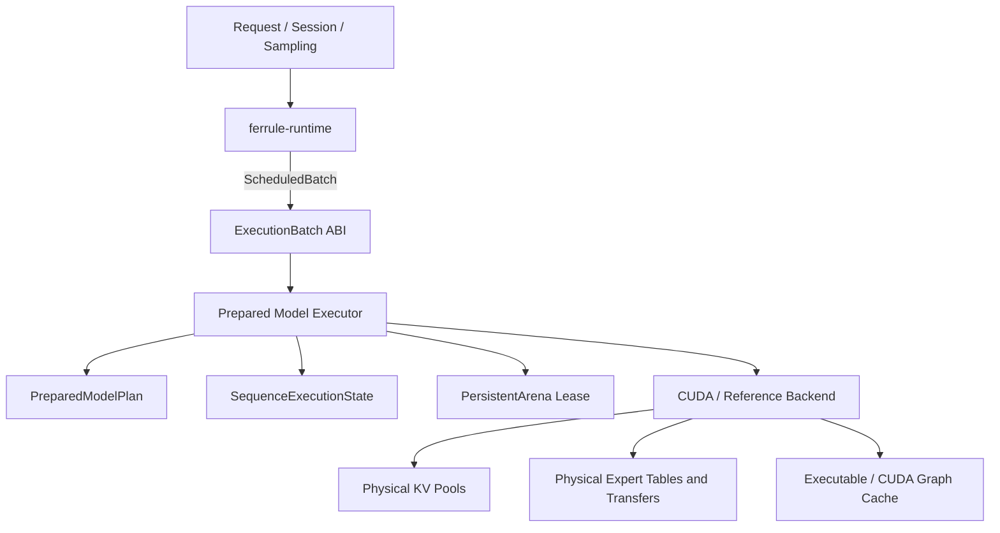

# Ferrule Execution Engine Architecture

_Status: E1–E6 complete; E7–E8 planned_

_Last updated: 2026-07-13_

This document is the canonical design for Ferrule's model execution ownership and
hot-path architecture. It covers:

- `ExecutionBatch` and prepared executor contracts;
- immutable `PreparedModelPlan`;
- per-sequence execution state;
- persistent shape-bucket arenas;
- one eager/graph device pipeline;
- DSV4 module decomposition;
- physical paged multi-plane KV;
- device routing and runtime expert residency;
- stable CUDA graph buckets.

It does **not** replace:

- [`runtime-graph-architecture.md`](runtime-graph-architecture.md), which defines
  device-independent semantic graph IR;
- [`storage-residency-architecture.md`](storage-residency-architecture.md), which
  defines object identity, placement, replicas, transfers, and policy;
- [`ROADMAP.md`](ROADMAP.md), which defines implementation order and gates.

---

## 1. Decisions

The following decisions are fixed for the next implementation phases.

1. **Execution ownership is the primary performance project.** More isolated
   kernels and feature flags cannot compensate for runner-global sequence state or
   host-controlled dispatch; a future E7 graph path must not duplicate eager math.
2. **There is one public execution ABI.** Scheduler lowering, compatibility runner
   adapters, and reference graph execution now share the packed/ragged
   `ExecutionBatch` in `ferrule-common`; the deleted graph-specific envelope is not
   a second ABI.
3. **Prepared, sequence, arena, and diagnostics lifetimes are distinct.** No
   struct should own all four.
4. **Eager and graph execution share one `*_into` pipeline.** Graph capture is a
   cached execution mode, not a third numerical implementation.
5. **Runtime owns logical lifecycle; backend owns physical resources.** Runtime
   controls requests, sessions, KV reservations, residency policy, and executable
   cache policy. CUDA controls buffers, streams/events, physical pages, expert
   handles, and graph execs.
6. **The current DSV4 path remains the differential oracle during migration.** No
   flag-day rewrite and no floating-point reorder hidden inside a move/refactor.
7. **The E1 compatibility error contract is poison-on-error.** A failed model
   mutation or post-mutation output/commit/callback path poisons the implicit
   single-runner adapter and prevents runner extraction. E3 generalizes this to
   explicit sequence state; E5 adds physical KV reservation/rollback.

---

## 2. Implemented execution baseline and remaining limits

The production path is:

```text
ResidentScheduler
  → token-budgeted SchedulerAction::Execute
  → runtime-private ScheduledBatch correlation
  → ferrule-common::execution::ExecutionBatch
  → NativeMultiSessionExecutor<MultiSessionRunner>
  → DSV4 whole-batch packed/ragged/mixed pipeline
  → authoritative physical paged multi-plane KV
  → runtime expert residency control
  → DSV4 CUDA physical transfers/tables and ferrule-cuda kernels
```

E1–E6 have separated logical lifecycle from physical resources. The major remaining
execution-shape work is E7 stable graph buckets and E8 profiler-driven fusion/sampling.

### 2.1 Native batching and prefill are implemented

`NativeMultiSessionExecutor` accepts multi-session packed decode, ragged prefill, and
mixed `ExecutionBatch` inputs. DSV4's whole-batch override executes real packed rows
through HC, attention, MoE, and output-head stages. Batch-2/batch-4 and ragged/mixed
real CUDA gates are exact against serial execution.

Production prefill is the paged packed/ragged rows pipeline. The token-loop path is
retained only as a parity/trace diagnostic oracle; it is not a production prefill
fallback.

### 2.2 Physical paged multi-plane KV is authoritative

Runtime `KvPageManager` is the logical allocation/refcount/block-table owner. CUDA
owns preallocated multi-plane physical pools and page tables. Window, compressed,
indexer, and recurrent metadata paths participate in prepare/execute/commit or
rollback, with exact-prefix sharing, partial-tail COW, preempt/restore, and reuse.
The obsolete contiguous CUDA KV and model checkpoint/restore paths are deleted.

### 2.3 Sequence, prepared, arena, and residency lifetimes are separate

The runner wraps a default sequence for compatibility, while explicit sequence states
are supplied by the native executor. Prepared resources and arenas are shared.
Runtime-owned expert residency control is backend-global and independent of sequence
reset/release. DSV4 CUDA does not construct CPU planner or handle-store mirrors; those
exist only for the CPU/reference implementation.

### 2.4 Runtime owns logical expert residency

The model-neutral ABI is in `ferrule-common`: `ExpertKey`, stable slot/generation
bindings, leases, prepare/publish/cancel transactions, requirements, and stats.
`ferrule-runtime` owns one coordinator per layer. `NativeMultiSessionExecutor` lazily
injects the controller before execution, and because the control remains attached to
the runner, clean runner moves and executor reconstruction preserve the same
residency state.

### 2.5 DSV4 CUDA owns only physical residency mechanisms

The DSV4 CUDA side consumes immutable source catalogs and owns host staging, pinned
sources, asynchronous upload tickets/events, resident handles, physical stable tables,
and grouped workspaces. Selected and prefetch uploads are pinned and asynchronous;
selected compute inserts a wait for the upload event on the compute stream without a
host synchronize or stream-wide synchronize.

Publication/eviction kernels update stable pointer, expert-to-slot, and generation
tables in place, with no normal-path H2D table copy or stream-wide synchronization.
Selected demand deterministically cancels excess prefetch reservations while retaining
already in-flight resources until their events complete. The old CUDA planner/backend
reconciliation path is removed, and runtime-controller stats are exposed through DSV4
operator counters.

### 2.6 Remaining limits

Stable, patchable CUDA graph buckets remain E7 work. Compressor control and further
fusion/sampling optimization remain measurable follow-on work rather than reasons to
reintroduce token-loop production execution or duplicate residency ownership.

### 2.7 Retired token-specific graph execution

The DSV4 token/position/route-specific one-shot graph path has been deleted. It
performed an eager warmup on cloned state, ran separate graph-only attention/MoE
implementations, and replayed once; that duplicated eager semantics without
providing a reusable execution system.

DSV4 now always uses the device-resident eager decode path. Stable, patchable graph
buckets remain an E7 deliverable after physical KV and device routing/residency.

---

## 3. Implemented ownership



| Owner | Owns | Does not own |
|---|---|---|
| `ferrule-model` | validated model config, typed artifact binding, model semantics, CPU/component reference, model-specific KV schema and lowering policy | request queues, session IDs, scheduler policy, CUDA graph lifecycle |
| `ferrule-runtime` | request/session/sampling, admission, batch planning, sequence-handle mapping, logical KV reservations/preemption, per-layer expert slot/generation/lease/prefetch policy, and executable-cache policy | DSV4 tensor names, compressor math, CUDA buffers or expert handles |
| prepared executor | immutable prepared plan, explicit sequence-state references, arena leases, batch validation/lowering, eager/graph choice | service-level request semantics, artifact discovery in execute |
| `ferrule-cuda` / DSV4 CUDA physical store | allocations/pools, streams/events, physical KV pages, immutable expert source/staging/upload resources, resident handles, stable device tables, kernels, graph exec | fairness, request IDs, logical residency policy, CPU planner/handle mirrors |
| diagnostics | counters, profiles, parity captures, traces | authoritative sequence/resource state |

---

## 4. Terminology and lifetime model

### 4.1 `EnginePlan`

Existing model support/policy description. It records semantic requirements and
supported policies. It is not directly executable.

### 4.2 `GraphProgram`

Device-independent semantic IR and external binding plan. It can be an input to
backend preparation, but it is not a prepared CUDA model and does not own sequence
state.

The reference graph path accepts the shared `ExecutionBatch` and an explicit
`&mut [ReferenceGraphSequenceState]`, but it remains a lower-level graph executor:
`ReferenceGraphExecutor::execute` returns `Vec<TensorData>`. Those graph outputs are
not `ModelBatchExecutor`'s validated `ExecutionOutput`; an adapter must perform any
model-output mapping rather than treating the two contracts as equal.

### 4.3 `PreparedModelPlan`

Immutable model-global executable description:

- validated dimensions and policies;
- bound/lowered layer recipes;
- typed fixed-weight handles or preparation descriptors;
- expert catalog;
- KV layout schema;
- required arenas and capabilities;
- model/resource fingerprint.

It has no request/session position and no mutable sequence KV.

### 4.4 `PreparedStepBinding`

One invocation's dynamic binding:

- sequence state generation;
- positions and logical lengths;
- KV slot/page mappings;
- route count/capacity;
- expert slot generations/leases;
- logits intent;
- arena bucket generation.

This object prevents token- or route-specific data from leaking into the immutable
plan.

### 4.5 `SequenceExecutionState`

One logical sequence's committed backend/model state:

- position;
- per-layer attention/compressor/indexer state;
- physical KV binding;
- sequence predictor/speculation state;
- state generation and poison flag.

### 4.6 `PersistentArena`

Reusable scratch and stable metadata buffers keyed by execution shape. It contains
no authoritative token history or committed KV.

---

## 5. Execution ABI v2 — implemented

E1 is implemented. This section describes the current neutral ABI and its
compatibility boundaries. E2–E6 build the prepared, sequence, batch, physical-KV, and
expert-residency lifecycles on this ABI.

### 5.1 Placement

The only public `ExecutionBatch` definition lives in the low-level module shared by
model and runtime:

```text
crates/ferrule-common/src/execution.rs
```

It contains no:

- runtime `SessionId`, `RequestId`, or current `KvHandle`;
- `SamplingConfig`;
- `GraphProgram`;
- `TensorRole`;
- `PrefillMode`;
- CUDA buffer types;
- model-family types.

Runtime keeps service-level correlation in a separate, crate-private
`ScheduledBatch`. The old graph-specific execution envelope has been deleted.

### 5.2 Implemented vocabulary

The following abridged definitions match the current field types and visibility;
constructors, checked ID conversions, and read-only accessors are omitted:

```rust
use std::num::NonZeroU32;
use std::ops::Range;

pub struct StateSlot(u32);
pub struct KvWriteSlot(u32);
pub struct KvBlockId(u32);

pub enum ForwardPhase {
    Prefill,
    Decode,
}

pub enum ForwardMode {
    Prefill,
    Decode,
    Mixed,
}

pub enum LogitsRequest {
    None,
    TopK(NonZeroU32),
    Full,
}

pub struct ExecutionSequence {
    pub state_slot: StateSlot,
    pub phase: ForwardPhase,
    pub query: Range<u32>,
    pub context_len: u32,
    pub sequence_len: u32,
    pub block_table: Range<u32>,
}

pub struct ExecutionBatch {
    mode: ForwardMode,
    token_ids: Vec<u32>,
    positions: Vec<u32>,
    kv_write_slots: Vec<Option<KvWriteSlot>>,
    logits: Vec<LogitsRequest>,
    sequences: Vec<ExecutionSequence>,
    kv_block_ids: Vec<KvBlockId>,
}
```

`StateSlot` indexes the mutable state slice passed to one execute call. It is not a
service session ID or globally persistent allocator handle. All three wire IDs are
opaque and expose `new`/`get` plus checked host-index conversions.

### 5.3 Capabilities and input validation

The implemented capability contract is:

```rust
pub enum KvBindingMode {
    None,
    Paged,
}

pub enum LogitsRowPolicy {
    None,
    LastPerSequence,
    Any,
}

pub struct ExecutionCapabilities {
    pub max_batch_tokens: usize,
    pub max_sequences: usize,
    pub max_prefill_query_tokens_per_sequence: usize,
    pub max_decode_query_tokens_per_sequence: usize,
    pub max_top_k: Option<NonZeroU32>,
    pub supports_prefill: bool,
    pub supports_decode: bool,
    pub supports_mixed: bool,
    pub full_logits_width: Option<NonZeroU32>,
    pub kv_binding_mode: KvBindingMode,
    pub logits_row_policy: LogitsRowPolicy,
}
```

`ExecutionBatch::validate(state_count, capabilities)` enforces:

- non-empty packed rows and equal token/position/write-slot/logits vector lengths;
- ordered, non-empty, non-overlapping sequence query ranges that exactly partition
  all packed rows;
- in-range, non-duplicated state slots;
- batch mode, sequence phase, and support flags agree;
- separate prefill/decode query limits;
- contiguous positions and `sequence_len == context_len + query_len` without
  overflow;
- in-range block-table spans;
- `TopK(NonZeroU32)` is supported and does not exceed `max_top_k`; `Full` requires
  `full_logits_width`;
- `LogitsRowPolicy` permits every requested row;
- `KvBindingMode::None` rejects all physical bindings, while `Paged` requires a
  block table and one unique write slot per packed row.

### 5.4 Strict output contract

Public model output contains no runtime IDs or KV handles and correlates only by
packed input row:

```rust
pub struct TokenLogit {
    pub token_id: u32,
    pub logit: f32,
}

pub enum LogitsOutput {
    TopK(Vec<TokenLogit>),
    Full(Vec<f32>),
}

pub struct LogitsRow {
    pub input_row: u32,
    pub logits: LogitsOutput,
}

pub struct ExecutionOutput {
    pub logits: Vec<LogitsRow>,
}
```

`ExecutionOutput::validate` and `validate_with_capabilities` require:

- output rows are strictly increasing and unique;
- every non-`None` request has exactly one output row and `None` has none;
- `TopK` requests receive only `TopK` payloads, with at most the requested number of
  finite, unique token candidates in deterministic logit-descending/token-ascending
  order;
- `Full` requests receive only non-empty, finite full-logits payloads whose width
  exactly matches `full_logits_width`.

Runtime maps `input_row` back to request/session/KV state through private
`ScheduledBatch` correlation. Device sampling remains outside ABI v2.

### 5.5 Prepared executor traits

The lifecycle traits are implemented and back the completed prepared-resource and
native execution paths:

```rust
pub struct SequenceStateInit {
    pub initial_position: u32,
    pub max_sequence_len: u32,
}

pub trait PreparedModelPlan {
    fn capabilities(&self) -> &ExecutionCapabilities;

    fn validate_batch(&self, state_count: usize, batch: &ExecutionBatch) -> Result<()> {
        batch.validate(state_count, self.capabilities())
    }

    fn validate_output(&self, batch: &ExecutionBatch, output: &ExecutionOutput) -> Result<()> {
        output.validate_with_capabilities(batch, self.capabilities())
    }
}

pub trait ModelBatchExecutor {
    type Plan: PreparedModelPlan;
    type SequenceState;

    fn create_sequence_state(
        &mut self,
        plan: &Self::Plan,
        init: SequenceStateInit,
    ) -> Result<Self::SequenceState>;

    fn reset_sequence_state(
        &mut self,
        plan: &Self::Plan,
        state: &mut Self::SequenceState,
    ) -> Result<()>;

    fn release_sequence_state(
        &mut self,
        _plan: &Self::Plan,
        state: Self::SequenceState,
    ) -> Result<()> {
        drop(state);
        Ok(())
    }

    fn execute(
        &mut self,
        plan: &Self::Plan,
        states: &mut [Self::SequenceState],
        batch: &ExecutionBatch,
    ) -> Result<ExecutionOutput>;
}
```

The traits intentionally do not combine plan, mutable backend cache, sequence state,
and runtime IDs into one object.

### 5.6 Implemented runtime lowering

Runtime-private types retain service correlation:

```rust
pub(crate) struct ScheduledSequence {
    pub(crate) state_slot: StateSlot,
    pub(crate) request_id: Option<RequestId>,
    pub(crate) session_id: SessionId,
    pub(crate) kv_handle: Option<KvHandle>,
}

pub(crate) struct ScheduledBatch {
    pub(crate) execution: ExecutionBatch,
    pub(crate) sequences: Vec<ScheduledSequence>,
}
```

`SchedulerAction` remains a control-plane object containing commit/finish/cancel
information. Prefill lowering transfers `action.tokens` into `ExecutionBatch` with
`std::mem::take`, so it does not clone the model-data `Vec`. Output correlation uses
only `input_row` plus the private sequence map.

The old scheduler/preemption prototypes are deleted. The active scheduling
vocabulary lives in `scheduling::actions`; `ResidentScheduler` owns request/session
lifecycle, and only crate-private `ScheduledBatch` carries runtime correlation.

### 5.7 Implemented compatibility and graph boundaries

E1 initially used `TopKCompatibilityExecutor<R: TopKModelRunner>` as a bounded
single-sequence migration adapter. E4 deleted that adapter after the resident driver
migrated to `NativeMultiSessionExecutor<R: MultiSessionRunner>`. The native path
validates capabilities, positions, phases, output intent, and the runner's top-k
limit before mutation; DSV4 reports `max_top_k = 40`.

Mutation or post-mutation output-contract errors poison the adapter. Driver failures
in model execution, output correlation, runtime commit, token callback, finish, or
output application fail the affected action and poison when state may have advanced.
A metadata-KV free failure leaves the handle attached to the failed sequence ledger;
a poisoned adapter cannot return its runner. This is compatibility safety, not yet
the E3 explicit `SequenceExecutionState` transaction model or E5 physical KV
rollback.

The reference graph backend uses the same input ABI with explicit state:

```rust
pub struct ReferenceGraphSequenceState {
    layer_states: BTreeMap<usize, LayerExecutionState>,
    kv_states: BTreeMap<usize, ReferenceKvState>,
}

impl ReferenceGraphExecutor {
    pub fn execute(
        &mut self,
        states: &mut [ReferenceGraphSequenceState],
        batch: &ExecutionBatch,
    ) -> Result<Vec<TensorData>>;
}
```

`Vec<TensorData>` is a low-level `GraphProgram` result, not `ExecutionOutput` and not
an implementation claim for `ModelBatchExecutor`. The former duplicate graph
execution module and implicit default-state entrypoints are gone; external resource
contracts now live in `graph::external_bindings`.

---

## 6. Prepared DSV4 model

### 6.1 Target host/model plan

```rust
pub struct DeepSeekV4PreparedModel {
    artifact: Arc<DeepSeekV4ArtifactModel>,
    config: DeepSeekV4PreparedConfig,
    layers: Vec<Arc<DeepSeekV4PreparedLayer>>,
    expert_catalogs: Vec<Arc<PreparedExpertCatalog>>,
    kv_schema: DeepSeekV4KvLayoutSchema,
    fingerprint: ModelFingerprint,
}
```

Responsibilities:

- validate config and dimensions once;
- bind typed artifact payloads once;
- register immutable expert load sources once;
- freeze environment/config-derived execution policy;
- expose arena/KV requirements;
- contain no sequence position, KV values, graph, or diagnostics.

Lazy layer binding may remain temporarily, but ownership moves from sequence runner
to the prepared model and uses one initialization contract.

### 6.2 Target CUDA prepared plan

The concrete DSV4 CUDA plan contains typed handles for:

- HC attention and FFN function/scale/base weights;
- attention/FFN/compressor norms;
- query-A/query-B/KV/output-B linears;
- compressor/indexer linears and APE;
- grouped output-A weights;
- attention sink;
- router weight/bias;
- shared-FFN gate/up/down;
- RoPE table identities/capacity policy;
- output head/final norm/HC head;
- fixed kernel and quantization policy.

The execute path must not recover these handles through strings or artifact slices.

Because `ferrule-cuda` currently does not depend on concrete model semantics, the
first prepared DSV4 CUDA plan can remain in a DSV4 backend module under
`ferrule-model`. A future `ferrule-backend-cuda` split should happen only after a
neutral lowering contract exists; do not create a dependency cycle to move files.

---

## 7. Per-sequence DSV4 state

### 7.1 Implemented structures

```rust
pub struct DeepSeekV4SequenceExecutionState {
    pub generation: u64,
    pub position: usize,
    pub poisoned: bool,
    pub layers: Vec<DeepSeekV4LayerSequenceState>,
    pub predictor: DeepSeekV4SequencePredictorState,
    pub cuda: Option<DeepSeekV4CudaSequenceState>,
}

pub struct DeepSeekV4LayerSequenceState {
    pub attention: DeepSeekV4AttentionCache,
}

pub struct DeepSeekV4CudaSequenceState {
    pub layers: Vec<DeepSeekV4CudaLayerSequenceState>,
}

pub struct DeepSeekV4CudaLayerSequenceState {
    pub window: Option<CudaWindowKvState>,
    pub combined: Option<CudaCombinedKvState>,
    pub indexer: Option<CudaIndexerKvState>,
    pub compressor_metadata: Option<CudaCompressorState>,
}
```

Buffer and capacity metadata belong in one typed state object, not parallel maps.

### 7.2 Sequence state versus shared resources

A sequence state includes:

- committed position and generation;
- host/reference attention state when running diagnostics;
- sequence-specific predictor state;
- authoritative runtime page bindings;
- device-resident recurrent compressor/indexer metadata.

Runtime page reservations, physical preempt/restore, and exact-prefix page sharing/COW
are the only serving rollback/fork mechanisms. The obsolete model-local CUDA D2D
checkpoint/restore/fork path is deleted.

A sequence state does not include:

- prepared weights/model;
- runtime-owned expert residency control;
- backend-global physical expert handles and host/pinned caches;
- arena scratch;
- CUDA graph exec;
- diagnostics.

### 7.3 Lifecycle API

```rust
pub fn create_sequence(...);
sequence.reset_for_reuse();
sequence.release_capacity();
pub fn fork_sequence_from_exact_prefix(...);
pub fn release_sequence(...);
pub fn release_arena(...);
pub fn shutdown_backend(...);
```

Required order for reset/release:

1. retire graph/executable leases referencing the sequence;
2. wait on sequence completion events, not a global stream if avoidable;
3. reset committed semantic state and predictor session state;
4. release or retain physical KV capacity according to the selected lifecycle operation;
5. release expert/resource leases;
6. return arena scratch to pool;
7. preserve prepared weights, runtime expert residency control, and backend physical
   expert resources;
8. reset diagnostics only through an explicit diagnostics API.

### 7.4 Error and commit semantics

The implemented E5/E6 transaction is:

```text
validate
  → reserve KV/pages/resources
  → prepare step binding
  → execute device work
  → record completion
  → commit state + reservation

error
  → rollback newly allocated pages/resources
  → state remains at previous committed generation
```

---

## 8. Persistent arena design

### 8.1 Bucket key

```rust
pub struct ExecutionBucketKey {
    pub phase: ForwardMode,
    pub sequences: u32,
    pub query_tokens: u32,
    pub max_query_per_sequence: u32,
    pub logits: LogitsBucket,
    pub topk_capacity: u32,
    pub route_capacity: u32,
    pub kv_schema_generation: u64,
}
```

Initial implementation should use exact rows buckets. Capacity/subview buckets can
follow after `CudaF32Buffer`/`CudaI32Buffer` gain explicit capacity and logical
views.

### 8.2 Whole-model buffers

- packed token/input metadata;
- initial HC state;
- HC ping and pong for cross-layer execution;
- final HC-head hidden;
- final normalized hidden;
- logits/top-k output and merge scratch.

### 8.3 Per-layer HC scratch

For bucket rows `B`, hidden size `H`, and HC width `M`:

- attention/FFN hidden: `B * H`;
- HC pre/post values: `B * M`;
- HC combine matrix: `B * M * M`;
- attention/FFN normalized hidden: `B * H`;
- after-attention and layer output: `B * M * H`.

### 8.4 Per-layer attention scratch

- preserved query/KV/index-weight inputs: `B * H`;
- q latent, q norm, indexer q copy;
- query/query-norm/context: `B * num_heads * head_dim`;
- KV/KV-norm: `B * head_dim`;
- index query and index weights;
- top-k indices at bucket capacity;
- grouped output latent;
- output hidden;
- prefill compact values;
- compressor projected KV/score/output scratch;
- stable dummy buffers where kernels require disabled inputs.

### 8.5 Shared FFN scratch

This is a future E7 stable-bucket workspace requirement, not a current DSV4 graph
path:

- gate activation input copy;
- up activation input copy;
- gate output;
- up output;
- SwiGLU hidden;
- down/output;
- optional add-into accumulator target.

`swiglu_ffn_from_device` may not allocate these buffers during capture.

### 8.6 Routed MoE scratch

- router logits/indices/weights;
- stable route weights and route slots;
- expert pointer/scale arrays or expert-slot indirection;
- token/expert grouping metadata;
- grouped input/output;
- per-expert output scratch;
- route-ranked reduction accumulator;
- existing `CudaMoeBatchedWorkspace` under arena ownership.

### 8.7 Arena contract

A method named `*_into` must guarantee:

- no device allocation;
- no device buffer replacement/drop required for correctness;
- no intermediate D2H;
- no hidden H2D except explicit stable metadata update;
- no stream-wide synchronization;
- exact shape/capacity validation before launch.

Counters must make violations visible.

---

## 9. Unified device pipeline

### 9.1 Layer pipeline

The numerical layer order remains:

```text
attention HC-pre
→ attention norm
→ attention
→ attention HC-post
→ FFN HC-pre
→ FFN norm
→ shared FFN + routed experts
→ FFN HC-post
```

Target API:

```rust
execute_decode_layer_into(
    plan,
    sequence_binding,
    step_binding,
    arena,
    hc_input,
    hc_output,
    diagnostics,
)

execute_prefill_layer_into(
    plan,
    sequence_binding,
    step_binding,
    arena,
    hc_input,
    hc_output,
    diagnostics,
)
```

Eager calls these directly. A future E7 CUDA graph implementation must call the
same methods after all bindings and resources are prepared.

### 9.2 Implemented routing/residency control boundary

Routing and grouping remain device-side. The only host control boundary is compact
selected/predicted demand used to acquire or prepare runtime-owned stable bindings:

```text
execute_layer_prefix_into
  attention HC/norm/attention/post
  FFN HC/norm
        ↓
device router + route compact
        ↓
runtime acquire/prepare stable slots and selected leases
        ↓
DSV4 CUDA stage/upload, compute-stream event wait, device table publication
        ↓
device stable-slot resolve + grouped experts + route-ranked reduction
        ↓
execute_layer_suffix_into
  FFN HC-post
```

A resident path performs no router-logit D2H, pointer/route-weight H2D, or stream-wide
synchronization. A selected miss uses a pinned asynchronous upload ticket and queues a
compute-stream wait on its upload event. E7 may capture stable device segments around
this host policy boundary; it must not capture file I/O or transfers.

### 9.3 Attention decomposition

Extract shared allocation-free stages without changing compressor transition order:

1. `execute_attention_query_into`
   - query-A;
   - q norm;
   - optional indexer query copy;
   - query-B;
   - head norm;
   - RoPE.
2. `execute_window_kv_projection_into`
   - KV projection;
   - KV norm;
   - RoPE;
   - QAT.
3. explicit sequence-state KV write/update.
4. `execute_decode_topk_into`
   - window/compressed/indexer lengths supplied by binding;
   - no hidden cache lookup.
5. `execute_attention_output_into`
   - sparse attention;
   - inverse RoPE;
   - grouped output-A;
   - output-B.

Compressed and non-compressed state transitions remain separate policies until
device compressor state is complete. CPU reference remains separate.

### 9.4 Prefill pipeline

Fresh and appended prefill share row-generic primitives:

```text
packed/ragged initial HC rows
→ whole-model HC ping-pong on device
→ per-layer row-generic attention/MoE/HC
→ final requested logits rows only
```

Appended prefill may not call single-token decode in a loop after E4.

### 9.5 Required CUDA primitives

First missing/ambiguous APIs:

- `CudaSwiGluWorkspace`;
- `artifact_swiglu_ffn_from_device_into`;
- `artifact_swiglu_ffn_rows_from_device_into`;
- shared-FFN add-into accumulator;
- activation-quantized linear rows with caller-owned input scratch;
- row RMS norm into caller-owned output;
- gather rows into caller-owned output;
- concatenate buffers into caller-owned output;
- prefill top-k and fused indexer top-k into caller-owned output;
- compressor softmax into caller-owned output with prepared APE;
- HC head into caller-owned output;
- device metadata upload/update APIs with explicit host-copy naming.

Existing allocation-free primitives should be reused rather than wrapped in another
large operator trait.

---

## 10. Physical paged multi-plane KV

DSV4 cannot be forced into a simple dense K/V page abstraction. Its schema contains:

```text
window latent KV plane
main compressed KV plane
indexer compressed KV plane
compressor/indexer recurrent metadata
valid lengths / write cursors / generations
```

### 10.1 Ownership

- model supplies `KvLayoutSchema` and update semantics;
- runtime page manager owns logical allocation, refcount, COW, reservation,
  preemption, and prefix sharing;
- CUDA backend owns physical plane pools and device page tables;
- `ExecutionBatch` carries compact read/write bindings;
- sequence state stores committed binding/generation, not raw global layer keys.

### 10.2 Reservation contract

```rust
pub struct KvReservation {
    pub positions: Range<usize>,
    pub write_slots: Vec<KvWriteSlot>,
    pub block_table: Vec<KvBlockId>,
    pub generation: u64,
    newly_allocated: Vec<KvBlockId>,
}

reserve → execute → commit
                 ↘ rollback on failure
```

Prefix/radix caches consume the same page owner. They do not own separate physical
block lifecycles.

### 10.3 Current implementation checkpoint

- `CudaKvPagePool` preallocates one contiguous storage buffer per token-scaled plane;
- COW copies only one physical slot range and rollback never publishes provisional pages;
- single- and dual-plane sparse attention resolve logical rows through physical slots;
- combined ring indices are converted to absolute logical rows and plane selectors on device;
- DSV4 indexer top-k has direct paged-plane variants;
- recurrent compressor/indexer metadata is device-resident per sequence;
- DSV4 truthfully publishes `KvBindingMode::Paged` when its bounded pool is configured;
- obsolete contiguous CUDA KV and model-local D2D checkpoint/fork paths are deleted.

### 10.4 Completed tests

- page boundary, ring wrap, compressed/indexer capacity, and position >4096;
- stale generation and reserve/rollback failure isolation;
- exact-prefix fork with partial-tail COW;
- preempt/restore parity;
- cancellation/refcount/reuse coverage;
- real packed batch-2/batch-4, ragged/mixed, and prefix-fork COW exactness.

---

## 11. Device router and expert residency — implemented in E6

### 11.1 Implemented ownership split

Model:

- router score/selection semantics;
- selected expert IDs/weights contract;
- optional hash/DSpark prediction hints;
- immutable expert artifact/source catalogs.

`ferrule-common` ABI:

- model-qualified `ExpertKey`;
- stable `ExpertSlotId`/`ExpertSlotGeneration` bindings;
- selected leases and selected/prefetch install intent;
- failure-atomic prepare/publish/cancel;
- requirements and aggregate/per-layer stats.

Runtime:

- `ExpertResidencyController` with one coordinator per layer;
- capacity/LRU decisions among unleased slots;
- selected leases, prefetch admission/cancellation, and generation policy;
- lazy `NativeMultiSessionExecutor` injection preserved across clean runner moves.

DSV4 CUDA physical store:

- immutable source-catalog access, staged/pinned buffers, upload tickets/events;
- resident expert handles, stable physical tables, and grouped workspaces;
- no CPU `ExpertStreamingPlanner` or `CpuExpertHandleStore` mirror.

### 11.2 Implemented device and transfer path

```text
router logits
→ device top-k/weights and token/expert compact
→ runtime acquire or prepare exact slot/generation
→ pinned asynchronous upload when missing
→ compute stream waits on the upload event only
→ device publication kernel updates the stable table
→ device stable-slot resolve and grouped FP4 gate/up/SwiGLU/down
→ route-ranked deterministic combine
→ selected leases release after submission
```

Selected demand deterministically cancels excess non-selected prefetch reservations.
Canceled in-flight tickets keep their staging/device resources until completion events
allow safe retirement. The steady/publication paths have no full router-logit D2H,
per-layer pointer/route-weight H2D, H2D stable-table publication, host event
synchronization, or stream-wide synchronization.

DSV4 operator counters expose `ExpertResidencyStats` from the runtime controller plus
physical upload, selected-hit/wait, prefetch, and eviction counters. The old CUDA
planner/backend reconciliation and host pointer/segment dispatch paths are removed.

### 11.3 Completion validation

- `ferrule-common`: 36 tests passed.
- `ferrule-model`: 175 tests passed.
- `ferrule-runtime`: 253 tests passed.
- `just test-cuda-required` passed.
- CUDA `expert_slot_resolve`: 5 tests passed.
- Real DSV4 packed batch-2/batch-4, ragged/mixed, and prefix-fork COW gates are exact.
- Repeated sequence execution demonstrates residency reuse, and the latest 43-layer
  resident runtime-driver gate passes.
- Explicit device score/hash router and paged-decode CUDA gates pass with their
  zero-copy/zero-stream-sync wrapper invariants.

### 11.4 Relationship to distributed EP

Ferrule's immediate problem is out-of-core single-node residency. Distributed
expert parallelism solves a different problem. A future EP backend can reuse the
same dispatcher → expert runner → combine boundary, but NCCL/DeepEP is not required
for the current roadmap.

---

## 12. Stable CUDA graph buckets

CUDA graphs are enabled only after prepared buffers, sequence bindings, page tables,
and expert indirection are stable.

### 12.1 Bucket identity

- model/prepared plan fingerprint;
- forward mode;
- sequence/query bucket;
- logits/top-k bucket;
- KV schema and page-table capacity;
- route capacity;
- arena/resource generation;
- kernel/fusion policy.

### 12.2 Dynamic metadata

Stable device slots receive:

- tokens;
- positions;
- context/query lengths;
- state/KV generation;
- write slots/block tables;
- route counts/slots/weights;
- logits masks.

### 12.3 Capture rules

Inside capture:

- kernels;
- D2D copies;
- device memset.

Forbidden:

- `ensure_*` that can allocate/grow;
- artifact discovery or weight upload;
- expert read/upload/eviction;
- D2H/H2D except explicitly captured stable device metadata copies supported by
  the chosen graph contract;
- environment parsing;
- parity downloads;
- stream-wide synchronization;
- temporary buffer lifetime shorter than graph exec.

Prefer piecewise/breakable graph segments. Unsupported shapes or residency misses
fall back to the same eager device pipeline, not a separate algorithm.

---

## 13. DSV4 directory and module reorganization

Current large files mix semantics, state, backend resources, and diagnostics. The
target layout is incremental:

```text
crates/ferrule-model/src/models/deepseek_v4/
  mod.rs
  config.rs

  artifact/
    mod.rs
    weights.rs            # typed host artifact binding
    expert_catalog.rs     # immutable expert load-source catalog

  prepared/
    mod.rs
    model.rs              # DeepSeekV4PreparedModel
    layer.rs              # immutable layer recipes
    kv_schema.rs

  reference/
    attention.rs          # CPU/component reference
    compressor.rs
    layer.rs

  execution/
    mod.rs
    sequence.rs           # DeepSeekV4SequenceExecutionState
    batch.rs              # DSV4 lowering from neutral batch
    layer_pipeline.rs
    prefill.rs
    decode.rs

  cuda/
    mod.rs
    backend.rs            # context/streams/backend-global services
    prepared.rs           # typed fixed device handles
    sequence.rs           # physical per-sequence CUDA state
    arena.rs              # persistent bucket scratch
    attention.rs          # CUDA attention lowering
    compressor.rs
    moe.rs
    output.rs
    graph.rs              # executable bucket integration

  diagnostics.rs
  compatibility.rs        # legacy runner/public adapters
  tests.rs
```

This is a target map, not a one-change file move. First split by ownership inside
existing modules; move files only when dependency direction is explicit.

### 13.1 `attention.rs`

Keep:

- immutable DSV4 attention/compressor payload semantics;
- host/reference state during migration;
- CPU reference implementation.

Extract:

- sequence state to `execution/sequence.rs`;
- CUDA prepared handles to `cuda/prepared.rs`;
- arena definitions to `cuda/arena.rs`;
- query/KV/top-k/output device stages to `cuda/attention.rs`;
- compressor CUDA state/update to `cuda/compressor.rs`.

Do not combine compressed/non-compressed or CPU/CUDA semantics merely to reduce line
count.

### 13.2 `cuda_cache.rs`

Split by lifetime:

- prepared fixed resources;
- backend-global physical expert sources/staging/uploads/handles/tables (logical policy remains in runtime);
- per-sequence KV state;
- per-bucket arenas;
- diagnostics.

The current six parallel KV maps become typed per-sequence layer state. String-keyed
weight resources become prepared typed handles.

### 13.3 `operators.rs`

Target is a narrow execution façade that explicitly borrows:

- prepared resources;
- backend runtime;
- sequence state;
- arena;
- diagnostics.

It should not own all of them. Avoid replacing it with a generic trait containing
hundreds of public per-op methods.

### 13.4 `runner.rs`

Split into:

- compatibility wrapper over a default sequence;
- prepared executor orchestration;
- sequence lifecycle;
- prefill/decode batch lowering;
- diagnostics APIs.

Graph lifecycle leaves the runner and moves to backend executable cache.

---

## 14. Redundancy cleanup policy

### 14.1 Mechanical candidates after call-site verification

Candidates identified by current static review:

- zero-call crate-private CUDA wrappers for grouped output, routed MoE, KV access,
  FP8 activation quantization, top-k scratch, sparse attention variants, and host
  combined-KV append;
- plain-theta RoPE wrappers superseded by typed parameter tables;
- duplicate layer lazy-bind/state initialization helpers;
- parallel `layers`/`states` option-vector initialization;
- interactive prefill wrappers that differ only in stats/mode forwarding;
- state factory chains that can delegate to one policy builder.

The DSV4 token-specific one-shot graph implementation and its graph-only arenas,
workspaces, policy, counters, and tests were removed after call-site verification.
Every further deletion requires all feature/cfg call sites to be checked.

### 14.2 Compatibility wrappers

Returning-buffer APIs can remain temporarily but must delegate to the same
allocation-free implementation:

```text
allocate compatibility output
→ call canonical *_into
→ return output
```

Graph/eager numerical code should not remain duplicated merely because both API
styles exist.

### 14.3 Do not delete

- CPU/component reference;
- token-loop prefill as a parity/trace diagnostic oracle only, never as production
  prefill;
- compressed/non-compressed semantic policies;
- layer/attention parity checkpoints;
- deterministic ranked reducer;
- cache-growth and real-model local regressions.

---

## 15. Diagnostics and measurable contracts

### 15.1 New counters

- device allocations/frees by resource class;
- arena hit/miss/grow/reuse;
- bytes reserved vs logically used;
- stream-wide sync count and source;
- H2D/D2H count/bytes split into metadata, model data, final output, diagnostics,
  and expert transfer;
- prepared resource lookup/miss/upload;
- execution batch sizes, sequences, query tokens, phase mix;
- KV reserve/commit/rollback/page alloc/free/COW;
- expert controller resident/lease/install/evict/hit/stale-release/cancel/
  prefetch-capacity stats, exposed in DSV4 counters;
- physical expert transfer/wait/retirement counters;
- graph bucket lookup/hit/capture/recapture/fallback/replay.

### 15.2 E7 capture-safe assertion mode

When E7 introduces stable buckets, a debug/test mode should fail capture preparation
if a capture region performs:

- allocation/free;
- host-dependent D2H;
- stream sync;
- resource growth;
- expert transfer;
- environment lookup;
- parity capture.

### 15.3 Performance gates

Do not report only asynchronous enqueue time. Required measurements:

- cold and warm TTFT p50/p95;
- ITL p50/p95;
- prompt tokens/s and generated tokens/s;
- aggregate throughput for concurrency 1/2/4/8;
- launch/copy/allocation/sync counts;
- expert bytes and residency hit rate;
- graph/arena hit rate;
- memory footprint and page utilization;
- correctness/quality note.

---

## 16. Migration plan

This document maps directly to [`ROADMAP.md`](ROADMAP.md):

1. [x] E1: neutral ABI and single-sequence compatibility adapter; no DSV4 math or
   CUDA kernel changes.
2. [x] E2a (complete): preserve allocation counters and add the strict shared-FFN
   `*_into` workspace.
3. [x] E2b (complete): introduce rows=1 prepared decode arena and shared layer stages.
4. [x] E2c (complete): move cross-layer prefill to device HC ping-pong.
5. [x] E2d: publish the concrete immutable DSV4 prepared plan, freeze execution
   policy during prepare, deduplicate 43 layer arenas to 3 exact shape variants,
   and enforce zero-allocation warm decode/prefill buckets on GB10.
6. [x] E3: extract explicit sequence state, transactional lifecycle, D2D
   checkpoint/restore/fork, and backend-global expert runtime.
7. [x] E4: native packed decode, ragged prefill, and mixed multi-sequence execution
   through one model-neutral `ExecutionBatch` path.
8. [x] E5: authoritative runtime reservations connected to physical multi-plane CUDA
   pages, including rollback, COW, preempt/restore, and exact-prefix sharing; obsolete
   contiguous CUDA KV and model checkpoint paths are deleted.
9. [x] E6: move routing/grouping device-side; publish the model-neutral common ABI;
   inject the per-layer runtime residency controller; reduce DSV4 CUDA ownership to
   immutable source/staging/upload/physical-table resources; and remove old CUDA
   planner/backend reconciliation.
10. E7: cache stable piecewise graph buckets.
11. E8: fuse and compare only after the execution shape is stable.

Each slice must pass the established real-model parity/continuation gates before the
next ownership move.

---

## 17. Alignment with vLLM and SGLang

Ferrule should adopt these principles:

### From vLLM

- scheduler/KV manager/model runner as a stable batch contract;
- persistent runner-side input/metadata buffers;
- physical block pool and per-sequence block tables as one lifecycle;
- graph/compiled execution cached by stable shape/resource properties.

### From SGLang

- explicit prefill/extend/decode forward modes;
- overlap scheduling after execution ABI and event ownership are correct;
- token/KV memory pools integrated with prefix/radix ownership;
- piecewise/breakable CUDA graph strategy;
- MoE dispatcher → expert runner → combine separation.

### Do not copy

- broad Python/plugin/config surfaces;
- distributed EP as a substitute for single-node out-of-core residency;
- serving/router/P-D layers before physical state identity exists;
- backend support lists that are not connected to the real DSV4 path;
- monolithic full-model graph as a goal by itself.

Official references reviewed for this design:

- vLLM source/releases: <https://github.com/vllm-project/vllm>
- vLLM P/D disaggregation: <https://docs.vllm.ai/en/latest/features/disagg_prefill/>
- vLLM expert parallel deployment:
  <https://docs.vllm.ai/en/latest/serving/expert_parallel_deployment/>
- SGLang source/releases: <https://github.com/sgl-project/sglang>
- SGLang server arguments:
  <https://docs.sglang.ai/advanced_features/server_arguments.html>
- SGLang attention backends:
  <https://docs.sglang.ai/docs/advanced_features/attention_backend>
- SGLang expert parallelism:
  <https://docs.sglang.ai/advanced_features/expert_parallelism.html>
- SGLang P/D disaggregation:
  <https://docs.sglang.ai/advanced_features/pd_disaggregation.html>
