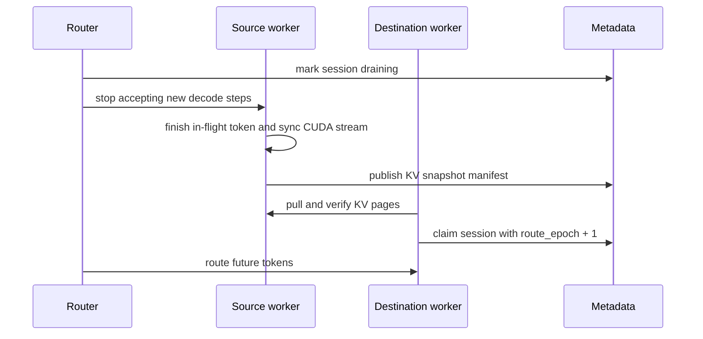

# Ferrule Architecture

Ferrule is a Rust-native, state-aware LLM runtime for edge inference. The current milestone is practical: **OLMoE-1B-7B-0924-Instruct chats on GPU Q4_0 while keeping router, top-k experts, quantized weights, and KV/session state explicit**.


---

## 1. Vision

Ferrule's goal is to become a **Rust-native edge runtime for stateful LLM systems**, starting from sparse MoE inference.

The thesis is simple: inference, rollout, quantization, cache management, and future training should share one native systems foundation. Router decisions, selected experts, quantized weights, KV cache, adapters, and rollout state should be explicit runtime objects that can be scheduled against real hardware.

Near term, Ferrule should reach llama.cpp-level local usability for the supported MoE path: reliable chat, fast cached startup, sampling controls, model inspection, benchmarks, and quality checks.

Long term, Ferrule should differentiate through MoE-native and hardware-aware runtime state:

- explicit router/top-k/expert execution
- expert hot/cold profiling
- expert offload and prefetch
- paged KV/session state
- LoRA/SFT and RL rollout state
- cloud-built qcache/adapters consumed by edge runtimes
- RISC-V/GPU/NPU scheduling hooks for future hardware co-design
- distributed state management for qcache, KV, adapters, trajectories, and checkpoints

The token hot path should remain local and fast. Coordination, migration, and training artifacts should live around it, not inside every decode step.

---

## 2. Current Runtime

| Crate | Role |
|---|---|
| `ferrule-core` | shared errors and metadata |
| `ferrule-gguf` | GGUF and safetensors readers |
| `ferrule-quant` | Q4_0, Q8_0, Q2S, T1S quantization |
| `ferrule-model` | OLMoE loader, tokenizer, CPU FP32 reference forward |
| `ferrule-cuda` | cuda-oxide kernels and GPU OLMoE forward pass |
| `ferrule-runtime` | shared runner, session, sampling, and chat generation loop |
| `ferrule-cli` | `chat`, `run`, `gpu-run`, `info`, `cuda` |

Current inference flow:

```text
safetensors + tokenizer files
        ↓
ferrule-model OLMoE loader
        ↓
CPU FP32 tensors
        ↓
Q4_0 / Q8_0 quantization
        ↓
model.q4_0_llama.qcache
        ↓
CUDA device buffers
        ↓
ferrule-runtime session + sampler
        ↓
chat / one-shot generation
```

Important limitation: a qcache hit avoids re-quantization, but Ferrule still loads the full CPU FP32 model first. **qcache-only startup is the next major systems milestone.**

---

## 3. OLMoE Forward Pass

Per token, each layer runs:

1. input RMSNorm
2. Q/K/V projections
3. Q/K head norms
4. RoPE
5. append K/V to KV cache
6. attention score, softmax, value combine
7. output projection and residual
8. FFN RMSNorm
9. router projection
10. top-k expert selection
11. expert gate/up/down loop
12. weighted expert accumulation and residual

Then Ferrule runs final RMSNorm, `lm_head`, and token selection.

### Router correctness contract

Ferrule follows the model config exactly:

- `norm_topk_prob=false`: softmax over **all experts**, select top-k probabilities, do not renormalize.
- `norm_topk_prob=true`: select top-k and renormalize selected probabilities.

This fixed the previous OLMoE-Instruct chat degeneration. Renormalizing top-k expert probabilities when the config says not to over-amplifies expert outputs.

---

## 4. GPU Runtime

`GpuOlmoeModel` owns one CUDA context, one stream, persistent device buffers, and reusable scratch buffers.

Persistent state:

- embedding table and `lm_head` in FP32
- norm weights and router weights in FP32
- quantized attention projections
- quantized expert projections
- RoPE tables
- per-layer K/V cache
- hidden, attention, router, expert, and logits scratch buffers

Key kernels:

| Kernel | Purpose |
|---|---|
| `embed_lookup` | token embedding lookup |
| `gemv_f32` | router and `lm_head` projections |
| `gemv_q4`, `gemv_q4_off` | Q4_0 GEMV and expert-offset GEMV |
| `gemv_q8`, `gemv_q8_off` | Q8_0 GEMV and expert-offset GEMV |
| `gemv_dual_q4_off` | fused Q4_0 expert gate/up GEMV |
| `gemv_triple_q4` | fused Q/K/V path when dimensions match |
| `rms_norm_fused` | RMSNorm reduction and apply |
| `rope` | rotary position embedding |
| `attn_scores` | GQA-aware attention scores |
| `attn_combine_softmax` | softmax and V accumulation |
| `router_topk` | all-expert softmax and top-k selection |
| `silu_mul` | SiLU(gate) × up |
| `saxpy` | weighted accumulation and residual updates |

Current decode is single-session with shared runtime sampling controls. Batch prefill, paged KV, CUDA graph replay, and server scheduling are planned.

---

## 5. Quantization and qcache

### Q4_0

Ferrule Q4_0 matches llama.cpp `block_q4_0`:

```text
block size: 32 values
storage:    16 bytes per block
byte j:     low nibble  = value j
byte j:     high nibble = value j + 16
scale:      d = max_value_at_absmax / -8
value:      (q - 8) * d
```

The current compatible cache suffix is:

```text
model.q4_0_llama.qcache
```

### Q8_0

Q8_0 quantizer and CUDA GEMV kernels exist, including expert-offset GEMV. Q8_0 should become the next accuracy baseline after qcache-only loading removes CPU RAM pressure.

### qcache target

The current qcache stores quantized per-layer projection and expert weights. The next format should add a manifest:

```text
QCacheManifest {
  model_id,
  source_revision_or_hash,
  tokenizer_hash,
  quant_type,
  layout_version,
  tensor_shapes,
  dtype_policy,
  file_chunks,
  checksums,
  compatible_runtime_versions
}
```

This enables local qcache-only startup now and remote qcache distribution later.

---

## 6. Alignment Targets

### llama.cpp parity that matters first

| Capability | Ferrule today | Target |
|---|---|---|
| chat CLI | REPL with sampling and stop strings | structured history and template registry |
| model metadata | `info` | qcache/model manifest inspection |
| quantization | Q4_0/Q8_0/Q2S/T1S | Q8 validation, mixed precision, K-quant/AWQ track |
| benchmarks | CUDA GEMV probe | prompt/decode tokens/sec report |
| quality checks | manual smoke tests | logits diff, perplexity, golden token tests |
| loading | safetensors first | qcache-only, streaming quantization |
| serving | none | small OpenAI-compatible HTTP server |
| offload | none | expert-aware CPU/NVMe offload |

Ferrule should stay selective: CUDA + sparse MoE is the current leverage point. Broad backend coverage can wait.

### Modern inference systems to track

- vLLM/PagedAttention: paged KV and continuous batching
- SGLang: prefix/radix KV reuse and structured generation
- FlashAttention: efficient exact attention for long context and prefill
- QServe/AWQ/KVQuant/KIVI: weight, activation, and KV quantization co-design
- PowerInfer/FlexGen/LLM-in-a-flash: hot/cold locality and out-of-core scheduling

---

## 7. Elastic State Fabric

Elastic State Fabric is the future state layer for distributed rollout, training, checkpointing, expert offload, and session migration. It is not implemented yet.

Core objects:

| Object | Purpose |
|---|---|
| `StateObject` | atomic state item: qcache chunk, KV page, adapter, trajectory, checkpoint chunk |
| `StateTablet` | ownership group for related state objects |
| `StateAgent` | worker-local cache, prefetch, eviction, transfer, and verification agent |
| `ModelVersion` | runnable model identity: source, tokenizer, quant, qcache layout, adapters |
| `SessionBinding` | `session_id → worker_id + kv_tablet_id + route_epoch` |

State classes:

| Class | Examples | Durability | Hot path? |
|---|---|---|---|
| Static model state | safetensors, tokenizer, qcache | durable | no |
| Runtime model state | device buffers, expert cache | local/cache | yes |
| Session state | KV pages, RNG state, chat history | semi-durable | yes |
| RL state | trajectories, rewards, advantages | durable | no |
| Training state | adapters, gradients, optimizer shards | durable | no |

A future migration protocol should be session-first and route-epoch protected:



First implementation step: qcache manifest discipline. It is useful locally today and becomes the first Fabric-compatible artifact later.

---

## 8. Training and RL Path

Ferrule should evolve in stages:

1. **Inference worker**: current single-GPU MoE decode.
2. **Rollout worker**: sampling, logprobs, trajectory records, model/adaptor version tags.
3. **LoRA/SFT prototype**: adapter representation, injection/merge path, minimal training loop.
4. **RL loop**: reward interface, advantage computation, PPO/GRPO-style driver.
5. **Distributed state**: qcache registry, trajectory store, checkpoint registry, session/expert placement.

A rollout trajectory should include model version, adapter version, prompt tokens, generated tokens, logprobs, rewards, terminal reason, sampling config, and tool/environment events.

---

## 9. Immediate Decisions

1. Keep OLMoE-Instruct as the golden correctness model.
2. Build qcache-only startup before adding larger MoE models.
3. Add CPU/GPU logits comparison before deep kernel tuning.
4. Add sampling and real chat templates before server work.
5. Treat Qwen MoE as the next model-family target after streaming quantization.
6. Treat expert profiling/offload as Ferrule's main differentiator over dense local runtimes.
