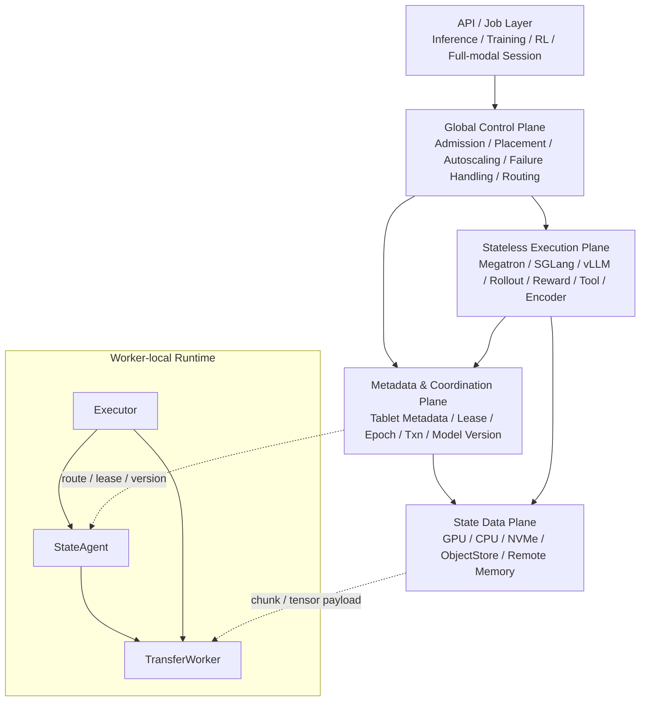
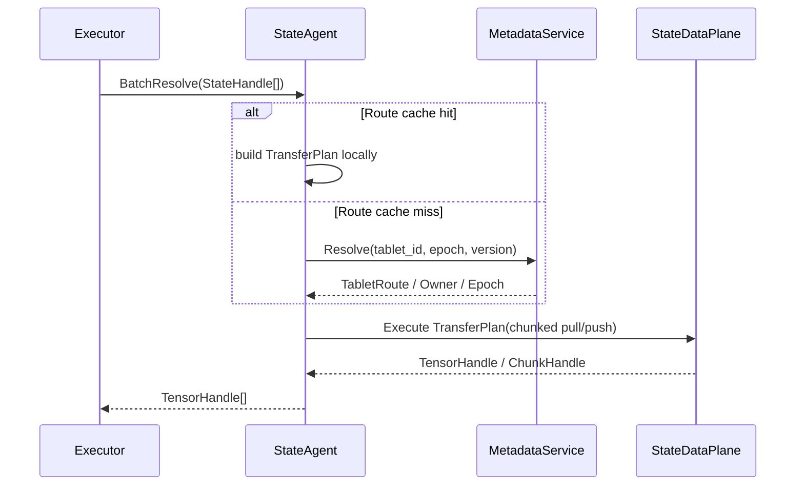
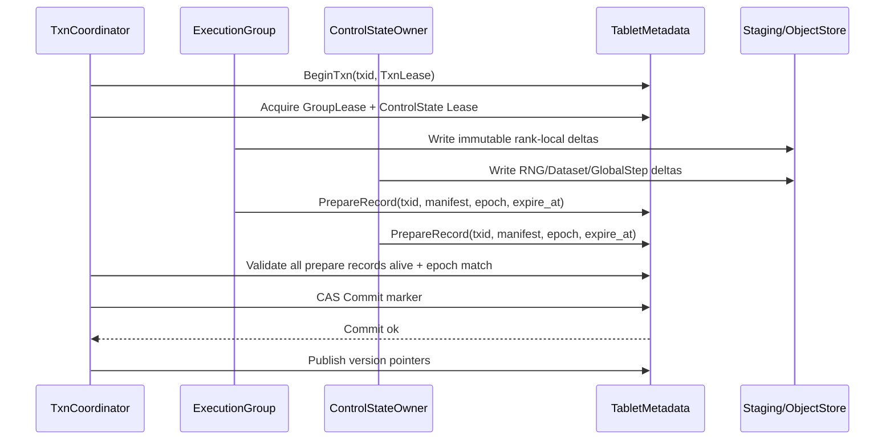
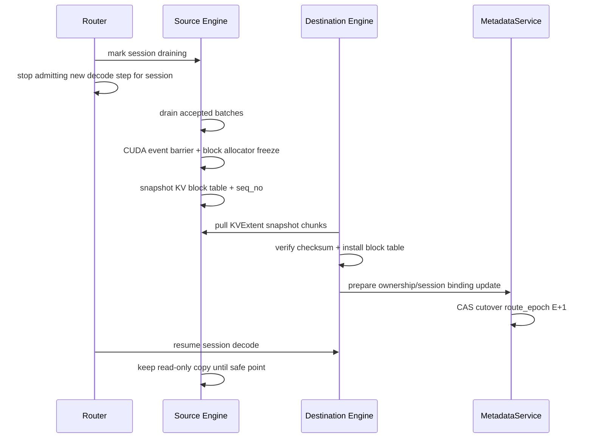
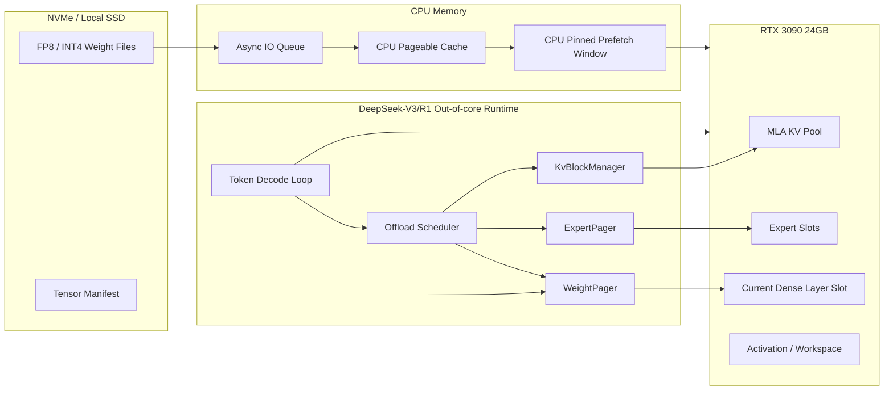

> **2026-06 状态**: StateFabric 暂不开发。当前聚焦 Ferrule Edge Runtime。详见 ferrule_arch.md。此文档保留作为分布式控制面参考。

# Elastic State Fabric for Train-Infer-RL Systems

> 面向训推强化一体的弹性状态织物设计文档  
> Version: v0.5  
> Date: 2026-06-11  
> Status: 设计草案 / v0.5 修订版

---


## 0. 本版修订重点

v0.5 在 v0.4 的基础上做一次设计收敛，目标是把系统主线和 3090 本地 out-of-core 推理研究支线拆开，避免把不可控的单卡超大 MoE 推理复杂度压进 StateFabric MVP。

本版关键修订：

1. **DeepSeek V4 Pro 降级为非目标**
   v0.4 中的 “DeepSeek V4 Pro 单卡 3090 Streaming Inference Engine” 修改为：

   ```text
   DeepSeek-V3/R1 单卡 3090 Out-of-core Streaming Prototype
   ```

   V4-Pro 暂不作为本机 3090 目标。3090 侧先验证 V3/R1 的 out-of-core decode loop、weight manifest、layer streaming、expert streaming 和 MLA KV 管理。

2. **修正 expert cache 预算错误**
   原文把 “256 experts” 作为全模型 expert 总量处理。v0.5 明确：DeepSeek-V3/R1 的 256 routed experts 是 **per MoE layer** 的 expert 数量，不是全模型总数。全模型所有 MoE layer 的 expert 权重大约是数百 GB 级，不能全量常驻 CPU pinned memory。

3. **修正 INT4 / FP8 权重量与 H2D 性能模型**
   671B 参数按 INT4 下界计算约为 335.5GB，而不是 170GB。`0.5GB / 12GB/s ≈ 41.7ms`，不是 0.04ms。v0.5 不再使用固定乐观估算，而改为基于 tensor manifest 的参数化预算模型。

4. **事务恢复规则收紧**
   v0.4 中 “TxnLease 过期后，如果所有 participant prepared 仍可 commit” 存在 split-brain 风险。v0.5 改为：

   ```text
   TxnLease expired 且无 Commit marker -> presumed abort
   ```

   Commit 必须满足 TxnLease 未过期、PrepareRecord 未过期、participant epoch 匹配，并通过 metadata CAS。

5. **KV migration 改为 session-first MVP**
   v0.5 明确 MVP 不做任意 tablet 级 live KV migration。优先支持 worker drain、session sticky、短暂停顿 quiesce snapshot migration。KV hot path 仍由推理引擎内部 scheduler/block manager 管理，StateFabric 不逐 token 干预。

6. **新增架构图**
   补充四张 Mermaid 架构图：

   - StateFabric 总体分层架构
   - StateTransaction / Group Commit 时序
   - Session-first KV Migration
   - DeepSeek-V3/R1 3090 out-of-core runtime 架构

7. **MVP 路线重新排序**
   StateFabric 主线优先做：RL trajectory log、checkpoint registry、model version registry、routing fabric、StateAgent、chunked transfer。DeepSeek-V3/R1 3090 原型作为研究支线，不阻塞主线 MVP。

本版保留 v0.4 的以下稳定设计：

```text
1. 训练状态采用 append-only delta + atomic metadata commit。
2. 多 rank 训练使用 ExecutionGroup / GroupLease。
3. MVP 不做 rank 热替换，任一训练 rank 失败触发 group rebuild。
4. Recomputable state 不进强事务，但通过 epoch fence 防 stale write。
5. 正常 decode per-token KV append 不走 StateFabric。
6. StateHandle 不暴露物理 owner，通过 StateAgent resolve。
7. ModelVersion publish 经过 readiness gate。
8. CommBackend 拆分 Collective / State Transfer / Fine-grained GPU State 三层。
9. Framework Adapter 分阶段接入，第一版不接管框架 hot path。
```

## 1. 核心定义

Elastic State Fabric 的目标是：

> 将 Megatron、SGLang、vLLM、rollout worker、reward worker、tool worker 等执行单元抽象为 **无长期状态的 executor**，把 checkpoint、optimizer state、weights、KV cache、trajectory、hidden state、encoder feature、vector index、模型版本、资源归属和弹性迁移统一抽象为外部托管的状态系统。

这里的“无状态”不是说 executor 运行过程中没有临时状态，而是：

```text
Executor 可以持有 transient state；
Executor 不应该持有 durable ownership。
```

也就是说：

```text
CUDA context / NCCL communicator / workspace / temporary KV page
  可以存在于 executor 内部；

checkpoint / optimizer shard / committed model version / trajectory / long-lived KV
  必须由 State Fabric 托管。
```

---


## 2. 总体架构

Elastic State Fabric 的核心目标是：

```text
将训练、推理、RL、全模态 pipeline 中的长期状态抽象为外部托管状态，
让 executor 只负责计算和短生命周期 runtime state。
```

系统不试图替代 Megatron、SGLang、vLLM、Ray 或 RL trainer，而是提供一层外置状态控制平面：

```text
控制面决定“谁应该做什么”；
元数据面决定“状态归谁、版本是什么、提交是否可见”；
数据面负责“大对象如何搬”；
executor 只做计算，不拥有 durable ownership。
```

### 2.1 分层架构图



### 2.2 组件职责

| 层 | 职责 | 不负责 |
|---|---|---|
| API / Job Layer | 接收 inference、training、RL、full-modal session | 不直接管理状态所有权 |
| Global Control Plane | admission、placement、routing、autoscaling、failure handling | 不搬 tensor payload |
| Metadata Plane | tablet metadata、lease、epoch、transaction、version registry | 不做 CUDA / NCCL hot path |
| State Data Plane | chunked transfer、object store、NVMe、RDMA、CUDA IPC | 不决定事务可见性 |
| Stateless Execution Plane | forward/backward/decode/reward/tool execution | 不拥有 durable state |
| StateAgent | worker-local resolve、cache、prefetch、coalesce、checksum | 不做全局强一致决策 |

### 2.3 状态访问路径



### 2.4 事务提交路径



### 2.5 Session-first KV 迁移路径



### 2.6 DeepSeek-V3/R1 3090 out-of-core 研究支线



该支线通过 WeightManifest / ChunkDescriptor / StateAgent 接入 StateFabric，但不作为 StateFabric MVP 的阻塞项。

## 3. 核心对象模型

### 3.1 StateObject

StateObject 是最小可寻址状态对象。

```cpp
enum class StateKind {
    // inference
    KVCache,
    PrefixCache,
    HiddenState,
    EncoderFeature,
    CodecToken,
    AudioFrame,
    DiffusionLatent,

    // training
    WeightShard,
    OptimizerShard,
    GradientShard,
    ActivationCheckpoint,
    RNGState,
    DatasetCursor,
    DistributedCheckpoint,

    // RL
    Prompt,
    Response,
    LogProb,
    Reward,
    Advantage,
    Trajectory,
    ToolResult,
    EnvSnapshot,

    // retrieval / routing
    VectorEmbedding,
    VectorIndexShard,
    ExactIndexShard,
    RoutingHint,
};

struct StateObject {
    StateId id;
    StateKind kind;

    NamespaceId namespace_id;
    TenantId tenant_id;

    ModelId model_id;
    Version version;

    JobId job_id;
    RequestId request_id;
    SessionId session_id;

    Shape shape;
    DType dtype;
    Layout layout;

    ExactKey exact_key;
    Optional<VectorKey> vector_key;

    StorageTier tier;
    DurabilityClass durability;
    ConsistencyLevel consistency;
    LifetimeClass lifetime;

    uint64_t epoch;
    uint64_t logical_timestamp;

    Checksum checksum;
    RefCount ref_count;
};
```

### 3.2 StateTablet

StateTablet 是弹性迁移、分裂、合并和所有权管理的基本单位。

```cpp
struct StateTablet {
    TabletId tablet_id;
    NamespaceId namespace_id;
    StateKind kind;

    KeyRange key_range;
    VersionRange version_range;

    OwnerId owner;
    vector<ReplicaId> replicas;

    Placement placement;
    StorageTier home_tier;

    LoadStats load;
    MemoryStats memory;
    HotnessStats hotness;

    uint64_t epoch;
    Lease lease;

    TabletStatus status;
};
```

TabletStatus：

```cpp
enum class TabletStatus {
    Serving,
    Draining,
    MigratingOut,
    MigratingIn,
    Splitting,
    Merging,
    ReadOnly,
    Tombstoned,
};
```

### 3.3 StateHandle

StateHandle 是 executor 看到的句柄，不直接暴露物理位置。

```cpp
struct StateHandle {
    StateId state_id;
    TabletId tablet_id;

    Version version;
    uint64_t epoch;

    StateKind kind;
    Layout layout;

    uint64_t size_bytes;
    vector<ChunkDescriptor> chunks;

    Checksum manifest_checksum;
};
```

### 3.4 ChunkDescriptor

大对象必须分块传输，不能假设一次性搬完。

```cpp
struct ChunkDescriptor {
    ChunkId chunk_id;
    uint64_t offset;
    uint64_t length;

    Checksum checksum;
    Compression codec;

    vector<Location> locations;
    TransferHint transfer_hint;
};
```

---

## 4. 一致性模型：从原地更新改为 State Transaction

### 4.1 问题

训练 step 可能同时更新多个状态：

```text
WeightShard tablet
OptimizerShard tablet
RNGState tablet
DatasetCursor tablet
```

如果这些 tablet 分属不同 owner，单 tablet lease 无法保证训练 step 的原子推进。

### 4.2 修订原则

训练、checkpoint 和模型发布不应被设计成：

```text
overwrite tablet A
overwrite tablet B
overwrite tablet C
```

而应设计成：

```text
write immutable delta objects
prepare manifests
commit one transaction marker
publish new version pointers
```

即：

```text
Append-only data + Atomic metadata commit
```

### 4.3 StateTransaction

```cpp
enum class TransactionKind {
    TrainingStep,
    CheckpointCommit,
    ModelVersionPublish,
    TrajectoryBatchCommit,
    TabletMigration,
    TabletSplit,
    TabletMerge,
};

struct StateTransaction {
    TxnId txid;
    TransactionKind kind;

    NamespaceId namespace_id;
    JobId job_id;
    ModelId model_id;

    vector<TabletId> participants;
    vector<StateHandle> input_states;
    vector<StateHandle> output_deltas;

    uint64_t read_epoch;
    uint64_t write_epoch;

    TxnStatus status;
};
```

TxnStatus：

```cpp
enum class TxnStatus {
    Pending,
    Preparing,
    Prepared,
    Committed,
    Aborted,
    Finalized,
};
```

### 4.4 Group Commit 协议

训练 step 或 checkpoint commit 使用 group commit。

每个事务有自己的 TxnLease，防止 coordinator 故障后 participant 被无限锁定：

```cpp
struct TxnLease {
    TxnId txid;
    CoordinatorId coordinator;
    uint64_t epoch;
    TimePoint expire_at;       // 超时后 participant 可单方面 release prepare lock
};

struct PrepareRecord {
    TxnId txid;
    TabletId tablet;
    uint64_t epoch;
    TimePoint expire_at;       // 与 TxnLease.expire_at 一致
    Manifest manifest;
};
```

流程：

```text
1. BeginTxn(txid) — 写入 TxnLease 到 metadata log
2. Acquire group lease for participant tablet group
3. Executors compute and write immutable delta chunks
4. Each participant tablet records PrepareRecord(txid, manifest, checksum, expire_at)
5. TransactionCoordinator verifies all participants prepared
6. Commit(txid) is written to strongly consistent metadata log (CAS: epoch must match)
7. Version pointers become visible
8. Old versions remain readable until GC safe point
```

关键约束：

```text
数据可以先写到 staging area；
只有 commit marker 可见后，读者才会解析到新版本。
commit 必须 CAS 校验 txn_lease.epoch == current_coordinator_epoch；
如果 PrepareRecord 已过期（new coordinator 已接管），旧 epoch 的 commit 被拒绝。
```


### 4.5 失败语义与 Coordinator 恢复

| 失败点 | 处理 |
|---|---|
| executor 计算中失败 | txid abort，staging delta GC |
| 部分 tablet prepare 成功 | txid 未 commit，不可见，可 abort |
| commit marker 已写入后 coordinator 崩溃 | 新 coordinator 从 metadata log 恢复并 finalize |
| output 上报前 executor 崩溃 | output delta 已按 idempotency key 写入，可重试 commit |
| 重复执行同一 txid | 根据 txid + output key 去重 |
| coordinator 在 Prepare 阶段崩溃 | 如果 TxnLease 未过期可继续；过期后 presumed abort |

v0.5 收紧事务恢复规则：**TxnLease 过期后，除非 Commit marker 已经存在，否则不能再主动 commit**。

原因：participant 的 PrepareRecord 过期后，可能已经释放 prepare lock，并接受了新 epoch / 新事务。如果旧 coordinator 或新 coordinator 在 lease 过期后仍根据 “all participants prepared” 提交旧事务，会产生 split-brain。

#### 4.5.1 Commit 必要条件

提交必须同时满足：

```text
1. Commit marker 尚不存在，且 Abort marker 尚不存在；
2. TxnLease 未过期；
3. 所有 PrepareRecord 未过期；
4. 所有 participant 的 current_epoch == prepare_epoch；
5. 所有 manifest checksum 校验通过；
6. CAS(txn.status: Prepared -> Committed, epoch == txn_lease.epoch) 成功。
```

如果已经存在 Commit marker，则进入 finalize commit；如果已经存在 Abort marker，则进入 finalize abort。

#### 4.5.2 Coordinator 恢复逻辑

```text
for each txn in [Pending, Preparing, Prepared]:

  if Commit marker exists:
      -> Finalize commit
      continue

  if Abort marker exists:
      -> Finalize abort
      continue

  if txn.TxnLease.expired():
      -> Abort / PresumedAbort
      -> release participant prepare locks if still held
      -> staging delta wait retention then GC
      continue

  if status == Pending or Preparing:
      -> Abort or retry prepare according to policy
      continue

  if status == Prepared:
      if all participants prepared
         and all PrepareRecord not expired
         and all participant epochs match
         and CAS commit succeeds:
          -> Commit
      else:
          -> Abort
```

#### 4.5.3 Participant 侧超时

PrepareRecord 过期后，participant 可以释放 prepare lock，但仍需保留 staging delta 一段 retention window，便于排查和处理已经写入 Commit marker 但未 finalize 的场景。

```text
PrepareRecord expired:
  - release prepare lock
  - reject old epoch commit
  - keep staging delta read-only for retention
  - allow new txn to acquire lease
```

#### 4.5.4 事务语义选择

MVP 采用 **presumed abort**：

```text
没有 Commit marker 的 expired transaction 默认 abort。
```

这样牺牲少量可用性，但避免旧事务在 lease 过期后复活。

### 4.6 Recomputable State 的 Epoch Fence

KV cache、hidden state、encoder feature 大多是 recomputable state，**默认不走强事务**。

但它们**仍然需要 epoch fence 防止写到旧 owner**：

```cpp
struct AppendRequest {
    StateHandle handle;
    TabletId tablet_id;
    uint64_t expected_epoch;
    IdempotencyKey idempotency_key;
    vector<ChunkDescriptor> chunks;
};
```

TabletOwner 收到写请求后的校验逻辑：

```text
if request.expected_epoch < current_epoch:
    reject StaleEpoch(new_owner_hint)
if request.expected_epoch > current_epoch:
    reject FutureEpoch(refresh_required)
if tablet.status not writable:
    reject TabletNotWritable
else:
    accept append
```

**关键澄清：正常路径不经过 StateFabric**：

```text
正常 decode 期间:
  executor 内部自己管理 KV page table
  per-token KV append 直接写本地内存
  StateFabric 不参与 → 延迟 0

迁移 / 故障场景:
  tablet 进入 MigratingOut / Draining
  → epoch fence 激活
  → 新 append 被拒绝或 redirect
  → 只有此时 StateFabric 才参与 KV write path
```

总的来说，recomputable state 的保障模型是：

```text
epoch fence     → 防止写到旧 owner
idempotency key → 防止 retry 重复追加
recompute fallback → 处理丢失或 abort
// 不使用 2PC，不需要 TxnLease
```

强事务只用于：

```text
checkpoint
optimizer
weight version
training progress
trajectory batch
model publish
tablet ownership cutover
```

---

## 5. TrainingGroup 与 Group Lease

### 5.1 问题

单 writer lease 无法表达 TP=8、PP=N、DP=M 的训练现实：

```text
8 个 TP rank 共同参与一个 training step；
它们需要 NCCL all-reduce / all-gather；
每个 rank 写不同 shard；
但逻辑上这是一个原子 step。
```

### 5.2 ExecutionGroup

```cpp
enum class ParticipantRole {
    ExecutionGroup,     // Megatron ranks — 写 rank-local weight/optimizer/grad shard
    ControlStateOwner,  // RNG / dataset cursor / global step / LR scheduler
    ManifestOwner,      // checkpoint/version manifest
    LogOwner,           // trajectory log / event log
};

struct ExecutionGroup {
    GroupId group_id;
    GroupKind kind; // Training, Prefill, Decode, RLBatch, EncoderTP

    vector<WorkerId> members;
    ParallelismSpec parallelism;

    NCCLTopology topology;
    Placement placement;

    uint64_t epoch;
    GroupLease lease;
};
```

**注意**：一个 TrainingStep transaction 的 participant 不全是 ExecutionGroup 成员。RNGState / DatasetCursor / GlobalStep 可能由独立 ControlStateOwner 持有（MVP 阶段建议由 TrainingGroup rank 0 兼任，跟随 group 一起重建；后续版本可拆为独立轻量服务）。

### 5.3 GroupLease

```cpp
struct GroupLease {
    GroupId holder_group;
    vector<TabletId> tablets;

    LeaseMode mode; // Read, Write, Append, Commit
    uint64_t epoch;

    TimePoint expire_at;
};
```

语义——训练 step 事务的完整 participant 视图：

```text
1. BeginTxn(step=1000) with TxnLease
2. Acquire group lease for TrainingGroup (ExecutionGroup participant)
3. Acquire write lease for ControlState tablet group (ControlStateOwner participant)
   - RNGState tablet
   - DatasetCursor tablet
   - GlobalStep tablet
   - LR scheduler state tablet
4. TrainingGroup writes rank-local deltas:
   - weight shard deltas (per rank)
   - optimizer deltas (per rank)
   - grad stats
5. ControlStateOwner prepares RNG / DatasetCursor / GlobalStep deltas
6. ManifestOwner (if separate) prepares step manifest
7. TxnCoordinator verifies all participants prepared
8. Commit marker written
9. New step version becomes visible
```

### 5.4 ExecutionGroup 故障模型

NCCL communicator 是 transient state，但 **ExecutionGroup membership / topology / epoch 是控制面状态**。

MVP 不支持 rank 热替换。故障模式分三级：

| 模式 | 语义 | MVP 支持 |
|---|---|---|
| **Group Rebuild** | 任一 rank 挂，整个 group abort/restart | ✅ 支持 |
| **Rank Replacement** | 单 rank 替换，其他 rank 保留 | ❌ 不支持 |
| **Elastic Resharding** | world size 改变后继续训练 | 🔮 后续研究 |
| **Online Communicator Surgery** | 原地替换 communicator 成员 | ❌ 不做 MVP |

**MVP Group Rebuild 流程**：

```text
任一 training rank 失败
  -> 整个 ExecutionGroup 标记 Failed
  -> 当前 txid Abort
  -> 所有 prepared delta 进入 abandoned/staging 状态
  -> group lease revoke
  -> 销毁原 NCCL topology
  -> 重新分配完整 TrainingGroup
  -> 从上一个 committed checkpoint / committed step replay
```

即：**rank failure = group failure**（不是 rank failure = rank replacement）。这与 PyTorch Elastic 的故障模型一致：worker failure 视作 membership change，通过 restart 从 snapshot/checkpoint 恢复。

**State Fabric 的职责边界**：

```text
State Fabric 负责：
  group placement
  group lease
  group membership / epoch（作为控制面状态）
  input StateHandle
  output StateDelta
  failure detection → 触发 Group Rebuild
  commit / abort

Megatron / executor group 负责：
  NCCL communicator 创建
  TP/PP/DP/EP 计算
  gradient communication
  microbatch schedule
```

State Fabric 不把 NCCL communicator 作为 durable state，但它把 ExecutionGroup membership / topology / epoch 作为控制面状态。一旦 group 内任一成员失败，MVP 默认使整个 group epoch 失效，abort 当前 transaction，并重新创建新的 execution group。

这种设计避免 State Fabric 取代 Megatron 的训练调度。

---

## 6. 数据面协议

### 6.1 控制面不搬大 tensor

控制面只传：

```text
StateHandle
TransferPlan
ChunkDescriptor
Lease / Txn metadata
```

tensor payload 走数据面。

### 6.2 TransferPlan

```cpp
struct TransferPlan {
    TransferId transfer_id;

    StateHandle source;
    Device target_device;

    vector<ChunkDescriptor> chunks;
    vector<TransferRoute> routes;

    bool resumable;
    bool verify_checksum;
    Compression target_codec;
};
```

### 6.3 数据传输模式

| 场景 | 默认模式 | 说明 |
|---|---|---|
| Executor 读取已有状态 | pull | executor-local StateAgent 拉取 |
| 预热权重 / KV 副本 | push or pull | 由 placement planner 决定 |
| checkpoint 写入 | push | training group 写入 staging/object store |
| KV cache 迁移 | pull preferred | destination 拉 source，便于断点续传 |
| 同机 GPU-GPU | CUDA IPC / peer copy | 需要 capability 检查 |
| 跨机 GPU-GPU | RDMA / NCCL / NIXL | 依赖底层 transport |
| 冷数据 | object store / NVMe | chunk manifest 管理 |

### 6.4 大 checkpoint 传输

100GB checkpoint 不作为单对象提交，而是：

```text
CheckpointVersion
  ├── shard manifest
  │     ├── tensor group
  │     ├── chunk list
  │     ├── checksum
  │     └── layout metadata
  └── commit marker
```

流程：

```text
1. Megatron ranks write checkpoint chunks to staging store
2. Each rank writes shard manifest
3. TransactionCoordinator validates all shard manifests
4. Commit checkpoint version
5. ModelVersionRegistry may later publish serving version
```


### 6.5 KV 迁移传输

KV cache 迁移有两种协议。MVP 使用方案 A，方案 B 留给后续版本。

v0.5 的重要收敛：**MVP 不做任意 tablet 级 live KV migration**。KV 的高频 append 和 page table mutation 仍由推理引擎内部 block manager 管理；StateFabric 只在 drain、snapshot、cutover、故障恢复场景介入。

#### 方案 A：Session-first Quiesce-based Migration（MVP，Phase 4）

迁移单位优先选择：

```text
SessionKVExtent / RequestKVExtent
```

而不是大范围 KV tablet。Tablet 仍可作为元数据分片和 placement 管理单位，但 live migration 的暂停范围应尽量收敛到单 session / request。

```cpp
struct KvSessionBinding {
    SessionId session;
    RequestId request;
    TabletId tablet;
    OwnerId owner;
    uint64_t route_epoch;
    DrainState drain_state;
    ModelVersion version;
};
```

MVP 协议：

```text
1. Router 标记 session draining。
2. Router 停止给该 session 分配新的 decode step。
3. Source engine 执行完已经 accepted 的 decode batch。
4. Source engine 等待 CUDA event barrier，确保 in-flight KV write 完成。
5. Source block allocator freeze。
6. Source 导出 KV block table snapshot + seq_no + checksum。
7. Destination requests TransferPlan(KVExtent)。
8. Destination pulls full snapshot chunks。
9. Destination verifies chunk manifest。
10. Destination installs block table and KV pages。
11. MetadataService CAS 更新 KvSessionBinding(route_epoch = E+1)。
12. Router 重新将该 session 路由到 destination。
13. Source 保留 read-only old copy until safe point。
14. GC removes old copy。
```

关键约束：

```text
metadata cutover 不能早于 CUDA stream barrier；
block table snapshot 必须带 seq_no；
Destination install 必须先完成再切 route_epoch；
Source old copy 在 active session safe point 前不能释放。
```

优点：协议简单、一致性清楚、适合第一版。  
缺点：该 session 有短暂停顿，不适合强实时音频或超低 TPOT 服务。

#### 方案 B：Worker Drain without KV Copy（MVP 优先路径）

对于大多数 serving 场景，MVP 更推荐先做 worker drain，而不是 live KV copy：

```text
1. 新 session 不再路由到旧 worker。
2. 旧 session sticky 到旧 worker。
3. 等待旧 session 自然结束。
4. 超过 drain timeout 的长 session 再选择 quiesce migration 或 abort/recompute。
5. worker 无 active session 后释放资源。
```

这是最贴近 SGLang / vLLM 当前 scheduler 边界的方案，工程风险低。

#### 方案 C：Continuous Replication（Phase 5+，未来版本）

用于低停顿迁移。PagedAttention / MLA KV 不只是 tensor append，还涉及 block table、page table 和 token→page mapping。因此 delta 必须包含 page alloc、KV tensor chunk、page table patch 四个维度：

```cpp
struct KVDelta {
    TabletId tablet_id;
    uint64_t epoch;
    uint64_t seq_no;

    RequestId request_id;
    LayerId layer;
    TokenRange token_range;

    vector<PageAllocDelta> page_allocs;
    vector<KVChunkDescriptor> kv_chunks;
    PageTablePatch page_table_patch;

    Checksum checksum;
};
```

Continuous replication 流程：

```text
1. Source exports base snapshot at epoch E。
2. Source starts KV delta stream from sequence number S。
3. Destination pulls base snapshot。
4. Source keeps streaming KVAppendDelta / PageTableDelta。
5. Destination applies deltas in order。
6. Source enters short quiesce。
7. Destination catches up to final sequence number。
8. Metadata cutover。
```

统一数据结构：

```cpp
struct KVExtent {
    RequestId request_id;
    SessionId session_id;
    ModelVersion version;

    LayerRange layers;
    TokenRange tokens;
    PageRange pages;

    Layout layout;
    uint64_t snapshot_seq_no;
    vector<ChunkDescriptor> chunks;
};
```

---

## 7. StateHandle 解析路径

### 7.1 Hot path 不应每次访问强一致控制面

executor 不直接问 etcd/Raft。

每个 worker 上有一个本地组件：

```text
StateAgent
```

负责：

```text
batch resolve StateHandle
cache tablet routing
coalesce reads
prefetch
choose transfer route
verify checksum
report local state
```

### 7.2 Resolve 流程

```text
Executor
  -> Local StateAgent.BatchResolve(handles)
  -> cached TabletRoute hit?
       yes: build TransferPlan locally
       no: query MetadataService
  -> StateAgent executes TransferPlan
  -> executor receives TensorHandle
```

### 7.3 Batch Resolve API

```cpp
struct BatchResolveRequest {
    vector<StateHandle> handles;
    Device target_device;
    ResolveOptions options;
};

struct BatchResolveResult {
    vector<TensorHandle> tensors;
    vector<TransferPlan> async_transfers;
    vector<ResolveMiss> misses;
};
```

### 7.4 Coalescing

StateAgent 应做：

```text
相邻 KV page 合并
同 tablet chunk 合并
同 source worker 传输合并
同 target GPU prefetch 合并
重复 StateHandle 去重
```

---


## 8. Tablet Migration 协议

### 8.1 基本原则

迁移过程中：

```text
source 在 cutover 前始终是 authoritative；
destination 只是 staging replica；
只有 metadata commit 后 owner / route binding 才切换。
```

不同 state 类型的迁移粒度不同：

| State 类型 | 推荐迁移粒度 | MVP 策略 |
|---|---|---|
| WeightShard | model version / shard | 预热新版本，不 live migrate |
| CheckpointShard | shard / manifest | object store durable copy |
| OptimizerShard | checkpoint step / shard | 不做每 step externalization |
| TrajectoryLog | log segment | append fence 后切换 writer |
| KVCache | session / request extent | worker drain 优先，少量长 session quiesce migration |
| PrefixCache | prefix extent | 可丢弃，可重算，按 hotness 异步复制 |
| VectorIndex | index shard | 新旧并存，最终一致 compaction |

### 8.2 Migration 状态机

```text
Serving
  -> MigrationIntent
  -> MigratingOut(source) / MigratingIn(destination)
  -> SnapshotPrepared
  -> CutoverCommitted
  -> SourceReadOnly
  -> Serving(new owner / new route binding)
  -> GC old copy
```

### 8.3 Durable State 两阶段迁移流程

通用流程适用于 checkpoint、weight shard、trajectory log 等 durable state：

```text
1. PlanMigration(tablet T, source S, destination D)
2. MetadataService writes migration intent with new epoch E+1
3. Source enters MigratingOut
4. Destination enters MigratingIn
5. Destination pulls snapshot chunks from source / object store
6. Destination verifies chunk manifest
7. Source fences new write leases
8. Remaining delta log is replayed or source drained
9. TransactionCoordinator commits ownership cutover
10. Router / StateAgent starts resolving T to destination
11. Source keeps read-only old copy until safe point
12. GC removes old copy
```

### 8.4 KV Migration 特化：Session-first

KV cache 的正常 append 不经过 StateFabric，因此 KV migration 必须和推理引擎 scheduler/block manager 做强握手。不能只依赖 metadata cutover。

```text
必须具备的 barrier:
  1. Router admission barrier
  2. Engine scheduler drain barrier
  3. CUDA event / stream barrier
  4. Block allocator freeze barrier
  5. Page table snapshot barrier
  6. Destination install barrier
  7. Metadata route_epoch cutover barrier
```

MVP 策略：

```text
默认：worker drain + session sticky
例外：长 session 使用 quiesce snapshot migration
不做：per-token continuous replication
```

### 8.5 进行中的请求

| State 类型 | 迁移中请求处理 |
|---|---|
| Durable checkpoint | 只读 snapshot，无影响 |
| WeightShard | 新版本 publish 前不切换；旧 session sticky old version |
| KV cache | session sticky；新 session 路由新 owner；长 session 可 quiesce migration |
| Trajectory log | append fence 后切换 writer |
| Vector index | 新旧 index 可并存，最终一致 |

### 8.6 故障恢复

| 故障 | 恢复策略 |
|---|---|
| destination 迁移中崩溃 | source 仍 authoritative，abort migration |
| source 迁移中崩溃但 cutover 未 commit | durable state 从 source replica/object store 恢复；recomputable state 可丢弃或 recompute |
| cutover commit 后 destination 崩溃 | destination 已 authoritative，从其 replica/staging manifest 恢复 |
| coordinator 崩溃 | 从 metadata log 重放 migration intent / commit |
| source 和 destination 同时故障 | durable state 从 object store/replica 恢复；recomputable state 标记 lost 并触发 recompute |

### 8.7 不丢不重原则

所有 write / append 请求都带：

```text
tablet_id
epoch
route_epoch
idempotency_key
```

如果请求命中旧 epoch：

```text
read 可由旧 tablet 服务；
write 必须 redirect 或 reject/retry；
append 必须根据 idempotency_key 去重。
```

## 9. Tablet Split / Merge 协议

### 9.1 Split 触发条件

```text
tablet size 过大
QPS 过高
hot key 集中
migration cost 过高
KV prefix range 过宽
trajectory log shard 过热
```

### 9.2 Split 流程

```text
1. Choose split key / split policy
2. Write SplitIntent(parent -> child A, child B)
3. Parent enters Splitting and fences new write leases
4. Existing readers continue using parent snapshot
5. Build child manifests from parent snapshot
6. Route new writes according to split epoch
7. Verify children checksum / key range
8. Commit split metadata
9. Parent enters Tombstoned after all old readers drain
10. GC parent data
```

### 9.3 Merge 流程

```text
1. Choose adjacent tablets A and B
2. Write MergeIntent(A, B -> C)
3. Fence new writes on A and B
4. Build merged manifest C
5. Verify range coverage and no overlap
6. Commit merge metadata
7. Route new reads/writes to C
8. Drain A/B readers
9. GC A/B
```

### 9.4 不丢不重原则

所有请求都带：

```text
tablet_id
epoch
idempotency_key
```

如果请求命中旧 epoch：

```text
read 可由旧 tablet 服务；
write 必须 redirect 或 reject/retry；
append 必须根据 idempotency_key 去重。
```

---

## 10. 幂等性与重试语义

### 10.1 执行是 at-least-once，提交是 exactly-once effect

executor 可能重复执行，但状态提交必须幂等。

```cpp
struct IdempotencyKey {
    JobId job_id;
    ExecutionId execution_id;
    TxnId txid;
    OutputName output_name;
    uint64_t attempt;
};
```

### 10.2 OutputDelta

executor 不直接覆盖状态，只写 OutputDelta：

```cpp
struct StateDelta {
    DeltaId delta_id;
    IdempotencyKey idempotency_key;

    vector<ChunkDescriptor> chunks;
    Checksum checksum;

    DeltaStatus status;
};
```

重复执行时：

```text
相同 idempotency_key + 相同 checksum -> 返回已有 delta
相同 idempotency_key + 不同 checksum -> 标记 nondeterministic conflict
```

### 10.3 Training step 重试

训练 step 必须绑定：

```text
step_id
input checkpoint version
dataset cursor
RNG state
parallel layout
```

如果 step 已 commit：

```text
retry 只能返回 committed result，不能再次更新 optimizer。
```

---

## 11. GC 与 Compaction

### 11.1 Safe Point

GC 不能只按 TTL。需要 safe point。

```cpp
struct SafePoint {
    NamespaceId namespace_id;

    map<ModelId, Version> min_active_model_version;
    map<JobId, CheckpointStep> min_required_checkpoint;
    map<SessionId, Timestamp> active_session_watermark;

    Timestamp vector_index_compaction_watermark;
};
```

### 11.2 不同 state 的 GC 策略

| State | GC 策略 |
|---|---|
| KV cache | TTL + active session refcount + memory pressure |
| Prefix cache | LRU/LFU + exact key hotness |
| checkpoint | keep last K + pinned versions + rollback window |
| optimizer state | 和 checkpoint 版本绑定 |
| trajectory | training consumed + audit retention |
| vector index | tombstone + background compaction |
| model version | no active session + rollback window expired |
| staging delta | tx committed/aborted 后按 retention 清理 |

### 11.3 Tombstone

删除不是立即物理删除：

```text
mark tombstone
stop new resolve
wait safe point
background compaction
delete physical chunks
```

---

## 12. 协调服务与容灾

### 12.1 需要强一致元数据服务

以下操作必须强一致：

```text
lease acquire / renew / revoke
transaction commit marker
tablet ownership cutover
model version publish
checkpoint version commit
split / merge metadata commit
```

### 12.2 MVP 选择

MVP 不自研 Raft，优先使用：

```text
etcd / FoundationDB / ZooKeeper-like metadata service
```

推荐 MVP：

```text
etcd:
  lease / election / watch / compare-and-swap 方便
  适合初期控制面元数据

object store:
  保存 durable chunks / checkpoint shards

StateAgent:
  worker-local hot path 缓存
```

### 12.3 StateBroker 不是单点

StateBroker 应是逻辑服务，由多类组件组成：

```text
MetadataService: 强一致元数据
StateAgent: 每个 worker 本地 hot path agent
TransferWorker: 数据面传输
ObjectStore: durable data
TabletOwner: state serving worker
```

---

## 13. 安全与多租户

### 13.1 Namespace

所有状态必须属于 namespace。

```cpp
struct Namespace {
    NamespaceId id;
    TenantId tenant;
    Quota quota;
    SecurityPolicy policy;
};
```

### 13.2 认证与授权

```text
worker 使用 mTLS 或 workload identity
executor 获取 scoped token
StateHandle 带 capability token 或需二次授权
```

### 13.3 隔离

| 资源 | 隔离策略 |
|---|---|
| metadata | namespace prefix + RBAC |
| object store | bucket/path policy |
| GPU memory | placement quota |
| KV cache | namespace + model version |
| vector index | namespace isolation |
| checkpoint | tenant encryption key |
| network transfer | mTLS / ACL |

---

## 14. 可观测性

### 14.1 指标采集

每个组件必须上报：

```text
StateAgent:
  resolve latency
  transfer latency
  cache hit rate
  prefetch hit rate
  coalescing ratio

TabletOwner:
  tablet QPS
  memory usage
  migration progress
  lease renew latency

Executor:
  execution latency
  GPU utilization
  HBM pressure
  NCCL error
  output delta size

TransactionCoordinator:
  prepare latency
  commit latency
  abort count
  dangling tx count

Router:
  routing latency
  locality score
  version distribution

Autoscaler:
  scale decision
  pending queue
  resource pressure
```

### 14.2 Trace

每个请求/训练 step/RL batch 都应有 trace id：

```text
request_id
execution_id
txid
state_id
tablet_id
model_version
```

### 14.3 Invariant 检查

后台 checker 周期性验证：

```text
tablet key range 不重叠
committed checkpoint shard 完整
model version 所有 required shard 存在
active session 没有引用已 GC 状态
trajectory 的 policy/logprob/reward version 一致
migration 没有长期卡在 prepared
```

---

## 15. Bootstrap / 冷启动

### 15.1 初始模型导入

```text
1. Import model artifact from object store/local path
2. Build WeightShard manifests
3. Register ModelVersion v0
4. Mark v0 as loadable but not serving
5. Placement planner chooses initial workers
6. Workers prewarm weights
7. Router publishes v0 as serving
```

### 15.2 初始训练任务

```text
1. Register training job
2. Resolve initial checkpoint or initialize from model version
3. Create TrainingStateGroup
4. Allocate ExecutionGroup
5. Create dataset cursor / RNG state
6. Start first execution epoch
```

### 15.3 Worker 加入

```text
1. Worker reports capability
2. Control plane assigns role
3. Worker starts StateAgent
4. StateAgent syncs tablet route cache
5. Optional prewarm model / state tablets
6. Worker becomes schedulable
```

---

## 16. Full-modal Dependency-aware StateFlow

全模态推理不应按 Thinker/Talker 等具体模型名建模，而应按依赖类型建模。

```cpp
enum class DependencyType {
    HardSync,
    AsyncStream,
    BarrierJoin,
    FanOut,
    Retrieval,
    Speculative,
    BestEffort,
};
```

### 16.1 Dependency 类型

| 类型 | 语义 | 典型策略 |
|---|---|---|
| HardSync | A_t -> B_t -> A_{t+1} | 同 stage 内 fuse，避免跨 scheduler |
| AsyncStream | 上游连续产出，下游异步消费 | descriptor queue + StateBroker |
| BarrierJoin | 多输入 watermark 到齐 | aggregator + timeout |
| FanOut | 一个 state 被多下游消费 | refcount + consumer cursor |
| Retrieval | 消费 top-k relevant states | vector index / exact index |
| Speculative | 预测未来 state 并预取 | prefetch + rollback |
| BestEffort | 可降级依赖 | deadline-first |

### 16.2 EdgeMessage

EdgeMessage 只传 metadata，不传 tensor payload。

```cpp
struct EdgeMessage {
    RequestId request_id;

    StageId producer;
    StageId consumer;

    StateHandle state;
    LogicalRange range;

    DependencyType dep_type;
    Deadline deadline;
    Priority priority;

    bool end_of_stream;
};
```

大 tensor 通过 StateHandle 解析到 TransferPlan。

---

## 17. Exact Index 与 Vector Index

### 17.1 Exact Index

用于 correctness-preserving reuse。

**ExactIndex 不存物理 owner，存 versioned StateHandle**：

```text
// 错误：存物理 owner
prefix_hash -> Worker W1  (W1 迁移到 W2 → index 必须立即更新)

// 正确：存逻辑引用
prefix_hash -> StateHandle(tablet_id, state_id, epoch, version)
                 ↓
            StateAgent resolve → 当前物理 owner
```

这样 KV tablet 迁移后，ExactIndex 无需立即变更：

```text
Tablet owner 从 W1 迁移到 W2
  → StateHandle 的 epoch 变旧
  → StateAgent route cache refresh
  → ExactIndex entry 不变
```

映射关系：

```text
prefix_hash           -> StateHandle → KV block
input_hash + preprocess_hash -> StateHandle → encoder feature
model_version + tensor_key   -> StateHandle → weight shard
```

KV 复用必须经过 exact match。

**Index tablet vs Data tablet 迁移顺序约束**：

```text
新增 index entry:
  DataTablet prepared → StateHandle visible → ExactIndex update

删除:
  ExactIndex tombstone → wait safe point → GC DataTablet

迁移:
  DataTablet owner cutover → StateHandle epoch stale → StateAgent refresh
  ExactIndex 不必同步更新 owner（因为存的是 logical handle，不是 physical owner）
```

Index tablet 自身更稳定：应小而多副本、读多写少、强缓存、迁移频率低于 data tablet。

### 17.2 Vector Index

用于近似选择：

```text
RAG
semantic memory
state prefetch
cache locality routing
expert prefetch
eviction priority
```

Vector search 不能直接证明 KV / hidden state 等价。

### 17.3 Freshness

Vector index 默认最终一致：

```text
write state object
  -> append embedding build task
  -> async index update
  -> old index remains queryable
  -> compaction removes tombstoned vectors
```

对强一致 retrieval 需求，需要显式声明。

---

## 18. 异构资源抽象

不要写死 A100/H20/3090/M1，而是抽象 capability。

```cpp
struct ResourceCapability {
    DeviceId id;

    ComputeBackend backend; // CUDA, ROCm, Metal, CPU
    double fp16_tflops;
    double bf16_tflops;
    double int8_tops;

    size_t hbm_bytes;
    double hbm_bandwidth;

    size_t cpu_mem_bytes;
    double cpu_mem_bandwidth;

    size_t nvme_bytes;
    double nvme_bandwidth;

    NetworkClass network;
    double rdma_bandwidth;
    double tcp_bandwidth;

    set<DType> supported_dtypes;
    set<KernelFeature> features;
};
```

Placement 应按 stage/state 需求匹配：

```text
decode -> HBM bandwidth + KV locality
prefill -> compute throughput
checkpoint -> NVMe/object store bandwidth
reward -> cheap GPU/CPU
vector index -> CPU memory / SIMD / GPU ANN
M1 -> local degraded execution / Metal-compatible stage
```

---

## 19. CommBackend 抽象：拆 NCCL 的职责

### 19.1 为什么需要 CommBackend

NCCL 是 NVIDIA GPU 上大规模 dense collective 的事实标准，特别适合 all-reduce / reduce-scatter / all-gather 等训练核心通信。但系统中的通信场景多样，不应全部压到 NCCL 上。

### 19.2 三层通信面

| 平面 | 用途 | 默认后端 | 替代/补充后端 |
|---|---|---|---|
| **Collective Plane** | dense training collectives | NCCL | UCC |
| **State Transfer Plane** | checkpoint/KV/hidden/weight movement | UCX / RDMA / ObjectStore | CUDA IPC, TCP |
| **Fine-grained GPU State Plane** | MoE dispatch, GPU-side prefetch, low-latency decode | NVSHMEM / MSCCL++ / Symmetric Memory (后续研究) | |

### 19.3 CommBackend 接口

StateFabric 本身不发起 collective 操作——它只管理 transfer。`CommBackend` 中的 collective 接口是给 Adapter 使用的：

```cpp
enum class CommBackendKind {
    NCCL, UCC, UCX, NVSHMEM, MSCCLPP,
    CUDA_IPC, SHM, RDMA, TCP, ObjectStore,
};

class CommBackend {
public:
    // State Transfer Plane — StateFabric 使用
    virtual TransferHandle Send(const TransferPlan& plan) = 0;
    virtual TransferHandle Recv(const TransferPlan& plan) = 0;
    virtual bool Supports(const Capability& cap) = 0;

    // Collective Plane — Adapter 使用
    virtual CollectiveHandle AllReduce(const CollectiveSpec& spec) = 0;
    virtual CollectiveHandle AllGather(const CollectiveSpec& spec) = 0;
    virtual CollectiveHandle ReduceScatter(const CollectiveSpec& spec) = 0;
};
```

### 19.4 各场景后端建议

| 场景 | 推荐后端 | 说明 |
|---|---|---|
| Megatron TP/DP dense all-reduce | NCCL / UCC | 训练核心通信 |
| checkpoint shard | ObjectStore / RDMA | chunked 传输 |
| KV cache migration | UCX / RDMA / pull | 大对象点对点 |
| full-modal stage relay | CUDA IPC / SHM / UCX | 低延迟场景 |
| MoE expert dispatch | NCCL EP / NVSHMEM (后续) | NCCL 不一定最优 |
| GPU-initiated fine-grained comm | NVSHMEM / Symmetric Memory (后续) | 后续研究 |
| CUDA/ROCm/CPU mixed | UCC / UCX | NCCL 不够泛化 |

### 19.5 MVP 策略

```text
Collective Plane:    使用 NCCL（MegatronAdapter 默认）
State Transfer Plane: 使用 TCP / ObjectStore / CUDA IPC
Fine-grained GPU State Plane: 不实现，留给后续研究
```

CommBackend 抽象的价值在于避免系统其他部分硬编码 NCCL 依赖——当引入 UCX、NVSHMEM 或异构硬件时，StateFabric 控制面逻辑不需要变更。

---


## 20. Framework Adapter 可行性评估

### 21.1 分阶段原则

第一阶段不深度 patch 框架内核。

```text
Phase 1:
  metadata fabric + routing + checkpoint/version/trajectory

Phase 2:
  通过已有 connector 接入 KV transfer/offload

Phase 3:
  patch block manager / scheduler hook

Phase 4:
  深度接管 state ownership
```

### 21.2 SGLangAdapter

可行切入点：

```text
PD disaggregation
KV transfer engine
engine drain/restart
prefix cache metadata export
request routing metadata
```

风险：

```text
paged KV layout 与内部 scheduler 强绑定
跨版本兼容难
如果要接管 KV block owner，需要较深 patch
```

MVP 策略：

```text
先做外部 router + worker drain + model version + KV transfer metadata；
不直接接管每个 KV page 的生命周期。
```

### 21.3 vLLMAdapter

可行切入点：

```text
KV connector
LMCache integration
prefix cache events
engine metrics
worker lifecycle
```

风险：

```text
PagedAttention block manager 是性能 hot path；
外部 StateFabric 不能逐 token 干预；
必须批量化和异步化。
```

MVP 策略：

```text
通过 connector/offload backend 对接；
先做 cache-aware routing 和外部 KV offload metadata。
```

### 21.4 MegatronAdapter

可行切入点：

```text
distributed checkpoint
checkpoint load/save
parallel layout metadata
weight publish
rank failure / restart hooks
```

风险：

```text
每 step 外置 optimizer state 成本极高；
NCCL communicator 和 rank topology 不能被简单无状态化；
动态 world-size 训练需要严格限制边界。
```

MVP 策略：

```text
先接 checkpoint registry + model version publish；
不要第一版做每 step optimizer externalization。
```

### 21.5 RL Adapter

可行切入点：

```text
trajectory log
policy version binding
reward/advantage state
rollout retry/dedup
trainer consume committed batch
```

这是最适合早期落地的模块之一，因为它对框架侵入较低，但收益明显。

---

## 21. Autoscaling 与 Routing

### 22.1 Autoscaler 输入

```text
stage queue length
p50/p99 latency
TTFT / TPOT
audio first packet latency
KV hit rate
KV transfer bandwidth
GPU memory pressure
CPU pinned pressure
NVMe queue depth
checkpoint backlog
training step time
RL rollout queue
reward model queue
cache locality score
```

### 22.2 Routing Score

```text
score(worker, request) =
    α * model_version_loaded
  + β * cache_locality
  + γ * free_kv_capacity
  + δ * stage_queue_delay
  + ε * network_distance
  - ζ * migration_cost
```

### 22.3 Concurrent Version Serving

同一模型多版本同时服务时：

```text
new session -> latest published version or traffic policy
existing session -> sticky to original model version
A/B test -> traffic split policy
rollback -> route new sessions back, old sessions drain
```

KV、hidden state、trajectory 必须绑定版本。

### 22.4 ModelVersion Readiness Gate

Publish 一个版本不等于所有 worker 都能服务它。版本状态机：

```text
Created → Committed → Loadable → Prewarming → Routable → Serving → Draining → Retired
```

| 状态 | 含义 | 驱动者 |
|---|---|---|
| Created | 版本已注册 | ModelVersionRegistry |
| Committed | checkpoint / weight manifest 完整提交 | TransactionCoordinator |
| Loadable | 版本可被 worker 加载（manifest 完整） | 自动 |
| Prewarming | worker 正在拉取权重 | Worker / PlacementPlanner |
| Routable | readiness policy 满足 | ModelVersionRegistry |
| Serving | Router 可分配请求 | 自动 or 手动（取决于 traffic policy） |
| Draining | 旧版本，等待 active session 结束 | ModelVersionRegistry |
| Retired | 可 GC | GC |

**Readiness Policy**：

```yaml
model_version_readiness:
  min_ready_replicas: 2
  min_ready_per_stage:
    prefill: 1
    decode: 2
  max_cold_load_latency_ms: 500
  fallback_policy: route_old_version  # wait | fallback_old_version | cold_load_allowed | reject
```

**Worker 上报 ready**：

```cpp
struct ModelVersionReady {
    WorkerId worker;
    ModelVersion version;
    vector<WeightShardId> loaded_shards;
    bool cuda_graph_ready;
    bool kv_layout_ready;
    bool tokenizer_ready;
    WarmupStats stats;
};
```

**Router 约束**：只路由到 `version == Serving` 且 `worker_ready(version) == true` 的 worker。

**Publish 决策**：

| 策略 | 行为 |
|---|---|
| `auto_promote` | Routable → Serving 自动（适用于 CI/CD 自动发布） |
| `manual` | Routable → Serving 需运维审批（MVP 默认） |
| `canary` | Routable → Serving 按流量比例逐步切换 |

MVP 默认 `manual`：版本变为 Routable 后等待运维确认，再切为 Serving。

---

## 22. 测试策略

### 23.1 单元测试

```text
StateHandle encode/decode
Chunk manifest checksum
idempotency key dedup
tablet route resolution
transaction state machine
lease expiration
```

### 23.2 Simulation Test

构造模拟集群：

```text
N workers
M tablets
random request
random migration
random crash
random retry
```

验证 invariant：

```text
committed version shard complete
no duplicate training step commit
no lost trajectory after commit
tablet key range no overlap
cutover after source/destination ownership unique
```

### 23.3 Fault Injection / Chaos Test

```text
executor crash during compute
source crash during migration
destination crash during migration
coordinator failover
network partition
object store partial write
duplicate retry
slow checkpoint shard
```

### 23.4 Jepsen-like 测试

重点覆盖：

```text
lease safety
transaction exactly-once effect
tablet split/merge linearizability for metadata
model version atomic publish
```

### 23.5 Framework Integration Test

```text
Megatron checkpoint save/load/publish
SGLang worker drain and reroute
vLLM connector/offload correctness
RL trajectory retry/dedup
```

---


## 23. MVP 路线

v0.5 将系统拆成两条路线：

```text
主线：Elastic State Fabric
支线：DeepSeek-V3/R1 3090 Out-of-core Runtime
```

主线不依赖支线。支线可以复用主线的 WeightManifest / ChunkDescriptor / StateAgent 概念，但不阻塞 StateFabric MVP。

### 23.1 主线：Elastic State Fabric MVP

#### Phase 0：Metadata Skeleton

目标：先把元数据对象和状态机跑通。

```text
StateObject / StateHandle / StateTablet
MetadataService abstraction
Lease / Epoch
ModelVersionRegistry skeleton
StateAgent local route cache
```

验收：

```text
1. 能注册 StateObject / StateTablet。
2. 能 resolve StateHandle。
3. 能模拟 tablet owner epoch 变化。
4. StateAgent 能缓存和刷新 route。
```

#### Phase 1：RL Trajectory Log

这是最适合早期落地的模块。

```text
TrajectoryBatchCommit
policy_version binding
reward / logprob / advantage manifest
idempotent append
trainer consume committed batch
```

验收：

```text
1. rollout worker 重试不会重复提交 trajectory。
2. trainer 只消费 committed trajectory batch。
3. policy/logprob/reward version 一致性可检查。
```

#### Phase 2：Checkpoint / Model Version Registry

```text
checkpoint shard manifest
append-only checkpoint commit
model version Created -> Committed -> Loadable
readiness gate
manual promote to Serving
```

验收：

```text
1. checkpoint 多 shard commit 原子可见。
2. failed checkpoint 不可见。
3. model version 未 ready 时 router 不路由。
```

#### Phase 3：Inference Routing Fabric

```text
external router
worker ready report
model version sticky session
cache locality score
worker drain
```

验收：

```text
1. 新版本 canary / rollback。
2. 旧 session sticky old version。
3. worker drain 不接收新 session。
```

#### Phase 4：State Data Plane

```text
ChunkDescriptor
TransferPlan
object store / local NVMe / TCP transfer
checksum
resumable transfer
StateAgent prefetch / coalesce
```

验收：

```text
1. 100GB checkpoint 按 chunk 写入和恢复。
2. transfer 中断可重试。
3. checksum mismatch 可检测。
```

#### Phase 5：Session-first KV Migration

```text
worker drain first
session sticky
quiesce snapshot migration for long session
KVExtent manifest
route_epoch cutover
```

验收：

```text
1. worker drain 正确释放。
2. 长 session quiesce 后可恢复 decode。
3. cutover 前后 KV block table 不丢不重。
```

#### Phase 6：Deep Framework Integration

```text
SGLang / vLLM connector
Megatron checkpoint adapter
RL trainer adapter
block manager hooks, only if necessary
```

验收：

```text
1. 不破坏框架 hot path。
2. 所有 adapter 可单独禁用。
3. StateFabric failure 不导致 executor 进程不可恢复。
```


```text
优先级 1：StateFabric 主线 Phase 0~3
优先级 2：Trajectory / Checkpoint / ModelVersion 可用闭环
优先级 3：Worker drain + session sticky
优先级 4：DeepSeek-V3/R1 3090 research prototype
优先级 5：KV live migration / continuous replication
优先级 6：V4-Pro / full elastic MoE runtime
```

## 24. 明确暂不解决的问题

v0.3 不承诺解决：

```text
完全动态 world-size 的在线 Megatron 训练
每 step optimizer state 全量外置且高性能
完全无侵入接管 SGLang/vLLM 内部 KV page 生命周期
强一致 vector index
跨模型版本 KV 复用
所有 state 的强事务
```

这些应该作为后续研究问题，而不是 MVP 默认能力。

---


## 25. 关键结论

v0.5 的核心结论：

```text
1. Elastic State Fabric 的主线是外置状态控制平面，不是推理框架重写。
2. 训练状态不做原地跨 tablet 更新，而做 append-only delta + atomic metadata commit。
3. 多 rank 训练使用 TrainingGroup / GroupLease；任一训练 rank 失败触发 group rebuild。
4. 事务采用 presumed abort：TxnLease expired 且无 Commit marker 时不能再 commit。
5. Recomputable state 不默认进入强事务，但必须通过 epoch fence 防 stale write。
6. 正常 decode per-token KV append 不走 StateFabric。
7. KV migration MVP 采用 worker drain + session sticky；长 session 才做 quiesce snapshot migration。
8. StateHandle 存逻辑引用，不存物理 owner；物理路由由 StateAgent resolve。
9. ExactIndex 存 versioned StateHandle，避免和 data tablet 迁移产生循环依赖。
10. ModelVersion publish 必须经过 readiness gate，Router 只路由 Serving 且 worker ready 的版本。
11. CommBackend 拆为 Collective / State Transfer / Fine-grained GPU State 三层，NCCL 只是后端之一。
12. Framework Adapter 必须分阶段，MVP 不深度接管框架 hot path。
13. DeepSeek V4-Pro 暂不作为 3090 目标。
14. DeepSeek-V3/R1 可以作为 3090 out-of-core research prototype，但不是高性能 serving 方案。
15. DeepSeek-V3/R1 的 256 routed experts 是 per MoE layer，不是全模型总共 256 个。
16. 全模型 routed expert 权重是数百 GB 级，不能全量常驻 CPU pinned memory。
17. 671B 参数 INT4 下界约 335.5GB，V3/R1 3090 原型必须依赖 NVMe/CPU/GPU 分层 streaming。
18. 所有 3090 容量和 TPOT 估算必须来自 WeightManifest 和实测带宽，不能手写乐观固定值。
19. DeepSeek-V3/R1 支线先做 manifest、layer streaming、single-layer MoE、single-token decode，再接 StateFabric metadata。
20. 主线 MVP 不应被 3090 out-of-core runtime 阻塞。
```

最终系统定位：

> **Elastic State Fabric 是一个由强一致元数据、可恢复数据面、状态事务、状态分片所有权、版本注册和框架适配器组成的外置状态控制平面。它把训练、推理和强化学习 worker 降级为 stateless executor，把真正的长期状态抽象成可迁移、可提交、可恢复、可索引、可 GC 的 StateTablet。**

v0.5 的落地建议：

```text
先做 StateFabric 的 metadata / transaction / version / routing 闭环；
再做 chunked data plane；
再做 worker drain 与 session sticky；
最后再做 KV migration 和 DeepSeek-V3/R1 3090 out-of-core research prototype。
```
