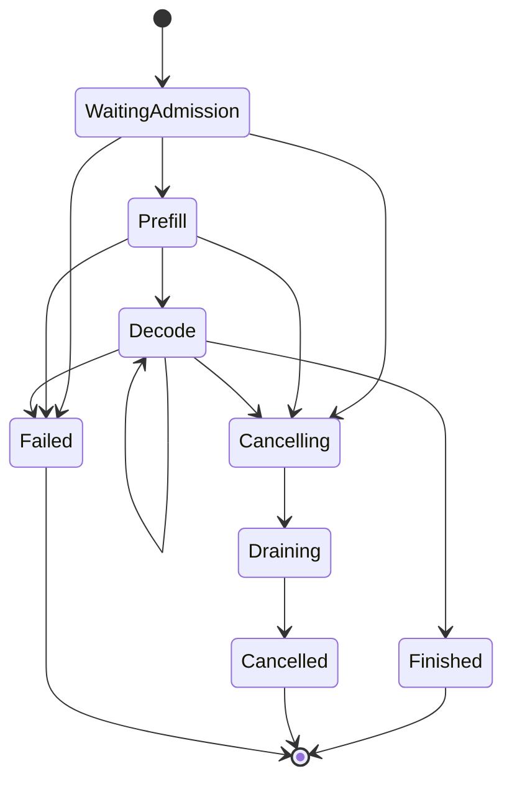
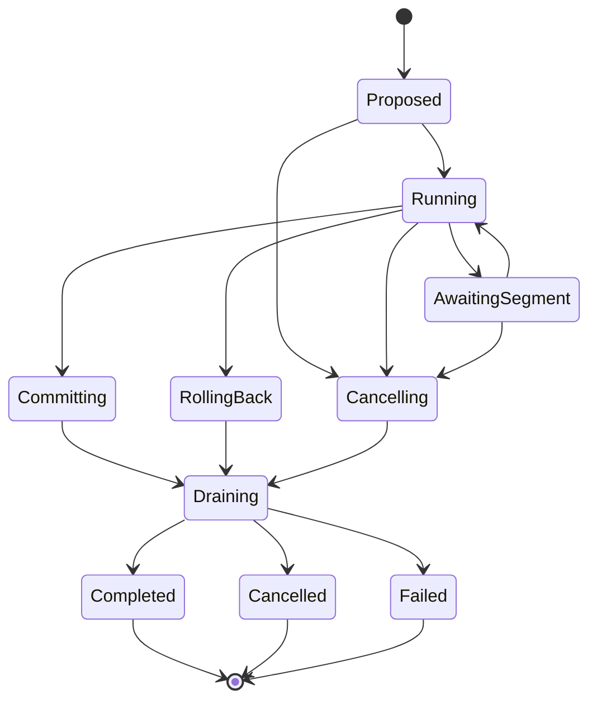
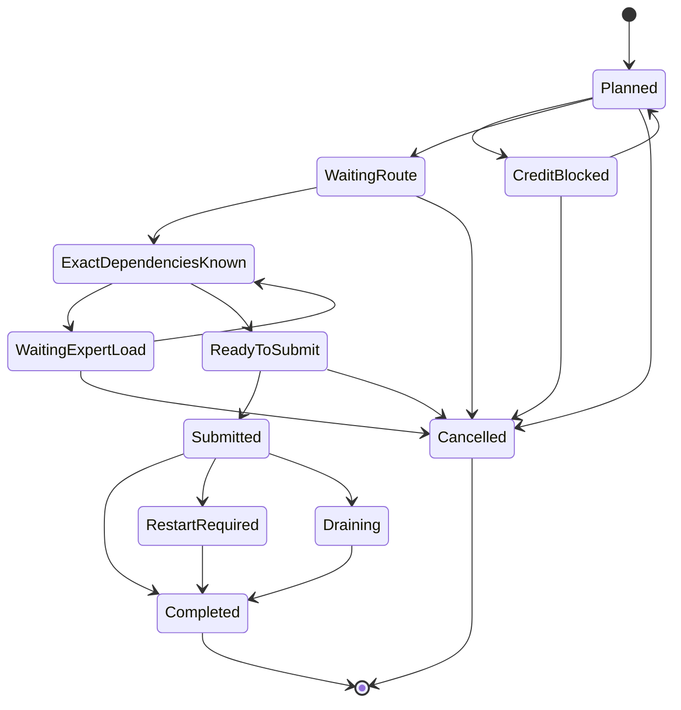
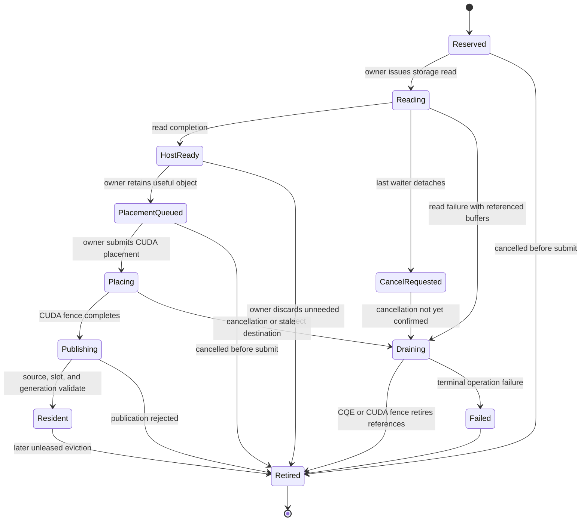
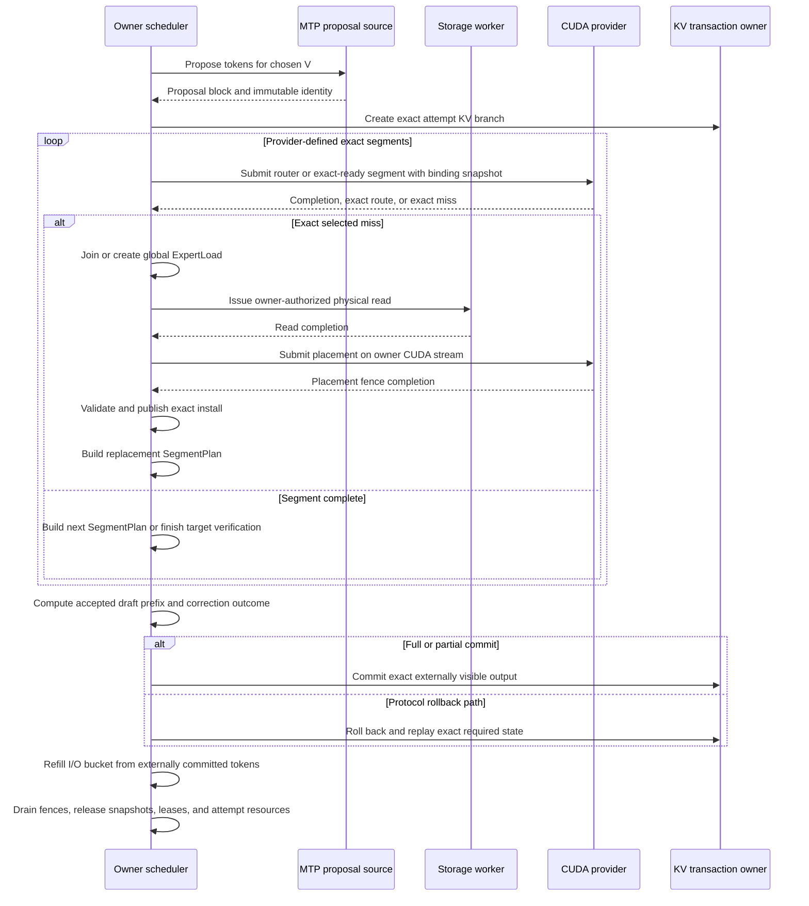
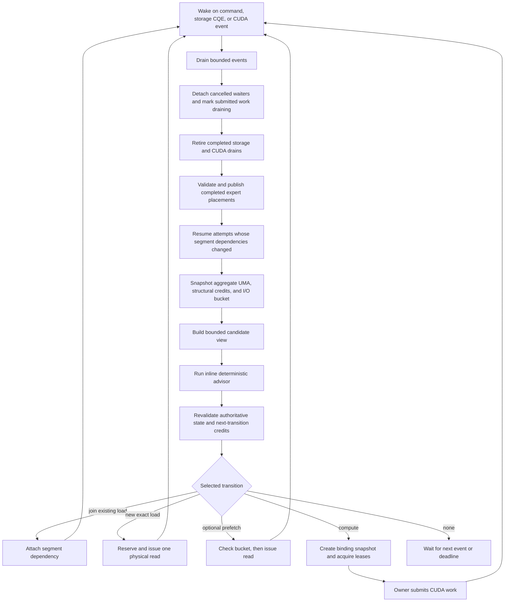

# Ferrule Scheduler Architecture

<!-- markdownlint-disable MD013 MD060 -->

> Design contract for exact speculative execution, dynamic MoE routing, global
> expert loading, and acceptance-aware scheduling on one DGX Spark / GB10.
>
> Status: design proposal; implementation and hardware contracts remain staged.
>
> Updated: 2026-07-17.

## 0. Current design decision

Ferrule should retain one authoritative owner and an explicit resumable state machine,
but the unit of exact readiness is **not a whole speculative cycle**.

The target architecture has three distinct authoritative objects:

1. `CycleAttempt`: stable speculative transaction identity;
2. `SegmentPlan`: one provider-supported exact execution or restart segment;
3. `ExpertLoad`: one globally shared physical expert read and placement lifecycle.

The most important corrections to the earlier design are:

- future MoE routes are generally unknown until preceding layers execute;
- readiness and authoritative leases are segment-scoped, not whole-cycle claims;
- all-hit is normally an observed outcome, not a host-side admission class;
- physical expert I/O is global and may outlive the cycle that first requested it;
- GB10 staging, CUDA allocations, KV, workspaces, page cache, and parked activations
  consume one shared physical UMA pool;
- cancellation detaches logical demand immediately but releases submitted physical
  resources only after a cancellation completion or execution fence;
- the current release path uses the model-owner thread as the only CUDA submitter;
- speculative accounting distinguishes accepted draft tokens from externally committed
  output tokens;
- the I/O governor is a real token bucket over physical bytes, with different policy for
  exact demand and optional prefetch;
- the first production advisor remains inline and deterministic. Off-thread prediction
  or packing is evidence-gated.

The architecture remains generator-like in the sense that a `CycleAttempt` is polled and
resumed through typed events. It does not require a general coroutine framework.

## 1. Scope and platform facts

Ferrule targets exact DeepSeek-V4-Flash-DSpark inference on one GB10 with:

- 43 target layers and dynamically selected routed experts;
- packed verification widths drawn from supported buckets such as `V=2/4/8`;
- a production MTP proposal source that is not yet connected;
- stable expert slots, generations, leases, and execution bindings;
- `O_DIRECT + io_uring` registered reads as the conservative storage baseline;
- no claimed direct NVMe-to-GPU GDS path;
- one 128 GB nominal coherent LPDDR5x memory pool shared by CPU, GPU, copies, staging,
  page cache, KV, workspaces, and the OS;
- a vendor memory-bandwidth figure of 273 GB/s shared by these consumers;
- a measured storage baseline near 10.53 GiB/s;
- a release target of at least 16 externally committed output tokens/s.

At the release rate, the nominal uncovered-I/O envelope is:

```text
10.53 GiB/s / 16 output tokens/s = 0.658 GiB/output token
```

This is already close to the measured storage ceiling. Accounting must therefore use
physical aligned bytes actually issued, including amplification, duplicated reads, and
reads that become useless after cancellation or prediction failure.

## 2. Non-negotiable invariants

### 2.1 Authoritative ownership

The model-owner thread is the only writer of:

- request lifecycle state;
- `CycleAttempt` and `SegmentPlan` state;
- logical and physical KV transaction state;
- global expert-load membership and waiter sets;
- expert install reservations, slot mappings, and generations;
- authoritative binding snapshots and leases;
- scheduler queues, credits, and accounting ledgers.

For the current GB10 release path, the model-owner thread is also the only CUDA API
submitter. It creates and owns contexts, streams, graph objects, and events, and it
submits placement copies, kernels, and graph replays.

Storage workers may execute owner-authorized reads into pre-reserved I/O-visible buffers
and return opaque completions. Inline or future asynchronous advisors may compute over
immutable snapshots. Neither may mutate authoritative state or submit CUDA work.

A future provider may declare a dedicated CUDA transfer thread, but that is a different
ownership contract and must explicitly define context binding, stream creation, event
lifetime, synchronization edges, cancellation, and error propagation.

```rust
enum CudaSubmissionOwner {
    ModelOwnerThread,
    DedicatedTransferThread,
}
```

The current release contract selects `ModelOwnerThread`.

### 2.2 Dynamic-route exactness

For an ordinary layer-by-layer MoE target:

```text
layer N input hidden state
    -> layer N router
    -> exact selected experts for layer N
    -> layer N expert output
    -> layer N+1 input hidden state
```

Future exact routes generally cannot be known before earlier layer outputs exist.
Therefore:

- prediction never creates an authoritative binding;
- prediction never permits an authoritative lease;
- whole-attempt `ResidentReady` is not a valid target-architecture state;
- exact readiness applies only to a current `SegmentPlan` or CUDA submission contract;
- a later router may create a new exact miss even after all previous segments hit;
- all-hit is recorded only after an attempt completes with zero new physical reads or
  other explicitly defined all-hit evidence.

### 2.3 Submission exactness

Every CUDA compute submission uses an immutable `DispatchBindingSnapshot` created and
validated by the owner immediately before dispatch.

For every binding the provider may dereference, the snapshot fixes:

- logical expert and source identity;
- physical slot or provider address identity;
- slot generation;
- mapping epoch and device table buffer;
- provider plan and graph bucket identity;
- lease and completion-fence contract.

The corresponding slots, generations, mapping table, and leases remain valid until the
submission fence completes.

### 2.4 Transaction exactness

- The target verifier never substitutes a predicted or fallback expert.
- Exact selected misses leave execution only at a provider-declared safe boundary.
- Full, partial, and zero draft acceptance follow the exact DSpark/MTP protocol.
- Only externally committed output tokens become visible to the client.
- A correction or bonus token, if required by the selected protocol, is counted
  separately from accepted draft tokens.
- Cancellation prevents future request commit but does not pretend submitted I/O or CUDA
  work has stopped.

### 2.5 Bounded physical resources

Ferrule enforces both:

1. one aggregate GB10 UMA capacity bound;
2. structural credits for operations and address-stable resources.

No fairness, liveness, deadline, or singleton-overflow rule may violate either hard
constraint.

### 2.6 Physical-operation lifetime

- An unsubmitted reservation may be released immediately.
- A submitted storage read retains its operation, staging, and destination-related
  credits until a cancellation completion or normal completion proves it no longer
  references those resources.
- A submitted placement or compute operation retains its snapshot, generations, leases,
  buffers, and events until its CUDA fence completes.
- A stale generation can prevent publication; it cannot make a still-running DMA safe to
  overwrite.
- Every physical resource reaches exactly one retirement path.

## 3. Authoritative object model

### 3.1 Request state

A request owns externally visible lifecycle and at most one non-terminal speculative
attempt.



The invariant is:

```text
one request has at most one non-terminal CycleAttempt
```

A request is not fully retired while its attempt, KV branch, submitted expert loads,
CUDA submissions, or event-channel obligations still require draining.

### 3.2 CycleAttempt

`CycleAttempt` holds immutable speculative identity and mutable transaction progress. It
may span multiple exact execution segments.

```rust
struct CycleAttempt {
    attempt_id: AttemptId,
    request_id: RequestId,
    session_id: SessionId,
    proposal_source: ProposalSourceIdentity,
    proposal_hash: ProposalHash,
    verification_width: u32,
    proposed_tokens: Vec<u32>,
    kv_branch: KvBranchId,
    sequence_number: u64,
    checkpoint: CheckpointId,
    accounting: SpeculativeCycleAccounting,
}
```

The proposal identity, selected width, proposed block, KV branch, and sequence number do
not change when a route miss causes a segment restart. Prediction, current bindings,
load reservations, and graph buckets do not belong to this immutable identity.

A conceptual lifecycle is:



### 3.3 SegmentPlan

A `SegmentPlan` is one provider-supported exact submission or restart unit inside an
attempt.

```rust
struct SegmentPlan {
    segment_id: SegmentId,
    attempt_id: AttemptId,
    phase: ExecutionPhase,
    checkpoint: CheckpointId,
    route_epoch: u64,
    readiness: DependencyReadiness,
    exact_dependencies: Vec<ExpertDependency>,
    predicted_prefetches: Vec<PrefetchHint>,
    graph_bucket: Option<GraphBucket>,
    binding_snapshot: Option<DispatchBindingSnapshot>,
}
```

It is replaceable after a route miss, restart, publication, or repacking decision.
Predicted hints may be updated or discarded without changing the attempt identity.



A submitted segment may not transition directly to `Cancelled`; it drains to its fence.

### 3.4 Dependency readiness

Readiness is scoped to a segment:

```rust
enum DependencyReadiness {
    ExactReady {
        segment: SegmentId,
        bindings: Vec<ExactBinding>,
    },
    PredictedReady {
        segment: SegmentId,
        predicted_bindings: Vec<PredictedBinding>,
        confidence: PredictionConfidence,
    },
    RouteUnknown {
        restart_boundary: CheckpointId,
    },
    ExactMiss {
        segment: SegmentId,
        demands: Vec<ExpertObjectKey>,
    },
}
```

Rules:

- only `ExactReady` may produce authoritative leases;
- `PredictedReady` supports prefetch and ordering only;
- `RouteUnknown` means a router or provider segment must execute before dependencies can
  be exact;
- `ExactMiss` resolves each demand through the global expert-load table;
- no variant claims readiness for future dynamic routes outside the segment.

### 3.5 Executor capability declaration

The provider must declare which dynamic-route contracts it supports:

```rust
struct ExecutorCapabilities {
    exact_route_ahead: bool,
    layer_restart: bool,
    device_miss_detection: bool,
    graph_binding_indirection: bool,
}
```

Interpretation:

| Capability | Meaning |
|---|---|
| `exact_route_ahead` | The provider can compute an exact route for a declared segment before submitting that segment's expert work |
| `layer_restart` | After an exact selected miss, the provider can restart from a declared layer or semantic checkpoint |
| `device_miss_detection` | A submission can validate selected bindings on device, skip unsafe expert work, and return an exact miss without corrupting state |
| `graph_binding_indirection` | Graph replay resolves experts through a versioned device mapping contract rather than assuming timeless logical pointers |

A graph region with future dynamic routing is legal only if its provider contract makes
miss behavior safe. The host must not infer whole-cycle readiness from a predicted
superset.

## 4. Global ExpertLoad ownership

### 4.1 One physical load, many logical dependencies

Expert I/O is global because the loaded object can serve multiple attempts and can
outlive the attempt that first triggered it.

```rust
struct ExpertObjectKey {
    model_version: ModelVersion,
    layer_id: LayerId,
    expert_id: ExpertId,
    layout: WeightLayout,
    quantization: QuantizationKind,
    source_content_id: ContentHash,
}

struct ExpertLoad {
    load_id: LoadId,
    key: ExpertObjectKey,
    source: ExpertSourceIdentity,
    destination: ReservedDestination,
    state: ExpertLoadState,
    exact_waiters: BTreeSet<CycleDependency>,
    speculative_waiters: BTreeSet<CycleDependency>,
    charge_owner: IoChargeOwner,
    issued_physical_bytes: u64,
}
```

The owner maintains:

```text
HashMap<ExpertObjectKey, LoadId>
```

A segment dependency stores a global load reference rather than owning the transfer:

```rust
struct ExpertDependency {
    load_id: LoadId,
    required_generation: Generation,
    requirement: ExactOrSpeculative,
}
```

The key must distinguish every property that changes execution meaning or source
contents. Two logical expert IDs are not equivalent if their model version, layout,
quantization, or source content differs.

### 4.2 ExpertLoad lifecycle

```rust
enum ExpertLoadState {
    Reserved,
    Reading,
    HostReady,
    PlacementQueued,
    Placing,
    Publishing,
    Resident,
    CancelRequested,
    Draining,
    Failed,
    Retired,
}
```



Cancellation behavior:

- cancelling one waiter detaches only that waiter;
- if other exact or speculative waiters remain, the load continues;
- if no waiter remains and the read is not submitted, the owner releases it immediately;
- if a read or placement is submitted, the load enters `CancelRequested` or `Draining`;
- physical buffers and credits remain held until the storage completion or CUDA fence;
- a completed orphan may be discarded or admitted as cache according to explicit policy;
- if an exact waiter joins an orphaned speculative load, the same physical operation can
  become useful without a second physical charge;
- a request cancellation never permits that request to commit output, even if the global
  load remains useful to another request.

### 4.3 Physical and logical accounting

One physical read is charged once when issued. Additional waiters record logical joins,
not additional physical bytes.

Recommended counters include:

- logical exact-demand bytes;
- logical speculative-demand bytes;
- physical requested, issued, completed, failed, and drained read bytes;
- aligned and source-payload bytes;
- existing-load join count and joined logical bytes;
- placement submitted and completed bytes;
- speculative useful, late, unused, and later-became-exact bytes;
- rejected-prefetch and orphaned-completion bytes;
- stale destination and rejected-publication bytes.

`IoChargeOwner` identifies the global release ledger and may retain a first-trigger
attempt for diagnostics. It does not make that attempt the owner of the physical load.

## 5. GB10 UMA and transfer model

### 5.1 Logical transfer backend

The scheduler must not hardcode a discrete-GPU `host -> device` mental model.

```rust
enum ExpertTransferBackend {
    DirectIoToPinnedThenCudaCopy,
    BufferedIoToPinnedThenCudaCopy,
    MappedHostExecution,
    ManagedOrMappedExperimental,
}
```

The generic transition is:

```text
immutable source extent
    -> I/O-visible buffer
    -> execution-visible binding
```

The conservative release baseline is `DirectIoToPinnedThenCudaCopy`, but even that path
uses allocations backed by the same GB10 physical DRAM. “Placement” is preferred to
“upload” in target-architecture state names.

Experimental mapped or managed paths require independent correctness, graph, residency,
and performance evidence. They are not production fallbacks.

### 5.2 Aggregate UMA credits

```rust
struct UnifiedMemoryCredits {
    usable_uma_bytes: u64,
    os_reserve_bytes: u64,
    safety_margin_bytes: u64,
    page_cache_bytes: u64,
    pinned_io_bytes: u64,
    cuda_allocation_bytes: u64,
    kv_bytes: u64,
    graph_workspace_bytes: u64,
    parked_activation_bytes: u64,
    transient_copy_duplication_bytes: u64,
    provider_other_bytes: u64,
}
```

The hard capacity equation is:

```text
page cache
+ pinned I/O staging
+ CUDA allocations and resident expert arena
+ KV
+ graph workspace
+ parked activations
+ transient duplication
+ provider-owned buffers
<= usable UMA - OS reserve - safety margin
```

The subfields remain useful for ownership and diagnostics, but they are not independent
physical-memory budgets.

For an expert with payload size `E`, a placement may temporarily consume:

```text
registered staging E
+ execution allocation E
+ page-cache contribution when buffered I/O is used
+ alignment and allocator overhead
```

The exact high-water mark must be measured rather than inferred from logical payload
size.

### 5.3 Structural hard credits

Capacity bytes are accompanied by structural limits:

- fixed-file read operations and NVMe queue depth;
- registered staging regions and descriptors;
- owner-pending CUDA placement operations and events;
- prepared install reservations;
- stable resident slots;
- device mapping-table buffers;
- KV pages and page-table entries;
- graph buckets and workspace instances;
- parked continuation frames.

Reservation succeeds only if aggregate UMA and every required structural credit can be
reserved together. Partial reservation is rolled back in deterministic order.

### 5.4 Shared bandwidth and interference

Storage, CPU prediction, placement copies, KV traffic, routed GEMMs, and graph execution
are not independent servers on GB10. They share UMA bandwidth to different degrees.

The scheduler should not assume:

```text
parallel time = max(compute time, copy time)
```

until H0 profiles demonstrate that approximation for a specific compute and transfer
class.

## 6. Residency publication and binding snapshots

### 6.1 Install reservation is not publication

A destination reservation fixes an intended slot and generation but does not expose a
logical mapping. A completed load becomes usable only after owner validation and
publication.

Required publication order for an indirection-table provider is:

```text
storage completion
-> owner-submitted placement completion
-> validate source, destination, slot, and generation
-> write inactive mapping table or entry
-> device-visible publication fence
-> publish active mapping epoch
-> permit later DispatchBindingSnapshot creation
```

The exact table-swap mechanism is provider-specific, but publication must be ordered and
observable.

### 6.2 DispatchBindingSnapshot

```rust
struct DispatchBindingSnapshot {
    attempt_id: AttemptId,
    segment_id: SegmentId,
    residency_epoch: u64,
    mapping_epoch: u64,
    bindings: Vec<ExactBinding>,
    device_table_buffer: DeviceTableId,
    provider_plan: ProviderPlanId,
    graph_bucket: Option<GraphBucket>,
}
```

Creation rules:

- only the owner creates it;
- every exact binding is revalidated immediately before dispatch;
- all required leases are acquired atomically or the snapshot is abandoned;
- the snapshot is immutable after CUDA submission;
- the submission ticket retains mapping epoch, slot generations, leases, table buffer,
  and completion fence;
- retirement happens only after the fence completes.

A slot lease alone is insufficient if a graph reads a logical mapping table that can be
rewritten. Snapshot lifetime covers both physical slots and the mapping view used by the
submission.

### 6.3 Graph legality under dynamic routing

A graph may capture direct slot addresses or a device indirection table. The provider
must declare which contract applies.

A large graph region containing future dynamic routes is correct only when at least one
of the following is true for that region:

- routes are computed exactly before the region;
- the full possible expert superset is execution-visible and leased;
- device-side binding validation prevents an invalid expert kernel from running and
  returns an exact miss at a safe boundary;
- the graph is segmented so the host creates a new exact binding snapshot after each
  route boundary.

Predicted superset preparation can improve the probability of uninterrupted graph
execution. It cannot by itself prove the graph is exact-ready.

After completion, the attempt may be classified as:

```text
observed_zero_new_read
observed_all_segment_hits
observed_restart_count = N
```

These are outcomes, not pre-dispatch readiness classes.

## 7. Speculative transaction and output accounting

### 7.1 Separate speculative counters

```rust
struct SpeculativeCycleAccounting {
    proposed_tokens: u32,
    verified_rows: u32,
    accepted_draft_tokens: u32,
    correction_tokens: u32,
    externally_committed_tokens: u32,
    rolled_back_rows: u32,
}
```

These values are not interchangeable.

For some exact speculative protocols, rejecting a draft token still produces a target
correction or bonus token. Therefore:

```text
accepted_draft_tokens = 0
```

does not necessarily imply:

```text
externally_committed_tokens = 0
```

Ferrule must document the concrete DSpark/MTP protocol once the production proposal
source is connected. Until then, transaction tests and mock traces must provide each
counter explicitly rather than infer correction behavior.

### 7.2 Release denominator

The serving throughput and I/O release metrics use externally committed output tokens:

```text
output throughput
    = externally_committed_tokens / complete_cycle_time

physical I/O intensity
    = physical_uncovered_bytes / externally_committed_tokens
```

The roadmap's `A(V)` should be interpreted as mean externally committed tokens per
cycle. Accepted draft prefix length remains an explanatory histogram, not the serving
throughput denominator.

Internal committed-token counts must reconcile exactly with externally returned tokens.

### 7.3 Attempt and segment execution



## 8. Acceptance-aware physical-I/O token bucket

### 8.1 Bucket update

The release governor maintains a signed byte balance:

```text
on externally committed output:
    balance = min(
        bucket_capacity,
        balance + externally_committed_tokens * bytes_per_output_token
    )

on first physical read issue:
    balance = balance - physical_aligned_read_bytes
```

With the current release target:

```text
bytes_per_output_token = 0.658 GiB
```

Warm resident periods accumulate positive burst credit up to `bucket_capacity`. Cold
periods spend it. A negative balance records bounded overdraft rather than losing warm
credit through `max(0, ...)`.

### 8.2 I/O purpose

Physical operations and logical dependencies need distinct classification.

```rust
enum IoPurpose {
    ExactDemand,
    SpeculativePrefetch,
    OpportunisticPrefetch,
}

enum DependencyDemand {
    NewExact,
    JoinSharedExact,
    Speculative,
}
```

`JoinSharedExact` does not issue or charge a second physical read. The immutable
issue-purpose remains available for auditing even if a speculative load later serves an
exact waiter.

### 8.3 Admission policy

| Purpose | Behavior when normal bucket credit is exhausted |
|---|---|
| exact demand | may use a bounded mandatory reserve or overdraft, subject to every hard credit |
| shared exact join | joins the existing load without another physical charge |
| speculative prefetch | suppressed immediately |
| opportunistic prefetch | suppressed before speculative prefetch |

Exact work must not deadlock merely because no token can be produced until an expert is
loaded. Configuration must ensure the mandatory reserve can cover at least one minimum
atomic exact transfer, or provide an explicit one-load progress permit. That permit
still cannot exceed aggregate UMA, staging, operation, destination, or mapping credits.

Already issued bytes are never refunded because of:

- cancellation;
- zero accepted draft tokens;
- read or placement failure;
- stale publication;
- unused prediction;
- later eviction.

If a speculative load later serves exact demand, counters record the conversion, but the
physical bucket is neither charged again nor refunded.

## 9. Scheduler classification and policy

### 9.1 Orthogonal candidate fields

The scheduler should not create one large enum that combines phase, readiness, I/O
state, and fairness. Candidate state is expressed through orthogonal fields:

```text
phase × readiness × byte deficit × urgency
```

Suggested phase values:

- prefill;
- MTP proposal;
- target router segment;
- target expert segment;
- target continuation;
- partial-accept replay;
- commit or rollback.

Suggested readiness values:

- runnable;
- waiting for exact route;
- waiting for one or more global expert loads;
- waiting for CUDA completion;
- hard-credit blocked;
- policy deferred;
- draining;
- terminal.

Suggested byte-deficit values:

- new exact physical bytes;
- shared in-flight logical bytes;
- new speculative physical bytes;
- aggregate UMA delta;
- estimated placement and interference class.

### 9.2 Lexicographic selection

The production baseline remains lexicographic:

1. hard feasibility for the next transition;
2. cancellation, deadline, and starvation obligations;
3. dispatchable current segments before optional new loads;
4. exact-demand progress and byte-aware fairness;
5. minimum marginal global expert work within a bounded window;
6. phase-aware decode/prefill preference;
7. deterministic arrival-order tie break.

This is intentionally not a large weighted score.

### 9.3 Hard feasibility

A transition is infeasible unless the owner can reserve all resources required by that
transition, including:

- aggregate UMA bytes;
- structural operation credits;
- KV and continuation state;
- exact current-segment loads or bindings;
- mapping-table and graph workspace capacity;
- submission snapshot and leases when dispatching compute.

The scheduler does not reserve unknown resources for future routes unless they are
optional prediction-backed prefetches with separate purpose and policy.

### 9.4 Work conservation and phase-aware preference

A runnable segment with a valid binding contract should not wait behind an unrelated
segment blocked on I/O. A waiting decode segment does not block a runnable prefill
segment, but among equally runnable work, decode normally receives preference to protect
inter-token latency.

Chunked prefill and mixed batches remain valid when the provider has an efficient mixed
shape. Phase remains explicit because prefill and decode have different latency,
batching, routing, and cache behavior.

### 9.5 Byte-aware fairness

Age alone can promote a 100 MiB exact demand and a 2 GiB exact demand identically. A
lightweight deficit mechanism can preserve fairness while respecting physical cost:

```text
priority class
-> deadline state
-> age
-> accumulated exact-I/O deficit credit
-> marginal physical bytes
-> arrival order
```

Each deferred exact-demand request accumulates bounded deficit credit. Joining an
existing load consumes no new physical-byte deficit. Speculative prefetch does not gain
mandatory fairness credit.

The first implementation should remain simple enough for deterministic replay, such as
deficit round robin over exact physical bytes plus a hard age ceiling.

### 9.6 Marginal expert-union packing

Within a bounded candidate window, prefer combinations that minimize:

```text
new global exact physical-read bytes
+ new speculative physical-read bytes
+ aggregate UMA high-water delta
+ placement-operation pressure
+ profile-derived interference and ready-time penalty
```

Positive reuse signals include:

- already published exact bindings;
- joining an existing global `ExpertLoad`;
- overlapping exact expert unions;
- compatible segment phase and graph bucket;
- reusable mapping-table snapshots where provider contracts permit.

Batch-local union estimates remain useful policy inputs, but the global load table is the
authoritative source of physical transfer deduplication.

### 9.7 Proposal-path and expert-cost optimization

Future proposal selection may jointly consider:

- prefix survival probability;
- target-equivalent correctness constraints;
- predicted marginal expert activation cost;
- expected physical I/O bucket impact;
- graph and segment compatibility.

Prediction may choose among legal proposal paths. It must not change exact target
verification rules or make predicted target routes authoritative.

## 10. Dynamic verification width

### 10.1 Metrics now, selector later

Dynamic-width observability is required before a dynamic-width controller is enabled.
For every attempt, record:

- supported and considered widths;
- chosen `V_i` and selection reason;
- proposal count and proposal-source identity;
- proposed tokens and verified rows;
- accepted draft tokens;
- correction tokens;
- externally committed tokens;
- zero, partial, and full draft-acceptance outcome;
- draft, route, verify, restart, replay, commit, rollback, and complete-cycle latency;
- exact, speculative, and total physical bytes;
- token-bucket balance before and after;
- unique expert union and restart count;
- graph bucket and observed all-hit result.

Accepted-prefix survival metrics should include:

```text
P(accepted_draft_tokens >= 1 | features)
P(accepted_draft_tokens >= 2 | features)
...
P(accepted_draft_tokens >= V | features)
```

### 10.2 Future objective

A future selector may maximize:

```text
expected externally committed output tokens
-------------------------------------------------------------
draft + route + verify + miss/restart + replay + commit latency
```

subject to:

- exact correctness;
- physical I/O bucket and mandatory reserve;
- aggregate UMA and structural credits;
- expert-union capacity;
- graph bucket availability;
- request deadline and serving SLO.

The model should condition on batch shape, context bucket, width, route/expert union, and
measured hardware profile. It should not use only `E[A(V)] / E[T_verify(V)]`.

Counterfactual regret is reported only when the trace or benchmark explicitly contains
valid outcomes for alternative widths under comparable state. Missing outcomes are not
invented.

## 11. Resumable poll model

### 11.1 Explicit state machine

The production interface can remain small:

```rust
fn poll_cycle(
    attempt: &mut CycleAttempt,
    event: Option<CycleEvent>,
) -> CyclePoll;

enum CyclePoll {
    Yield(CycleIntent),
    Waiting(DependencySet),
    Complete(CycleResult),
}
```

Possible intents include:

- create or replace a `SegmentPlan`;
- request exact route execution;
- join or create global expert loads;
- request a binding snapshot and compute submission;
- commit or roll back the attempt;
- enter draining.

This supports resume, cancellation, deterministic replay, and typed resource contracts
without a general async executor or boxed dynamic future in the hot path.

### 11.2 Yield and atomic regions

Legal yields occur only at declared boundaries:

- before a proposal or target segment submission;
- after router or device-miss output becomes exact;
- while waiting on global loads;
- after storage or CUDA completion;
- before commit or rollback begins;
- after an exact checkpoint has been restored.

Atomic regions include:

- a running CUDA kernel or graph replay;
- residency publication;
- binding snapshot creation plus atomic lease acquisition;
- KV/backend commit;
- retirement bookkeeping that must execute exactly once.

### 11.3 Yield resource contract

```rust
struct YieldContract {
    held_uma_bytes: u64,
    held_activation_bytes: u64,
    held_kv_pages: usize,
    held_expert_leases: usize,
    draining_loads: Vec<LoadId>,
    draining_submissions: Vec<SubmissionId>,
    releasable: ResourceMask,
    wake_dependencies: DependencySet,
    restartable: bool,
}
```

The owner distinguishes:

- `park-and-hold` for short bounded waits;
- `checkpoint-and-release` for resumable work;
- `rollback-and-release` for speculative or capacity-heavy waits;
- `drain-and-retire` for already submitted work.

Parked and draining resources have separate limits and metrics.

### 11.4 Inline advisor first

The first policy extension uses a synchronous pure interface:

```rust
trait SchedulingAdvisor {
    fn advise(&self, snapshot: &AdvisorSnapshot) -> Advice;
}
```

Production starts with `InlineDeterministicAdvisor`. The simulator can provide:

- `DelayedMockAdvisor`;
- `StaleAdviceAdvisor`;
- `FailedAdvisor`.

The owner validates every returned transition against current authoritative state and
hard credits. Advisor failure falls back to deterministic policy.

Real helper threads are introduced only if profiling proves that owner-side candidate
classification or bounded-window search is material and if H0 shows that snapshot
scanning does not consume more shared UMA bandwidth than the scheduling gain saves.

### 11.5 Optional off-thread advice

If promoted later, advice is versioned by:

- advisor snapshot epoch;
- request generation;
- attempt and segment identity;
- proposal hash;
- residency and mapping epoch;
- source and layout identity.

Off-thread advice may recommend prediction, packing, eviction, or cooperative
preemption. It never submits CUDA, publishes residency, or mutates scheduler state.

### 11.6 Cooperative preemption

Preemption means selecting a different attempt at the next safe yield point.

| State | Permitted action |
|---|---|
| unselected or policy-deferred segment | reorder, defer, or cancel |
| unsubmitted load reservation | cancel and release immediately |
| shared load with other waiters | detach only this dependency |
| last waiter on submitted read | request cancellation and drain |
| placement or compute submitted | wait for CUDA fence; retain resources |
| exact segment ready but not leased | defer freely |
| leased but not submitted | release leases, then defer |
| speculative restart boundary | checkpoint or roll back, then defer |
| CUDA or commit atomic region | no preemption |

## 12. Owner loop



Accounting happens at physical transition boundaries:

- bucket debit at first physical read issue;
- physical resource retirement at CQE or CUDA fence;
- output-token credit at exact external commit;
- no second charge for load joins;
- no early credit release for logical cancellation.

## 13. Current Ferrule alignment

The current `ResidentScheduler` remains a useful deterministic baseline. It already
provides:

- bounded waiting, active, prefill, and decode queues;
- decode-first and mixed-batch token planning;
- model-neutral `ExpertIoAdvisor` estimates;
- batch-local marginal-union accounting;
- multiple expert-I/O policy dimensions;
- skip-and-rotate behavior that avoids simple head-of-line blocking;
- deterministic decision traces;
- runnable-queue restoration on advisor errors;
- explicit KV reservation, commit, and rollback boundaries.

Some current names are legacy trace vocabulary rather than target states:

| Current concept | Valid current meaning | Target-architecture interpretation |
|---|---|---|
| `ResidentReady` trace class | advisor estimates zero incremental/cold bytes for the inspected candidate | not proof of whole-cycle exact readiness |
| `IoAdmissible` trace class | estimated candidate fits configured batch budgets | permission to consider a global load transition, not execution readiness |
| `MissBlocked` trace class | candidate exceeded a current estimate/budget | reason must separate hard credits from soft policy |
| batch-local expert union | avoids duplicate estimated cost inside one scheduler action | global `ExpertLoad` is authoritative for physical deduplication |
| singleton overflow | prevents a purely policy-blocked batch from stalling | may cross soft debt only; never aggregate UMA or structural credits |

The target architecture evolves rather than replaces this baseline. Existing tests remain
useful for token-budget, queue-rotation, rollback, and deterministic-advisor parity.

## 14. Deterministic scheduler and interference simulator

### 14.1 Purpose

The simulator verifies exact state transitions, bounded physical resources, policy
behavior, and service interference without pretending to predict GB10 performance from
unmeasured constants.

It drives the same conceptual attempt, segment, global-load, binding-snapshot, and event
vocabulary as production.

### 14.2 Service centers

At minimum, model:

1. NVMe queue and fixed-file operations;
2. unified DRAM capacity and bandwidth;
3. CUDA placement/copy engines;
4. GPU compute and graph submissions.

These centers interact. A profile-derived interference record may be:

```rust
struct InterferenceProfile {
    compute_class: ComputeClass,
    transfer_class: TransferClass,
    compute_slowdown: f32,
    transfer_slowdown: f32,
}
```

For example, if isolated compute takes 100 units and isolated placement takes 30 units,
the simulator must be able to represent a measured concurrent completion of 125 units
rather than always assuming the ideal 100.

### 14.3 Trace inputs

A trace may specify:

- request arrival, prompt, output limit, deadline, and cancellation;
- proposal identity and supported/chosen verification widths;
- explicit speculative accounting outcomes;
- per-segment exact routes and prediction hints;
- expert object keys, physical aligned bytes, and initial residency;
- global load joins and waiter detachments;
- read, cancellation-CQE, placement, compute, and fence timing;
- aggregate UMA capacity, OS reserve, page-cache behavior, and safety margin;
- structural operation and slot capacities;
- mapping and slot generations;
- provider restart boundaries and capability flags;
- graph and binding-snapshot contracts;
- interference profiles;
- inline advisor cost and optional delayed/stale advice events;
- OS reclaim or changing usable-UMA watermarks.

### 14.4 Compared policies

Replay the same trace through:

1. legacy FIFO/rotation scheduling;
2. phase × readiness × byte-deficit inline scheduling;
3. global-load coalescing with the purpose-aware token bucket;
4. resident/current-segment-first plus bounded fairness;
5. bounded-window marginal physical-byte packing;
6. dynamic width only when valid alternative-width outcomes are present;
7. offline route/Belady/CSP-style oracle as a non-production lower bound.

### 14.5 Required invariants

Every simulated transition asserts:

- one request has at most one non-terminal attempt;
- every attempt, segment, load, install reservation, and submission has one state;
- every segment dependency references an existing resident binding or global load;
- the same expert object key has at most one active equivalent physical load;
- one physical read debits the bucket exactly once;
- joining a load never duplicates physical charge;
- aggregate UMA and every structural credit remain within bounds;
- draining resources remain charged until CQE or CUDA fence;
- no slot or mapping snapshot changes while a submission can dereference it;
- every binding snapshot is owner-created and validated before submission;
- all CUDA submissions originate from the configured CUDA owner;
- prediction never becomes an authoritative exact binding;
- cancellation prevents request commit but does not prematurely free physical buffers;
- accepted draft, correction, external commit, and rollback counters reconcile;
- internal and external output-token counts reconcile;
- optional I/O is suppressed before exact progress is denied;
- a dispatchable segment is work-conserving when its compute slot is free;
- fairness progresses when required hard resources eventually become available;
- every reservation or submitted operation retires exactly once;
- observed all-hit is computed after execution, never assumed as whole-cycle readiness.

### 14.6 High-value scenarios

1. A cold head candidate does not block a later dispatchable segment.
2. Multiple attempts require one absent expert; one load is created and all others join.
3. The first-trigger attempt cancels while other exact waiters keep the load alive.
4. All waiters cancel before read submission; all reservations release immediately.
5. All waiters cancel after read submission; the load drains until CQE.
6. A DMA or placement completes after logical cancellation and cannot overwrite reused
   staging or destination memory.
7. A predicted load later serves exact demand and is charged once.
8. A predicted load is never used and remains fully charged.
9. A route prediction matches layer/expert ID but differs in model, layout, quantization,
   or source content and is rejected as a dependency.
10. The last layer misses after earlier predictions all hit; the attempt creates a new
    segment rather than violating a whole-cycle readiness claim.
11. A mapping table is republished while an older graph is executing; the old binding
    snapshot and leases remain valid until its fence.
12. All resident slots are leased; replacement and optional prefetch remain blocked.
13. Partial and zero draft acceptance charge caused physical bytes while only externally
    committed tokens refill the bucket.
14. Zero accepted draft tokens still commit a correction token when the trace protocol
    explicitly requires one.
15. Exact demand progresses through bounded mandatory overdraft when all requests are
    cold.
16. Optional prefetch is suppressed when the bucket is exhausted.
17. A 100 MiB and a 2 GiB cold request receive byte-aware deficit fairness.
18. Long prefill advances under continuous decode without treating phases as identical.
19. Bounded-window packing reduces new physical bytes without starvation.
20. Concurrent placement and GEMM perform worse than serial execution under a supplied
    interference profile.
21. Page-cache growth or OS reclaim reduces usable UMA and blocks new reservations
    without violating existing lifetimes.
22. A stale advisor result cannot change authoritative state.
23. Disabling or failing the advisor preserves deterministic fallback progress.
24. Cooperative preemption occurs only at a declared yield point.
25. Restart resumes from the declared checkpoint without duplicate external tokens.

### 14.7 Output metrics

#### Speculation and dynamic width

- attempts, proposals, verified rows, accepted draft tokens, correction tokens,
  externally committed tokens, and rolled-back rows by width;
- zero, partial, and full draft-acceptance rate by width;
- prefix-survival probabilities;
- complete-cycle latency and output tokens/s by width;
- mixed-width aggregate throughput;
- width switches and reasons;
- counterfactual regret only when trace evidence exists.

#### Global expert loading

- loads created, joined, cancelled-before-submit, drained, failed, published, discarded,
  and retired;
- current and peak waiter count;
- physical bytes saved by joins;
- exact, speculative, useful, late, unused, became-exact, rejected, and orphaned bytes;
- aligned read amplification;
- stale destination and publication rejection counts.

#### Memory and interference

- aggregate UMA current and peak use by consumer;
- OS reserve and usable-watermark changes;
- storage queue depth and service time;
- placement and compute overlap;
- isolated versus contended service time;
- interference-attributed stalls;
- parked and draining bytes;
- binding snapshot and mapping-table lifetime peaks.

#### Scheduling

- phase × readiness queue counts;
- queue wait, deadline miss, age promotion, and byte-deficit metrics;
- candidate-window size and marginal physical bytes;
- advisor CPU time, scanned bytes/candidates, stale results, and fallback count;
- dispatchable work-conservation failures;
- cancellations, failures, and externally visible request outcomes.

Virtual throughput is not a hardware claim. It identifies state-machine errors and the
measurements needed for F2/F3 decisions.

## 15. Implementation stages

### H0 — Hardware and executor contracts

Before implementing the final scheduler state model, establish:

- measured usable UMA after OS reserve and safety margin;
- physical high-water behavior of staging, CUDA allocations, page cache, and transient
  duplication;
- `O_DIRECT` versus buffered-read behavior;
- ordinary versus registered I/O buffers;
- pageable, `cudaHostAlloc`, CUDA allocation, mapped, and managed placement paths where
  supported;
- copy/placement versus MoE GEMM and KV interference;
- efficient expert transfer granularity;
- storage and CUDA cancellation/draining behavior;
- stable slot and mapping-table graph semantics;
- exact provider capabilities for route-ahead, restart, device miss detection, and graph
  indirection;
- CUDA submission-owner contract;
- supported graph and verification-width buckets.

Required microbenchmarks:

| Microbenchmark | Purpose |
|---|---|
| buffered read versus `O_DIRECT` | determine whether page-cache retention is ever worth its UMA cost |
| ordinary versus registered buffers | measure `io_uring` registration benefit |
| pageable, pinned, CUDA, mapped, and managed placement | identify actual execution-visible paths |
| placement concurrent with MoE GEMM and KV | measure shared UMA interference |
| expert transfer size sweep | find minimum efficient transfer granularity |
| stable slot plus indirection graph replay | validate binding-snapshot contract |
| staging plus destination high-water test | validate duplicate physical allocation model |
| cancellation during read and placement | establish real draining and retirement semantics |

### S1 — Authoritative state model

Implement or freeze the contracts for:

- `RequestState`;
- `CycleAttempt`;
- `SegmentPlan`;
- global `ExpertLoadTable`;
- install reservation and resident slot state;
- aggregate UMA and structural credit bundle;
- purpose-aware token bucket;
- exact dependency versus predicted hint;
- waiter join and detach;
- cancellation, draining, and retirement;
- owner-only CUDA submission;
- mapping publication and `DispatchBindingSnapshot`;
- speculative and dynamic-width counters.

No advanced prediction policy is required.

### S2 — Deterministic simulator

Implement:

- current scheduler parity fixtures;
- virtual time and typed attempt/segment/load events;
- global load sharing and cancellation interleavings;
- aggregate UMA and structural-credit invariants;
- storage, placement, compute, and interference service centers;
- exact speculative counters and token-bucket accounting;
- inline, delayed, stale, and failed advisor fixtures;
- offline lower bounds where trace data permits them.

### S3 — Low-risk policies

Add and compare:

- completion-driven segment promotion;
- global expert-load coalescing;
- dispatchable current-segment work before unrelated optional loads;
- bounded age and byte-aware deficit fairness;
- bounded-window marginal physical-byte packing;
- phase-aware decode and chunked-prefill scheduling;
- exact-demand mandatory reserve and optional-prefetch suppression.

Policies remain inline, deterministic, and replayable.

### S4 — Prediction integration

Only after S2/S3 evidence:

- route prediction with explicit confidence and identity;
- bounded prefetch depth or cutoff layer;
- speculative and opportunistic purpose accounting;
- prediction-aware eviction hints;
- rejected, late, unused, and became-exact prefetch metrics;
- profile-gated overlap of prediction, storage, placement, and compute.

Prediction cannot create exact bindings or alter target correctness.

### S5 — Adaptive speculation and optional parallel advice

Only after real F2/F3 traces:

- dynamic verification width;
- prefix-survival and accepted-output models;
- expert-aware proposal/path selection;
- deadline/SLO controller;
- off-thread advisor snapshots and versioned mailboxes if inline planning is measured as a
  bottleneck;
- more complex eviction or cooperative-preemption advice;
- finer provider restart/yield points that preserve the graph fast path.

Every S5 feature must improve complete externally committed output throughput or release
latency under the frozen serving contract.

## 16. Research inputs

The architecture does not depend on predictive accuracy for correctness. Research is
used to choose optional policies and simulator comparisons.

Pinned local references include:

| Reference | Ferrule use |
|---|---|
| [MoE-Infinity](../papers/2401.14361-moe-infinity.pdf) | activation traces, request-aware caching, and prefetch baseline |
| [Fiddler](../papers/2402.07033-fiddler.pdf) | heterogeneous expert execution and transfer tradeoffs |
| [FineMoE](../papers/2502.05370-finemoe.pdf) | fine-grained expert offloading decisions |
| [Klotski](../papers/2502.06888-klotski.pdf) | expert loading and compute overlap models |
| [SP-MoE](../papers/2510.10302-sp-moe.pdf) | speculative expert prefetch and bounded prefetch depth |
| [MoE-SpeQ](../papers/2511.14102-moe-speq.pdf) | speculative MoE performance and memory/bandwidth modeling |

Additional
 references to pin and verify before their reported numbers become engineering
evidence include:

- EcoSpec / Less Experts, Faster Decoding;
- DSpark dynamic verification-length work;
- AdaSpec;
- ProMoE;
- Sarathi-Serve;
- DuoServe-MoE;
- INFERMAX;
- recent expert-aware speculative and proposal-selection systems.

The relevant hypotheses are:

- future expert routes can be predicted but are not exact before the corresponding
  hidden states exist;
- deep prefetch can cause cache churn and should have a bounded horizon;
- marginal expert activation cost can matter in proposal/path selection as well as batch
  packing;
- optimal verification width depends on prefix survival, batch/context shape, expert
  union, hardware profile, and SLO;
- chunked prefill and phase-aware scheduling remain important;
- offline cache and scheduling oracles are useful lower bounds, not production policies.

DeepSpeed Pipeline's generator-style instruction schedules are also a useful structural
precedent: each yielded instruction group is an atomic safe step. Ferrule applies that
principle to exact segment, load, placement, and transaction boundaries rather than
pipeline microbatch communication.

## 17. Final contract and non-goals

The core architecture is:

```text
single authoritative owner
+ one non-terminal CycleAttempt per request
+ replaceable exact SegmentPlans
+ globally shared ExpertLoads
+ segment-scoped exact readiness
+ immutable binding snapshots held to CUDA fences
+ aggregate GB10 UMA and structural credits
+ draining cancellation
+ physical-byte token bucket
+ externally committed output accounting
+ deterministic inline policy and simulator
```

Required now:

- eliminate whole-cycle readiness assumptions;
- establish H0 provider and UMA contracts;
- make physical load and cancellation lifetimes explicit;
- separate exact dependencies from predictions;
- separate speculative counters and physical bytes;
- retain work-conserving, phase-aware, lexicographic scheduling.

Evidence-gated later:

- prediction-backed prefetch;
- expert-aware proposal selection;
- dynamic verification width;
- off-thread advisory workers;
- complex cooperative preemption;
- finer graph/restart segmentation.

Not justified:

- treating predicted routes as exact;
- acquiring whole-cycle authoritative leases for future dynamic routes;
- request-owned physical expert transfers;
- immediate reuse of buffers after logical cancellation;
- independent GB10 host/device memory budgets;
- repeated physical charging for shared loads;
- a large opaque weighted scheduler score;
- a general async/coroutine framework in the production hot path;
- distributed rollout orchestration inside the single-owner scheduler.

The near-term implementation target is therefore an exact, segment-aware ownership and
resource model plus a deterministic interference simulator. Smarter prediction and
adaptive speculation are consumers of that foundation, not prerequisites for its
correctness.
